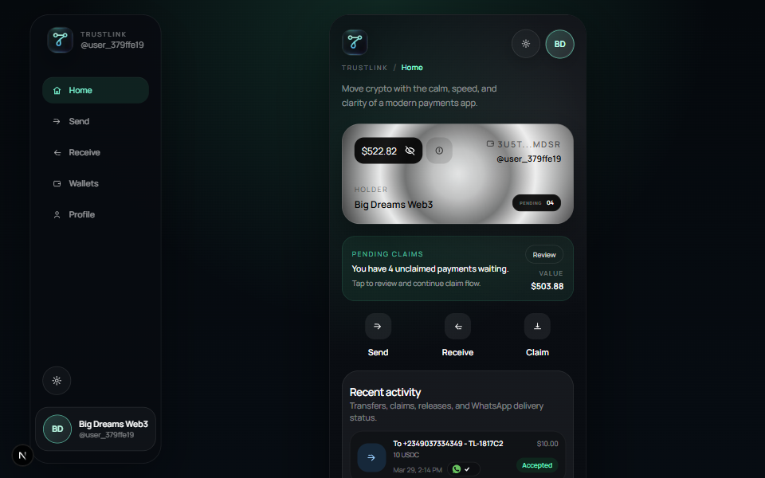
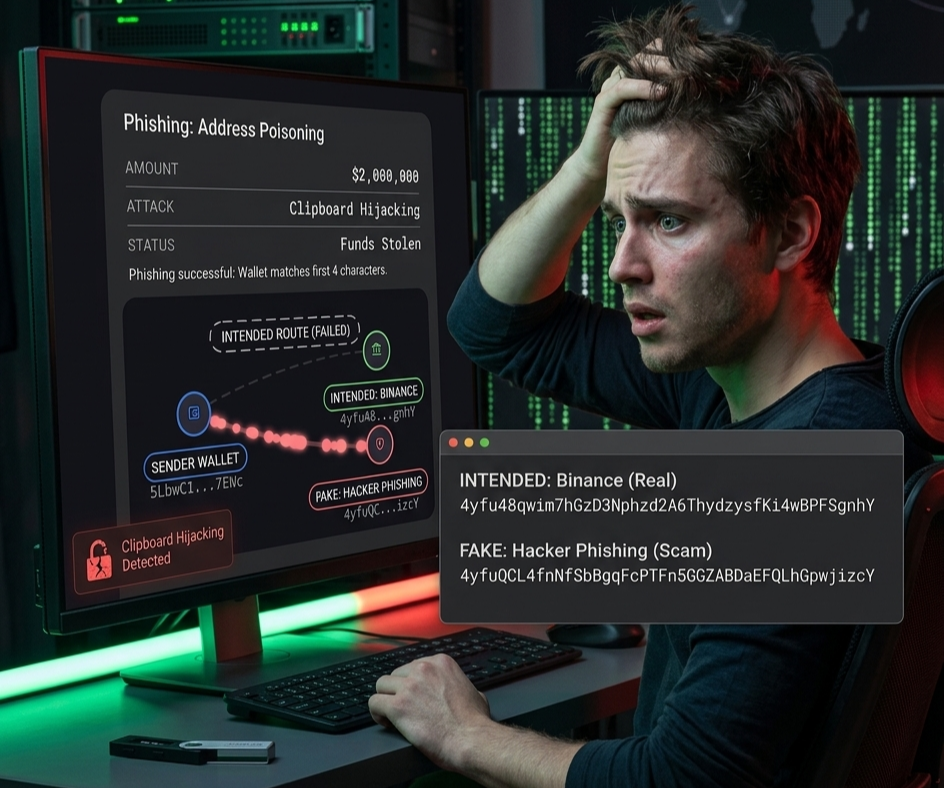
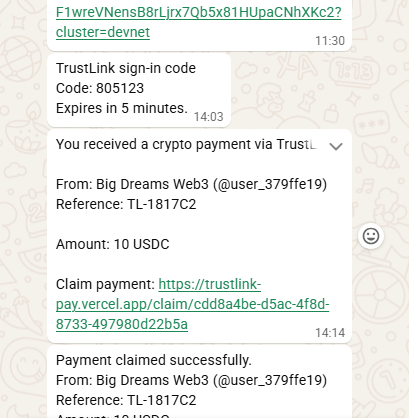
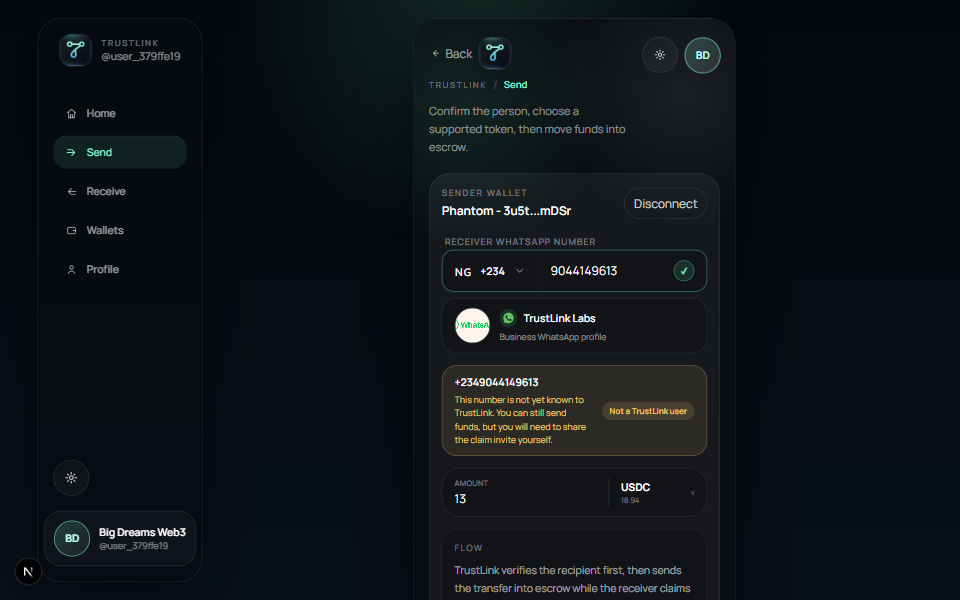
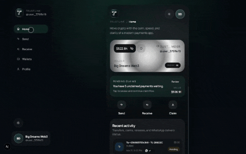
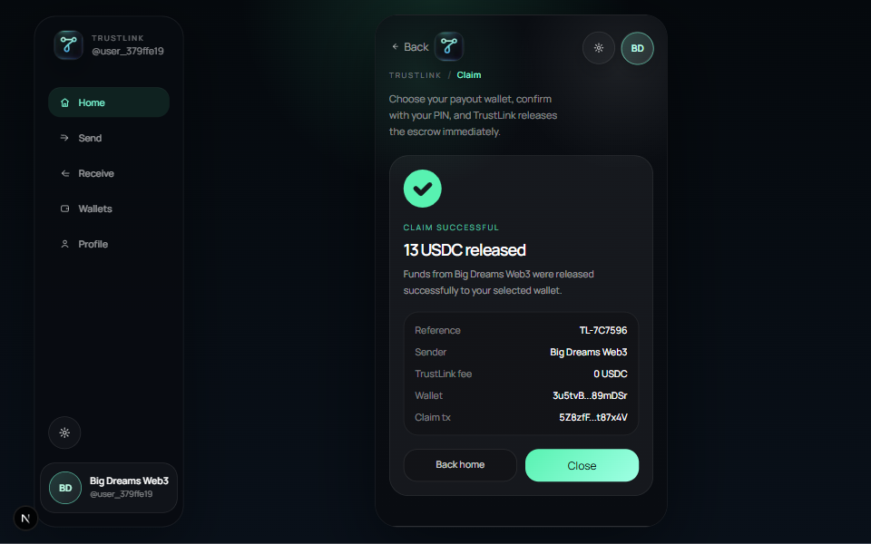

# TrustLink Pay

Send stablecoins on Solana to a WhatsApp number with the same confidence as a bank alert.

TrustLink Pay is a phone-number-first payment product built for real-world stablecoin transfers. Instead of forcing users to copy wallet addresses, TrustLink lets a sender choose a supported asset, enter a WhatsApp number, move funds into escrow, and let the recipient complete a guided claim flow.



_TrustLink Pay turns a WhatsApp number into a safer payment destination without making users think like blockchain operators first._

## Pitch

- [TrustLink Pay pitch video 60 seconds edition](https://youtube.com/shorts/9IH888rWwDo?si=Pe3-PPU3oUjhVezq)

- [TrustLink Pay pitch Pitch Deck](https://pitch.com/v/trustlink-pay-pitch-7d8h4e)

## Overview

TrustLink Pay combines:

- Solana escrow
- WhatsApp messaging and consent flow
- phone-number identity
- OTP verification
- in-app PIN protection
- sender-side delivery visibility
- gasless transaction UX for users

The result is a payment experience that feels closer to OPay, Paytm, or Pix than a traditional crypto dashboard.

## The Problem

Crypto payments are still difficult for normal users.

Wallet addresses are:

- long
- unreadable
- hard to verify visually
- easy to copy incorrectly

And blockchain transfers are irreversible, which means one small mistake can become a permanent loss.

In many markets such as Nigeria, India, and Brazil, users already trust phone-number-based payment flows. Crypto should feel that simple, but most products still require users to understand addresses and wallets before they can even send money safely.

### Real Example: Address Poisoning

On November 23, 2024 at 04:47 UTC, a Solana user reportedly lost $2.91 million after copying a fake address that looked almost identical to the intended address.



_Illustration: a user confused after losing funds by sending crypto to the wrong wallet address or falling victim to a scam._

- Intended: `4yfu48...gnhY`
- Fake: `4yfuQC...izcY`

References:

- [Solscan transaction](https://solscan.io/tx/T3vqZjMEi8MrJ34pwgnPG1ZjrFwygw6KYzij4Rt8dcFp2gZMqurHxC2Ta9gK7gELq2XXr4xpyotUYZryvQ2h5RP)
- [Article source](https://www.the-blockchain.com/2024/11/25/solana-user-losses-2-91million-in-an-address-poisoning-scam-are-these-scams-becoming-a-nightmare-for-crypto-users/)

## Our Solution

TrustLink Pay is a stablecoin payment system built on Solana that lets users send funds to a WhatsApp number instead of a wallet address.

The sender:

- logs in with a WhatsApp number
- completes OTP verification
- unlocks the app with a 6-digit PIN
- connects a Solana wallet
- verifies the recipient
- sends funds into escrow

The recipient:

- receives a TrustLink WhatsApp notification if they are registered and opted in
- or receives a personal invite from the sender if they are not yet onboarded
- signs in with their own WhatsApp number
- completes OTP and PIN setup
- claims the payment securely

TrustLink does not just route money. It creates identity confidence before the transfer and controlled release after the transfer.

TrustLink is designed for regions where users already trust phone-number-based payments. Instead of teaching users a new financial behavior, TrustLink keeps the familiar phone-number flow and upgrades the settlement rails underneath to stablecoins on Solana.

## Core Docs

- [Devnet testing guide](C:/Users/codepara/Desktop/trust-link/docs/devnet-testing.md)
- [Wallet roles](C:/Users/codepara/Desktop/trust-link/docs/wallet-roles.md)
- [Escrow V2 design](C:/Users/codepara/Desktop/trust-link/docs/escrow-v2-design.md)
- [Payment escrow architecture](C:/Users/codepara/Desktop/trust-link/docs/payment-escrow-architecture.md)

## Institutional Fit

TrustLink Pay is designed as compliance-aware payment infrastructure for stablecoin delivery and payout workflows. While the current MVP focuses on recipient delivery, escrow, and claims, the architecture is intended to support future layers such as:

- KYC onboarding
- KYT transaction screening
- AML monitoring workflows
- Travel Rule data handling
- verified payout destination controls
- fiat payout and off-ramp integrations

TrustLink already demonstrates:

- recipient-state handling before payout delivery
- escrow-backed payment control
- traceable payment references
- claim-based settlement instead of blind direct transfer
- privacy-aware transaction views

## Current Product Logic

TrustLink now operates with two recipient paths.

### 1. Registered and Opted-In TrustLink Recipients

If the recipient already has a TrustLink account and has opted in for WhatsApp messaging:

- TrustLink shows the sender a recipient identity preview
- the payment is created in escrow
- TrustLink sends the WhatsApp payment message
- the sender can see if the message was:
  - sent
  - delivered
  - seen
- the recipient opens the claim flow and completes release



_Registered recipients get a real TrustLink WhatsApp notification and the sender gets receipt visibility inside the app._

### 2. Unregistered or Not-Opted-In Recipients

If the recipient is not yet onboarded or has not opted in:

- the sender can still create the escrowed payment
- TrustLink does not automatically send a WhatsApp business message
- TrustLink generates a personal invite message written from the sender's perspective
- the sender shares that invite manually using WhatsApp, SMS, email, or copy/paste
- the invite can be regenerated later from activity and transaction detail pages until the recipient joins

This is the current compliance-safe messaging model in the product.

## Why WhatsApp

TrustLink uses WhatsApp as both a communication layer and a consent layer.

Why it matters:

- WhatsApp numbers are familiar identities
- users are already active there
- the first user action can happen in a tool they already trust
- onboarding can begin before a user ever understands wallets

TrustLink's WhatsApp bot currently handles:

- `START TRUSTLINK` opt-in flow
- inbound consent detection through webhooks
- OTP delivery after opt-in
- `STOP` opt-out handling
- payment notifications for eligible recipients
- delivery status updates for sender visibility

## How It Works

### Step 1: Phone-First Access

The user enters a WhatsApp number in TrustLink.

If the number is not opted in, TrustLink opens a prefilled WhatsApp message:

`START TRUSTLINK`

Once the webhook confirms the message, TrustLink issues an OTP.

After OTP success, the user still cannot use the app until they complete the in-app PIN gate.

### Step 2: In-App Security Layer

TrustLink adds a second layer of protection after OTP:

- new users create a 6-digit PIN inside the app
- returning users verify their existing PIN inside the app

This keeps app access protected even after successful WhatsApp verification.

### Step 3: Recipient Verification Before Send

Before money moves, TrustLink verifies the recipient state.

Possible states:

- registered TrustLink recipient
- partial TrustLink record not ready for active messaging
- manual invite required

That helps the sender understand whether the payment will trigger a direct TrustLink WhatsApp notification or require manual follow-up.



_TrustLink verifies the recipient before money moves so the sender gets clarity before confirming the transaction._

### Step 4: Escrowed Payment Creation

Once the sender confirms:

- the blockchain transaction is signed
- the payment is recorded with a reference code
- funds move into escrow
- TrustLink handles the correct notification path based on recipient state
- TrustLink sponsors the Solana gas so the user does not need SOL in their wallet


_The sender flow is built around identity confidence first, then escrow-backed payment creation._

### Step 5: Claim and Release

The recipient claims through TrustLink by:

- opening the claim link
- logging in with their WhatsApp number
- completing OTP and PIN requirements if needed
- selecting or confirming a wallet
- releasing the escrowed funds



_TrustLink guides the recipient from message to claim without exposing raw blockchain complexity._

### Step 6: Final Confirmation

After release, TrustLink shows a clear final state with trace details appropriate to the viewer.



_Both sender and receiver get a clear payment state, reference, and release confirmation._

## Key Features

### Phone Number Payments

TrustLink lets users send to a WhatsApp number instead of a wallet address.

### Stablecoin-Focused UX

TrustLink is designed around real payment use cases, not speculative token behavior.

### Smart Contract Escrow

Funds are held before release so recipient verification can happen safely.

### Gasless User Experience

TrustLink users do not need SOL to use the product.

- TrustLink pays Solana network fees through its verifier wallets
- sender-side fee is charged in the token being sent
- claim-side fee is charged in the token being claimed
- recoverable account rent is reclaimed by TrustLink when escrow vaults close

This keeps the product closer to a modern payment app than a typical wallet flow.

### Sender-Side Delivery Visibility

For registered recipients, senders can track whether the TrustLink WhatsApp message was sent, delivered, or seen.

### Manual Invite Regeneration

For unregistered recipients, the sender can regenerate and share the personal invite again later from transaction history.

### OTP + PIN Security

TrustLink uses WhatsApp OTP for identity confirmation and an in-app PIN for ongoing access control.

### Transaction Detail Pages

Each transaction can be opened into a full detail view with:

- payment reference
- viewer-safe trace information
- claim state
- delivery state
- privacy-aware sender and receiver visibility

### Hidden Referral Foundation

TrustLink now stores onboarding attribution in the backend when a recipient eventually joins through a received payment flow. This is not public yet, but it creates the basis for future referral rewards and ranking systems.

## Privacy and Trust Model

TrustLink is designed to make payments traceable without exposing private details to the wrong party.

Receivers do not normally see:

- the sender's wallet address
- the sender's full personal phone number

Receivers do see:

- sender display name
- sender handle
- payment reference
- release state
- TrustLink verification cues

Deeper trace data is stored internally for compliance and support, not casual recipient access.

## Architecture

### Frontend

- Next.js
- TypeScript
- mobile-first sender, receive, claim, activity, wallet, settings, and transaction detail UI

### Backend

- Next.js App Router backend
- TypeScript services and route handlers
- Neon/Postgres persistence
- OTP orchestration
- WhatsApp webhook handling
- payment notification retry logic

### Blockchain Layer

- Solana
- Anchor-based escrow workspace
- live escrow funding, claim release, fee charging, and expiry sweep support

### Messaging Layer

- WhatsApp Business API
- webhook-driven inbound opt-in detection
- outbound payment messaging for eligible recipients
- sender receipt-state tracking

## Why This Matters For Solana

TrustLink lowers one of the biggest UX barriers to stablecoin adoption on Solana: address-based payments.

By replacing wallet addresses with a familiar phone-number identity layer, TrustLink makes stablecoin transfers more understandable for:

- cross-border payments
- remittances
- payroll
- merchant payments
- first-time crypto users

This is especially important in markets where phone-number payments are already a trusted mental model.

## Current Status

TrustLink currently includes:

- phone-first WhatsApp auth
- webhook-based opt-in and opt-out
- OTP verification
- in-app PIN gating
- recipient verification before send
- escrow-backed payment creation
- gasless send and claim UX for users
- sender receipt-state indicators
- manual invite flow for unregistered recipients
- full transaction detail pages
- backend referral attribution groundwork

## Repository Structure

- [backend](backend/README.md)
- [docs/devnet-testing.md](docs/devnet-testing.md)
- [docs/wallet-roles.md](docs/wallet-roles.md)
- [frontend](frontend/README.md)
- [public](public/README.md)

## Quick Start

### Backend

```bash
cd backend
npm install
npm run db:init
npm run dev
```

### Frontend

```bash
cd frontend
npm install
npm run dev
```

## Devnet Testing

For testers, judges, and new contributors who need Devnet SOL, allowlisted test tokens, and the current TrustLink escrow test flow:

- [Devnet Testing Guide](docs/devnet-testing.md)
- [Wallet Roles Guide](docs/wallet-roles.md)

## Local Verification Scripts

```bash
cd backend
npm run test:auth-phone-flow
npm run test:recipient-lookup
npm run test:payment-flow
```

## Closing Pitch

TrustLink Pay is not just a wallet UI with a messaging layer attached.

It is a payment trust system for stablecoins:

- identify the person with a phone number
- confirm consent through WhatsApp
- secure access with OTP and PIN
- move funds into escrow
- release only after the recipient completes the right claim path

That is how crypto starts feeling usable for everyday payments.
