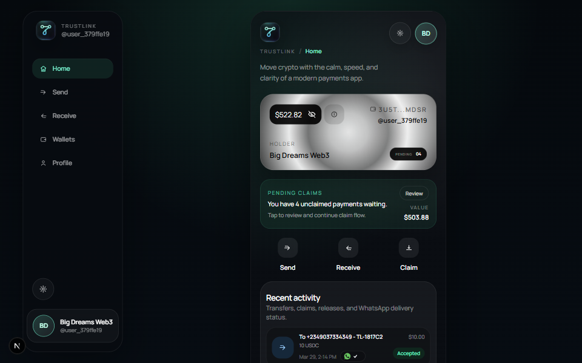
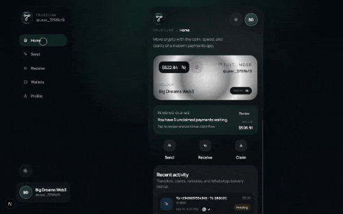

# TrustLink Pay

> Send stablecoins on Solana to a WhatsApp phone number with the same confidence as a bank alert.

TrustLink Pay is a phone-number-first, noncustodial stablecoin payment dApp on Solana. Instead of pasting wallet addresses, senders enter a WhatsApp number, funds move into a per-payment escrow, and the recipient completes a guided claim flow.

TrustLink Pay team is also building **TINS**: the **Transfer Identity Number System**, an open on-chain registry and escrow routing program for Solana. TINS is the protocol track that moves identity-based routing beyond TrustLink Pay's app database and into a native blockchain system other Solana developers can integrate directly.

Milestone 4 adds the first version of the **Transfer Settlement Network (TSN)**: a Proof of Payment layer where independent Crankers can claim payment execution leases, settle receiver claims from PDA-held liquidity, submit proof on-chain, and get reimbursed in settlement epochs.



## Pitch Links

- [Pitch video - 60 seconds](https://youtube.com/shorts/9IH888rWwDo?si=Pe3-PPU3oUjhVezq)
- [Pitch Deck Slides](https://pitch.com/v/trustlink-pay-pitch-7d8h4e)

---

## Testing Proof (Devnet)

We treat documentation as proof of testing. The most recent end-to-end TSN devnet run (including the exact commands we ran, what failed, why it failed, and the correct approach) is documented in:

- `docs/devnet-testing.md`

## The Problem

### Wallet addresses are a UX catastrophe

A Solana address (`4yfu48GhqFBMDrHJr9VBnGMDHJr9VBnGMDHJr9gnhY`) is 44 random characters: impossible to memorise, trivial to mistype, and irreversible if wrong.

### Address poisoning is real

On 23 Nov 2024 a user lost **$2.91 M** by copying a lookalike address seeded into their transaction history. TrustLink eliminates this: the sender never sees a wallet address.

### Crypto isn't accessible yet

Hundreds of millions of people in Nigeria, India, Brazil, and Southeast Asia already pay with phone numbers (UPI, Pix, OPay). TrustLink keeps that familiar UX and upgrades settlement to stablecoins on Solana.

---

## The Solution

TrustLink Pay replaces "paste a wallet string" with:

- **Pay a phone number** the sender already knows
- **Confirm a verified identity** through TrustLink and WhatsApp signals
- **Lock funds in escrow** using per-payment Solana PDAs
- **Request claim without requiring SOL** from the recipient
- **Settle through Crankers** in Milestone 4, so claim requests can be fulfilled by a decentralized execution layer

### TINS: The On-Chain Program Track

Alongside the live TrustLink Pay product, the team is building TINS as a blockchain-native identity and payment-routing layer.

TINS is designed to:

- create permanent transfer identities on Solana
- issue a 10-digit transfer number that behaves like an account number
- route incoming funds into escrow instead of directly exposing a visible receiving wallet
- allow any Solana builder to call the program without depending on the TrustLink Pay database

This matters because TrustLink Pay today proves the user experience, while TINS is the protocol layer that turns identity-based transfer routing into a reusable on-chain primitive.

### TSN: Proof Of Payment Settlement

Milestone 4 introduces TSN, the settlement layer that sits beside the existing escrow flow.

TSN adds:

- Mother Escrow as the accounting root
- PaymentIntent records for escrowed payments
- DB-only ClaimRequest ledger for M4 testing
- Cranker PDA registration and DNA verification
- 30-second atomic lease claiming
- Proof of Payment submission
- encrypted local Cranker ledger
- future settlement epochs for reimbursement and fee sharing

In plain English: the sender still locks money into TrustLink escrow, but the receiver's claim can now become a request that a Cranker processes. The Cranker pays the receiver from a program-controlled Cranker vault, proves it, and gets reimbursed later.

### WhatsApp's Role

| Layer               | Purpose                                           |
| ------------------- | ------------------------------------------------- |
| Identity proxy      | Route payments by phone number, not raw addresses |
| Business confidence | Surface verified merchant identity to senders     |
| Notifications       | Payment sent / received / ready-to-claim alerts   |
| Authentication      | OTP + session-code verification                   |

WhatsApp is the identity and notification layer. TrustLink Pay is not a WhatsApp chat app or custodial wallet.

---

## How It Works

### Send Flow


1. Sender logs in and enters recipient WhatsApp number plus amount.
2. TrustLink verifies recipient identity before money moves.
3. Sender confirms and wallet signs.
4. Funds enter a unique escrow vault PDA.
5. Backend records a TSN payment intent when TSN is enabled.
6. Recipient gets a WhatsApp notification or sender shares an invite link.
7. TrustLink sponsors Solana gas fees for the app flow where possible.

### Claim Flow Before TSN



1. Recipient opens TrustLink, verifies WhatsApp OTP, and sets PIN.
2. Recipient connects a Solana wallet.
3. Existing direct claim path prepares and signs an escrow release transaction.
4. Escrow releases directly to the recipient wallet.
5. Escrow account closes and rent returns to TrustLink.

### Claim Flow With TSN (Milestone 4)

1. Recipient opens TrustLink, connects wallet, and confirms PIN.
2. Frontend sends a claim request to the backend.
3. Backend records a DB-only `claim_request`; no Solana fee is paid for the request.
4. A Cranker sees a matching `payment_intent + claim_request`.
5. Cranker calls `tsn_claim_intent()` to acquire the lease.
6. Cranker pays the receiver from the Cranker PDA vault liquidity.
7. Cranker calls `tsn_submit_proof()` to record Proof of Payment.
8. The encrypted Cranker ledger records the private settlement details.
9. Epoch settlement later reimburses the Cranker and distributes fees.

---

## Security Model

### Core Guarantees

| Property                     | How                                                                 |
| ---------------------------- | ------------------------------------------------------------------- |
| Noncustodial                 | TrustLink never holds user funds or private keys                    |
| Per-payment isolation        | Each payment gets its own escrow vault PDA                          |
| Replay prevention            | On-chain nonce bitmask; consumed nonces cannot reuse                |
| Derivation proof             | Master key binds child key to escrow + nonce + expiry + destination |
| Front-run resistance         | Destination hash checked before transfer                            |
| Address poisoning eliminated | Sender never sees a wallet address                                  |
| Cranker exclusivity          | Only one Cranker can hold a valid lease for an intent               |
| Proof-based settlement       | Cranker reimbursement requires a submitted proof                    |

### Key Architecture (v3 Hardened)

- **Ephemeral child keys** derived from a master privacy key per payment
- **Derivation proofs** verified on-chain via Ed25519 sysvar introspection
- **Nonce-consumption PDAs** for O(1) replay prevention
- **Destination-hash binding** at escrow creation, so destination cannot change after the fact
- **Auto-claim path** via crank for expired escrows

### TSN Security Additions

- Cranker PDA must inherit protocol DNA from Mother Escrow
- payment intent can only be in one state at a time
- lease claiming is an atomic on-chain state transition
- claim requests stay off-chain in M4 so receivers do not pay network fees
- Cranker ledger encrypts sensitive receiver and sender settlement data
- future slashing and reputation will punish failed or malicious Crankers

### Threat Model

| Threat                   | Defense                                                                   |
| ------------------------ | ------------------------------------------------------------------------- |
| Forged child key         | Program requires derivation proof signed by master key + child hash match |
| Replayed signature       | On-chain nonce consumed; reuse fails                                      |
| Destination swap         | Destination bound in signed payload; mismatch rejected                    |
| Operator custody         | Escrow requires valid user proofs; platform cannot author claims          |
| Duplicate Cranker payout | One on-chain lease holder per intent                                      |
| Fake Cranker PDA         | DNA hash verification against Mother Escrow                               |
| Claim spam               | DB ledger first in M4; stake/slashing planned for production TSN          |

---

## Gasless And Fee Model

No SOL required for ordinary senders or recipients:

- Sender pays a simple visible fee in the token being sent
- Receiver claim request is free in M4 because it is DB-only
- TrustLink sponsors app-side network fees where needed
- Crankers pay their own lease/proof fees and recover them later
- Epoch settlement batches many reimbursements into one settlement action

Milestone 4 internal fee target:

| Share | Receiver                  |
| ----- | ------------------------- |
| 70%   | Cranker reward            |
| 20%   | Liquidity provider reward |
| 10%   | TrustLink treasury        |

The recipient should receive the intended amount. Fees should be simple enough to feel better than banks, not more confusing.

## Sender Delivery Visibility

Real-time WhatsApp delivery receipts: **Sent -> Delivered -> Seen**. The goal is the same emotional confidence as a bank alert.

---

## Architecture

```text
+------------------+------------------+---------------------------+
| Frontend         | Backend          | Blockchain                |
| Next.js 15       | Node.js          | Solana + Anchor           |
| React 19         | Next.js API      | SPL Token Program         |
| Tailwind v4      | Postgres DB      | Ed25519 Program           |
| Send / Claim UI  | TSN claim ledger | Escrow + TSN PDAs         |
|                  | WhatsApp API     | Mother Escrow / Cranker   |
+------------------+------------------+---------------------------+
```

### Identity Layer

Phone -> SHA-256 hash -> `IdentityBinding` PDA -> WhatsApp OTP -> in-app PIN -> master privacy key -> ephemeral child keys.

### Escrow Layer (v3)

`EscrowV3` PDA seeded by `child_hash + nonce + mint`, Ed25519 derivation proofs, bitmask nonce PDAs, destination-hash binding, and auto-claim support.

### TSN Layer (M4)

`MotherEscrow`, `Cranker`, and `PaymentIntent` accounts add deterministic settlement rights and Proof of Payment records. The `claim_requests` table stays in Postgres for M4 so receiver requests are free and fast.

---

## TINS In This Workspace

The Transfer Identity Number System is being developed in this workspace as a dedicated program track:

- [TINS Overview](<transfer-identity-number-system-(TINS)/README.md>)
- [TINS Phase 1 Scope](<transfer-identity-number-system-(TINS)/docs/phase-1-scope.md>)
- [TINS Change Log vs SNS](<transfer-identity-number-system-(TINS)/docs/tins-change-log.md>)

Why auditors, investors, and ecosystem partners should care:

- TrustLink Pay already proves demand for identity-first stablecoin transfers
- TINS moves identity routing toward a fully on-chain registry and escrow routing system
- the TINS program follows an SNS-derived Solana registry structure
- the long-term goal is to let TrustLink Pay and third-party Solana apps use the same transfer identity system

---

## Authentication

TrustLink uses WhatsApp-based, session-code authentication:

1. **Session code generated** (for example `TLXXXXXX`, expires in 5 min)
2. **User sends code via WhatsApp** and the app verifies in real time with SSE plus polling fallback
3. **PIN setup / verify** adds a 6-digit second factor
4. **Wallet connection** proves ownership for send, claim, and identity actions

Device-aware: mobile gets a direct WhatsApp link; desktop gets a QR code.

---

## Milestones

### Milestone 1: StableHacks 2026 - Programmable Stablecoin Payments

[StableHacks 2026](https://dorahacks.io/hackathon/stablehacks/detail)

TrustLink Pay was built and submitted for **StableHacks 2026**, a global hackathon for institutional-grade stablecoin infrastructure on Solana, organized by [Tenity](https://dorahacks.io/org/14594/hackathon).

**Track:** Programmable Stablecoin Payments

**What was built:**

- Noncustodial per-payment escrow on Solana (v2 + v3 hardened architecture)
- Phone-number-first identity layer with WhatsApp verification
- Gasless send and claim UX
- WhatsApp Business identity verification for merchant payments
- Delivery receipts (sent / delivered / seen)
- Hardened v3 escrow with Ed25519 derivation proofs and replay prevention
- Compliance-aware architecture

---

### Milestone 2: The Bags Hackathon - Creator Token Payments

[The Bags Hackathon](https://dorahacks.io/hackathon/the-bags-hackathon/detail)

TrustLink integrates with the [Bags SDK](https://docs.bags.fm/) to support **creator token payments via phone number**, making TrustLink the first dApp where any Bags creator token can be sent to a WhatsApp number with noncustodial escrow.

**Track:** Payments - _"Enable real-world and peer-to-peer payment flows using creator tokens on Solana."_

**Three payment modes:**

| Mode          | Sender pays | Recipient gets | Use case                                |
| ------------- | ----------- | -------------- | --------------------------------------- |
| Stablecoin    | USDC        | USDC           | Standard payments, remittances          |
| Creator token | `$CREATOR`  | `$CREATOR`     | Community tipping, token distribution   |
| Cross-token   | `$CREATOR`  | USDC           | Real-world payments with creator tokens |

**Integration:** [Trade Quote API](https://docs.bags.fm/api-reference/get-trade-quote), [Swap API](https://docs.bags.fm/api-reference/create-swap-transaction), [Bags Pools](https://docs.bags.fm/api-reference/get-bags-pools)

**Milestone 2 token:** `$OOPS` on [Bags](https://bags.fm/)

`$OOPS` is TrustLink Pay's community invite and reward token for the Bags milestone. It is not the main TrustLink network token. It is a meme-driven growth token built around one of crypto's most relatable payment failures: sending funds to the wrong wallet address.

**How `$OOPS` fits TrustLink Pay:**

- Rewards users for inviting new people into TrustLink Pay
- Gives the community a fun, social token tied to a real payments pain point
- Turns "wrong address" anxiety into a viral story that points back to TrustLink Pay as the fix
- Supports referral campaigns, onboarding rewards, and community participation as the product grows

---

### Milestone 3: TINS - Transfer Identity Number System

TrustLink Pay is actively developing **TINS**, a blockchain-native identity, escrow, and transfer-routing program for Solana.

**What TINS adds:**

- Permanent 10-digit transfer identities
- On-chain registry-based identity lookup
- Escrow-first receiving designed to keep visible wallets out of the public payment path
- A protocol direction that reduces dependence on TrustLink Pay's own database for identity routing

**Why this matters:**

- It expands TrustLink Pay from product experience into protocol infrastructure
- It gives other Solana developers a path to integrate the same identity-routing system directly on-chain
- It signals that the team is building long-term payment privacy infrastructure, not only a single consumer app flow

**Track documentation:**

- [TINS Overview](<transfer-identity-number-system-(TINS)/README.md>)
- [Phase 1 Scope](<transfer-identity-number-system-(TINS)/docs/phase-1-scope.md>)
- [Change Log](<transfer-identity-number-system-(TINS)/docs/tins-change-log.md>)

---

### Milestone 4: TSN - Proof Of Payment Settlement Network

Milestone 4 upgrades TrustLink Pay from only an escrow app into the first version of a decentralized settlement execution network.

**What M4 adds:**

- Mother Escrow settlement authority
- PaymentIntent records mapped to real TrustLink escrow payments
- DB-only ClaimRequest ledger for receiver claim requests
- Cranker PDA registration
- Cranker DNA verification
- lease-based claim rights
- Proof of Payment submission
- encrypted local Cranker ledger
- frontend support for TSN claim queueing
- backend scripts for Mother Escrow setup, Cranker setup, and local Cranker execution

**Current M4 behavior:**

- sending a payment still locks funds in the existing escrow PDA
- if `TSN_ENABLED=true`, backend creates a TSN payment intent after escrow confirmation
- receiver claim creates a `claim_request` instead of immediately releasing escrow
- Cranker watches pending work, claims the lease, submits proof, and records encrypted ledger data

**What remains next:**

- real SPL token payout from Cranker PDA vault liquidity
- deeper LP share/reward accounting on top of vault positions
- LP share accounting
- slashing and reputation
- 7-hour epoch reimbursement
- Arweave/Irys archival for permanent claim and settlement records

---

## Current Status

- WhatsApp OTP authentication + session codes
- Recipient identity verification before send
- Per-payment escrow creation + gasless UX
- Delivery receipts (sent / delivered / seen)
- Manual invite flow for unregistered recipients
- WhatsApp Business identity verification
- Hardened v3 escrow with derivation proofs
- In-app PIN security gating
- TINS Phase 1 architecture and program track
- TSN Milestone 4 settlement scaffold
- DB claim request ledger
- Cranker PDA vault funding with per-funder withdrawal positions
- Cranker setup and local daemon scripts
- Frontend claim flow updated for TSN queueing

---

## Repository Structure

| Path                                     | Description                                                |
| ---------------------------------------- | ---------------------------------------------------------- |
| `backend/programs/trustlink-escrow`      | Anchor escrow program (v2 + v3 + TSN M4)                   |
| `backend/app/blockchain/solana-tsn.ts`   | TSN transaction builders                                   |
| `backend/app/db/schema.sql`              | Core DB schema plus TSN ledgers                            |
| `backend/scripts/tsn-setup.ts`           | Mother Escrow and Cranker setup                            |
| `backend/scripts/tsn-cranker.ts`         | Local Cranker daemon                                       |
| `backend/app/lib/privacy-keys.ts`        | Privacy key derivation + proofs                            |
| `frontend`                               | Next.js 15 frontend                                        |
| `cranker-sdk`                            | Standalone Cranker SDK scaffold                            |
| `docs/`                                  | Architecture, escrow, TSN, wallet roles, and testing docs  |
| `transfer-identity-number-system-(TINS)` | TINS program track and SNS-derived registry evolution work |

## Quick Start

```bash
# Backend
cd backend
npm install
tsx scripts/init-db.ts
npm run dev

# Frontend
cd frontend
npm install
npm run dev
```

Open:

```text
http://localhost:3001
```

## Milestone 4 Setup

Set these in `backend/.env.local`:

```bash
TSN_ENABLED=true
TSN_CREATE_INTENTS_ONCHAIN=true
TSN_CRANKER_KEYPAIR_PATH=./cranker-keypair.json
```

Deploy and initialize from Ubuntu or any environment where Anchor works:

```bash
cd backend
anchor deploy
tsx scripts/tsn-setup.ts init-mother
tsx scripts/tsn-setup.ts register-cranker
tsx scripts/tsn-setup.ts init-vault <TOKEN_MINT>
```

Run the local Cranker:

```bash
cd backend
tsx scripts/tsn-cranker.ts
```

Check pending Cranker work:

```bash
curl http://localhost:3000/api/intents/pending
curl http://localhost:3000/api/tsn/work/pending
```

## Funding A Cranker

The Cranker operator wallet does not custody pooled liquidity. It only signs lease/proof transactions.

Liquidity is held by a Cranker PDA vault. Each funder gets a `LiquidityPosition` PDA, and only the same funder wallet can withdraw that wallet's available principal.

```bash
cd backend
tsx scripts/tsn-setup.ts init-vault <TOKEN_MINT>
tsx scripts/tsn-setup.ts fund-cranker <TOKEN_MINT> <FUNDER_KEYPAIR_PATH> <FUNDER_TOKEN_ACCOUNT> <AMOUNT_BASE_UNITS>
tsx scripts/tsn-setup.ts withdraw-cranker <TOKEN_MINT> <FUNDER_KEYPAIR_PATH> <FUNDER_TOKEN_ACCOUNT> <AMOUNT_BASE_UNITS>
```

The operator keypair at `TSN_CRANKER_KEYPAIR_PATH` still needs SOL for Cranker transactions, but it should not hold community liquidity.

## Epoch Settlement

Default TSN epoch is 7 hours (`25200` seconds) and is enforced by `tsn_settle_epoch`.

For test environments, operator can run:

```bash
cd backend
tsx scripts/tsn-setup.ts settle-epoch --force
```

For production-like timing checks:

```bash
cd backend
tsx scripts/tsn-setup.ts settle-epoch
```

## Milestone 4 Test Evidence

The current codebase has validated these behaviors on devnet:

1. Cranker vault funded via PDA, not operator custody.
2. Cranker claim + proof path executes successfully for new intents.
3. Recipient token balance increases after Cranker proof.
4. Vault token balance decreases after payout.
5. Funder wallet can withdraw its own principal.
6. Non-funder wallet is denied withdraw access (no valid `LiquidityPosition` for that wallet).

## Testing

```bash
cd backend
npm run test:auth-phone-flow
npm run test:payment-flow
```

See [docs/devnet-testing.md](docs/devnet-testing.md) for devnet SOL, test tokens, TSN setup, and end-to-end Cranker testing.

---

**TrustLink Pay** - crypto payments that feel as familiar as a bank alert, settled noncustodially on Solana and moving toward decentralized Proof of Payment settlement.
