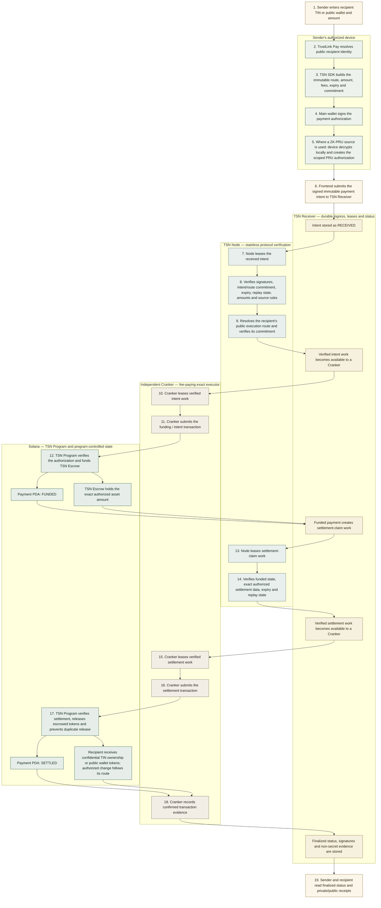

# TrustLink Labs / TrustLink Pay

TrustLink Labs is building the **Transfer Settlement Network (TSN)**: an
identity-aware payment coordination and settlement infrastructure that runs on
Solana. TrustLink Pay is the application experience built on that network.

## TrustLink Labs resources

- [TrustLink Pay live application](https://trustlink-pay.vercel.app/)
- [TSN Protocol research blog](https://tsn-protocol.blogspot.com/)
- [TrustLink Labs GitHub organization](https://github.com/Trustlink-Labs)
- [TrustLink Pay source repository](https://github.com/bigdreamsweb3/trustlink-pay)

TSN is not a new blockchain and it is not one smart contract. It combines
identity, recipient discovery, protected receiving and spending, authorization,
payment intents, an application-level work queue, transaction execution,
escrow, settlement, receipts, replay protection, and recovery tracking.

## A finalized TSN payment

TSN settlement has two separate on-chain submissions. The first funds a
program-controlled TSN Escrow and records a payment as `FUNDED`. The second
releases the already-authorized payment from that escrow and records it as
`SETTLED`. The Receiver is the durable ingress and work/status surface; the
TSN Node verifies work; a Cranker pays Solana fees and submits the exact work
that was verified. Neither the Node nor a Cranker receives a user's private
keys or decrypted ZK-PRU master material.

```mermaid
flowchart TD
    A["1. Sender enters recipient TIN or public wallet and amount"]

    subgraph DEVICE["Sender's authorized device"]
        B["2. TrustLink Pay resolves public recipient identity"]
        C["3. TSN SDK builds the immutable route, amount, fees, expiry and commitment"]
        D["4. Main wallet signs the payment authorization"]
        E["5. Where a ZK-PRU source is used: device decrypts locally and creates the scoped PRU authorization"]
    end

    F["6. Frontend submits the signed immutable payment intent to TSN Receiver"]

    subgraph RECEIVER["TSN Receiver — durable ingress, leases and status"]
        G["Intent stored as RECEIVED"]
        H["Verified intent work becomes available to a Cranker"]
        O["Funded payment creates settlement-claim work"]
        R["Verified settlement work becomes available to a Cranker"]
        X["Finalized status, signatures and non-secret evidence are stored"]
    end

    subgraph NODE["TSN Node — stateless protocol verification"]
        I["7. Node leases the received intent"]
        J["8. Verifies signatures, intent/route commitment, expiry, replay state, amounts and source rules"]
        K["9. Resolves the recipient's public execution route and verifies its commitment"]
        P["13. Node leases settlement-claim work"]
        Q["14. Verifies funded state, exact authorized settlement data, expiry and replay state"]
    end

    subgraph CRANKER["Independent Cranker — fee-paying exact executor"]
        L["10. Cranker leases verified intent work"]
        M["11. Cranker submits the funding / intent transaction"]
        S["15. Cranker leases verified settlement work"]
        T["16. Cranker submits the settlement transaction"]
        W["18. Cranker records confirmed transaction evidence"]
    end

    subgraph SOLANA["Solana — TSN Program and program-controlled state"]
        N["12. TSN Program verifies the authorization and funds TSN Escrow"]
        N1["Payment PDA: FUNDED"]
        N2["TSN Escrow holds the exact authorized asset amount"]
        U["17. TSN Program verifies settlement, releases escrowed tokens and prevents duplicate release"]
        V["Payment PDA: SETTLED"]
        Y["Recipient receives confidential TIN ownership or public wallet tokens; authorized change follows its route"]
    end

    Z["19. Sender and recipient read finalized status and private/public receipts"]

    A --> B --> C --> D --> E --> F
    F --> G --> I --> J --> K --> H --> L --> M --> N
    N --> N1
    N --> N2
    N1 --> O
    N2 --> O
    O --> P --> Q --> R --> S --> T --> U
    U --> V
    U --> Y
    V --> W
    Y --> W
    W --> X --> Z

    classDef device fill:#edf3ec,stroke:#284c36,color:#17251b;
    classDef receiver fill:#f6f0df,stroke:#8b7131,color:#30240d;
    classDef node fill:#e9efed,stroke:#4e6e60,color:#14241c;
    classDef cranker fill:#f2eee6,stroke:#6b6254,color:#211f1a;
    classDef chain fill:#e7eee9,stroke:#1f5038,color:#10251a;
    classDef outcome fill:#fbf6e9,stroke:#8b7131,color:#30240d;
    class B,C,D,E device;
    class G,H,O,R,X receiver;
    class I,J,K,P,Q node;
    class L,M,S,T,W cranker;
    class N,N1,N2,U,V,Y chain;
    class A,F,Z outcome;
```

The first on-chain signature proves that the payment was authorized and
funded; it is not the recipient settlement. A payment is finalized only after
the separate settlement transaction succeeds and the Payment PDA is `SETTLED`.

## Core terms

- **TSN:** the complete payment coordination and settlement network.
- **TIN:** a 10-digit Transfer Identity Number used to discover an authorized
  payment route without exchanging a normal wallet address.
- **ZK-PRU:** TSN's protected receiving and spending subsystem. It uses
  device-local encrypted derivation material, scoped child authorities, and
  policy-driven receiving/spending routes.
- **TSN SDK:** the local planner and authorization layer that creates the
  immutable payment route.
- **TSN Receiver:** the Firebase-backed ingress, durable work queue, leases,
  and status-read service.
- **TSN Node:** the stateless off-chain protocol verifier and processor. It
  leases received work and returns verified or rejected evidence.
- **Cranker:** an independent fee-paying executor that submits already
  authorized transactions. It does not receive user private keys or replan a
  payment.
- **TSN Program:** the Solana program that verifies authorization and state and
  performs the enforced token movement.
- **TSN Escrow:** a program-controlled vault that temporarily holds funded
  assets between funding and settlement.

Solana validators provide transaction execution, ordering, consensus, and
finality. They are not TSN Nodes or Crankers. TSN uses Solana; it does not
replace Solana consensus.

## Supported routes

1. Native TIN-to-TIN: protected ZK-PRU source to protected ZK-PRU destination.
2. Wallet-to-TIN: public wallet source to protected TIN destination.
3. TIN-to-wallet: protected source route to a public wallet exit.
4. Wallet-to-wallet: public compatibility settlement.

The full two-stage lifecycle and diagrams are in
[TSN Transaction Explorer](./docs/tsn-transaction-explorer.md).

## Start reading

- [Protocol architecture](./docs/protocol-architecture.md)
- [Identity and TIN](./docs/identity-and-tin.md)
- [ZK-PRU](./docs/zk-pru.md)
- [Network and runtime](./docs/network-and-runtime.md)
- [Security model](./docs/security-model.md)
- [Operations and testing](./docs/operations-and-testing.md)
- [Security](./docs/SECURITY.md)
- [Metadata use and compliance](./docs/META-DATA-USE-COMPLIANCE.md)
- [TSN Private View Lit architecture](./docs/tsn-private-view-lit.md)

## Status boundaries

The TSN Node, SDK, Cranker, TSN Program, and TSN Escrow are the active runtime
architecture. Recurring payments remain disabled. TCAP is a separate
experimental confidential-asset direction, not the current settlement actor.
Formal zero-knowledge proofs are not claimed unless the implementation and
verification evidence are present.

TrustLink Pay is experimental software. Always verify program IDs, cluster,
wallet authority, and transaction evidence before using Devnet.
