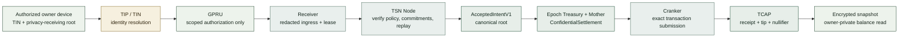

# TrustLink Pay / TSN

TrustLink Labs is building **TSN (Transfer Settlement Network)**, an
identity-aware payment coordination and settlement infrastructure on Solana.
TrustLink Pay is the application experience built on that network. **TCAP
(Transfer Confidential Asset Protocol)** provides the commitment-backed private
balance accounting used by the current credit architecture.

## TrustLink Labs resources

- [TrustLink Pay application](https://trustlink-pay.vercel.app/)
- [TSN Protocol research blog](https://tsn-protocol.blogspot.com/)
- [TrustLink Labs GitHub organization](https://github.com/Trustlink-Labs)
- [Service hosting and deployment map](docs/SERVICE-HOSTING.md)
- [Live testing and contributor guide](docs/GETTING-STARTED-LIVE.md)
- [Cranker operator guide](docs/CRANKER-OPERATOR-GUIDE.md)
- [Receiver, Node and settlement verification](docs/tsn-receiver-verification-settlement.md)

TSN coordinates identity resolution, signed payment intents, redacted Receiver
work, Node verification, leases, Epoch Treasury liability, Mother authorization
and exact transaction submission. TCAP consumes the authorized credit receipt,
advances a tip commitment and supports an owner-private encrypted snapshot.

## The current TrustLink credit path

The active receiving and credit architecture is:

```text
TIN identity
  -> privacy-receiving root
  -> GPRU authorization and routing (non-custodial)
  -> TSN Epoch Treasury coordination
  -> Mother / TSN ConfidentialSettlement authorization
  -> TCAP tip credit
  -> encrypted private balance snapshot
  -> owner-device private balance read
```


```mermaid
flowchart LR
    A["Authorized owner device<br/>TIN + privacy-receiving root"]
    B["TIP / TIN<br/>identity resolution"]
    C["GPRU<br/>scoped authorization only"]
    D["Receiver<br/>redacted ingress + lease"]
    E["TSN Node<br/>verify policy, commitments, replay"]
    F["AcceptedIntentV1<br/>canonical root"]
    G["Epoch Treasury + Mother<br/>ConfidentialSettlement"]
    H["Cranker<br/>exact transaction submission"]
    I["TCAP<br/>receipt + tip + nullifier"]
    J["Encrypted snapshot<br/>owner-private balance read"]

    A --> B --> C --> D --> E --> F --> G --> H --> I --> J

    classDef device fill:#edf3ec,stroke:#284c36,color:#17251b;
    classDef identity fill:#f6f0df,stroke:#8b7131,color:#30240d;
    classDef service fill:#e9efed,stroke:#4e6e60,color:#14241c;
    classDef chain fill:#e7eee9,stroke:#1f5038,color:#10251a;
    classDef private fill:#fbf6e9,stroke:#8b7131,color:#30240d;
    class A,C,J device;
    class B identity;
    class D,E,H service;
    class F,G,I chain;
```

The device authorizes the intent and retains private roots and snapshot keys.
The Receiver and Node coordinate only the redacted work required for
verification. TSN creates and checks the AcceptedIntent record, Mother binds
the one-time settlement authorization, and a Cranker submits the exact
transaction. TCAP validates the receipt and atomically consumes the receipt and
nullifier while advancing the tip. The owner device then verifies and decrypts
the matching snapshot.

## Core terms and authority boundaries

- **TSN:** Transfer Settlement Network, coordinating authorization, leases,
  epoch liability and settlement execution.
- **TIN:** Transfer Identity Number, a 10-digit identity and route-discovery
  handle; it is not a private key, token account or balance.
- **TIP:** Transfer Identity Protocol and the Transfer Identity stack that
  issues and resolves TIN relationships.
- **GPRU:** Guard Privacy Routing Unit, a non-custodial authorization and
  routing layer that never holds funds or balances.
- **TCAP:** Transfer Confidential Asset Protocol, the private balance accounting
  layer for tip transitions and encrypted owner snapshots.
- **Receiver:** durable ingress, redacted work storage, leases and status
  evidence; it does not receive plaintext roots or spend keys.
- **TSN Node:** off-chain verifier that checks signatures, policy, commitments,
  sequence, expiry, replay material and account bindings.
- **Mother and Epoch Treasury:** protocol-controlled authorization and aggregate
  liability boundaries for an epoch.
- **Cranker:** fee-paying submitter of already authorized work; it cannot change
  amount, token, recipient binding, commitments, sequence, policy, scope,
  nullifier or expiry.
- **TCAP program:** on-chain receipt, tip, commitment and nullifier enforcement.

Solana validators provide execution, ordering, consensus and finality. They are
not TSN Nodes or Crankers; TSN uses Solana and does not replace Solana
consensus.

## AcceptedIntent and ConfidentialSettlement ABI

For a TCAP credit, TSN creates an `AcceptedIntentV1` PDA and derives a
domain-separated root over the canonical fields: epoch ID, intent commitment,
amount, token ID, recipient tip-root commitment, settlement commitment, asset
commitment, policy commitment, GPRU scope commitment, replay nonce, nullifier
and validity window. The TSN CPI wrapper receives that PDA, verifies the fields
against the record and consumes the intent after the TCAP CPI succeeds.

The shared `ConfidentialSettlement` receipt includes the intent commitment,
amount, settlement commitment, accepted-intent root, previous TCAP root,
transition type, asset commitment, authorization digest, verifier domain
version, validity window, replay nonce, tip PDA, previous/new commitments,
sequence, token ID, policy commitment, GPRU scope commitment and nullifier.
TCAP rejects an incomplete, mismatched, wrong-transition or replayed receipt.

## Supported route boundaries

1. **TIN-to-TIN credit:** the current private receiving route through GPRU, TSN
   authorization and TCAP tip credit.
2. **Wallet-to-TIN credit:** a public source can be coordinated with the same
   private receiving and credit boundary when the governed asset path is ready.
3. **Wallet-to-wallet compatibility:** public settlement remains a separate
   compatibility route with public chain visibility.
4. **Debit and exit:** interfaces may exist, but live confidential debit and
   exit remain proof-gated and disabled. A GPRU signature, hash-only payload or
   placeholder proof cannot spend or drain liquidity.

## Historical architecture boundary

ZK-PRU was an earlier protected receiving and spending experiment. It was
superseded by the privacy-receiving-root, GPRU and TCAP model and is retained
only for historical auditability. New integrations must not target ZK-PRU as a
receiving, balance or spending architecture. See the [ZK-PRU retirement note](docs/ZK-PRU-RETIRED.md).

## Evidence and Devnet policy

TrustLink distinguishes code evidence, build evidence, Devnet transaction
evidence and production-readiness evidence. A checked-in helper or successful
simulation does not prove that a program is deployed. Reviewers should record
the program ID, cluster, upgrade authority, deployment slot, transaction
signature and post-transaction account state.

Program-dependent testing is Devnet-only. After any on-chain code or ABI change,
build the SBF artifact, deploy it to Devnet, verify the deployment slot and only
then run simulation or live transactions. See [Devnet build and deploy](docs/DEVNET-BUILD-DEPLOY.md) and the [TCAP credit smoke procedure](docs/tcap-devnet-credit-smoke.md).

Current Devnet program IDs:

| Program | Address |
| --- | --- |
| TSN / `trustlink_escrow` | `TSN31jddtsmUg4D5aEdhY31nwB1e53VJJg9X8NoRP8V` |
| TCAP / `tcap` | `TcApT4CytBqvqEDpRYVB7Wfi6aFzmtSZdWvDsq6bp9x` |
| TIP / Transfer Identity / TIN registrar | `TinseNnU588NkmRZBe4ADJbxqrqQma92678UFP6VuwT` |

## Repository map

| Path | Purpose |
| --- | --- |
| `frontend/` | TrustLink Pay application |
| `backend/` | API, application records and notifications |
| `transfer-identity-protocol/` | TIP/TIN registrar and SDK |
| `tsn-protocol/` | TSN programs, SDK, Receiver, Node and Cranker tooling |
| `tcap-protocol/` | TCAP program, SDK and credit tooling |
| `protocol-tests/` | Devnet-only protocol scenarios and UI |
| `docs/` | Architecture, security, operations and evidence documentation |

## Milestones and ecosystem support

The factual project history and acknowledgements are documented in [Project Journey](docs/PROJECT-JOURNEY%20(1).md). Community references are collected in [Community Mentions](docs/mentions.md).

## Maintainer

TrustLink Pay is created and led by **Agbaka Matthew Daniel U. E. (Big Dreams Web3)**.

- [X / @0xbigdream](https://x.com/0xbigdream)
- [GitHub / @bigdreamsweb3](https://github.com/bigdreamsweb3)
- [LinkedIn / Big Dreams Web3](https://www.linkedin.com/in/bigdreamsweb3/)
- [TrustLink Labs](https://github.com/Trustlink-Labs)

## License

[MIT](LICENSE)
