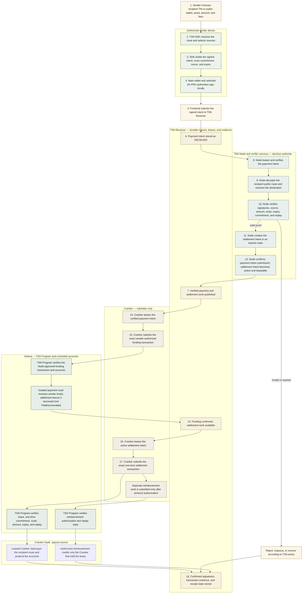
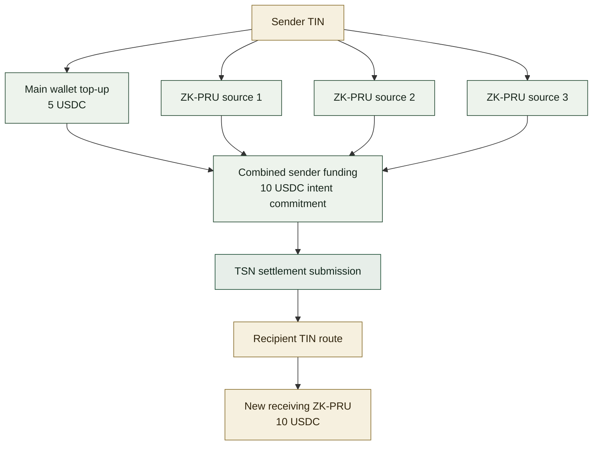

# TrustLink Labs / TrustLink Pay

TrustLink Labs is building the **Transfer Settlement Network (TSN)**: an
identity-aware payment coordination and settlement infrastructure that runs on
Solana. TrustLink Pay is the application experience built on that network.

## TrustLink Labs resources

- [TrustLink Pay live application](https://trustlink-pay.vercel.app/)
- [TSN Protocol research blog](https://tsn-protocol.blogspot.com/)
- [TrustLink Labs GitHub organization](https://github.com/Trustlink-Labs)
- [TrustLink Pay source repository](https://github.com/bigdreamsweb3/trustlink-pay)

TSN combines identity, recipient discovery, protected receiving and spending,
authorization, payment intents, Receiver work queues, TSN Node verification,
Cranker execution, commitment checks, escrow, reimbursement, receipts, replay
protection, and recovery tracking.

## A finalized TSN payment

TSN separates payment intent, verification, settlement execution, and any later
reimbursement decision. The Receiver stores work, the TSN Node and verifier
services decide whether work is valid, and a short lease gives one Cranker the
right to submit the exact settlement work. The recipient payout comes from the
leased Cranker's Cranker Vault. The TSN Program verifies authorization and state;
it is not the liquidity payer. A Cranker cannot unilaterally mark a payment
paid, recoverable, or reimbursable.

```mermaid
flowchart TD
    A["1. Sender chooses recipient TIN or public wallet, asset, amount, and fees"]

    subgraph DEVICE["Authorized sender device"]
        B["2. TSN SDK resolves the route and selects sources"]
        C["3. SDK builds the signed intent, route commitment, nonce, and expiry"]
        D["4. Main wallet and selected ZK-PRU authorities sign locally"]
    end

    F["5. Frontend submits the signed intent to TSN Receiver"]

    subgraph RECEIVER["TSN Receiver — durable ingress, leases, and evidence"]
        G["6. Payment intent stored as RECEIVED"]
        H["7. Verified payment and settlement work published"]
        O["13. Funding confirmed; settlement work available"]
        R["18. Confirmed signatures, transaction evidence, and receipt state stored"]
    end

    subgraph VERIFIER["TSN Node and verifier services — decision authority"]
        I["8. Node leases and verifies the payment intent"]
        J["9. Node decrypts the recipient public route and resolves the destination"]
        P["10. Node verifies signatures, source, amount, route, expiry, commitment, and replay"]
        Q["11. Node creates the settlement intent in an inactive state"]
        P2["12. Node confirms payment-intent submission; settlement intent becomes active and leaseable"]
    end

    subgraph CRANKER["Cranker — submitter only"]
        K["14. Cranker leases the verified payment intent"]
        L["15. Cranker submits the exact sender-authorized funding transaction"]
        S["16. Cranker leases the active settlement intent"]
        T["17. Cranker submits the exact one-time settlement transaction"]
        T2["Separate reimbursement work is submitted only after protocol authorization"]
    end

    subgraph SOLANA["Solana — TSN Program and controlled accounts"]
        M["TSN Program verifies the Node-approved funding transaction and accounts"]
        N["Isolated payment vault receives sender funds; settlement leaves it escrowed (not Paid/recoverable)"]
        U["TSN Program verifies lease, one-time commitment, route, amount, expiry, and replay"]
        V["TSN Program verifies reimbursement authorization and replay state"]
    end

    subgraph VAULT["Cranker Vault - payout source"]
        Y["Leased Cranker Vault pays the recipient route and protocol fee accounts"]
        Z["Authorized reimbursement credits only the Cranker that held the lease"]
    end

    A --> B --> C --> D --> F --> G --> I --> J --> P
    P -->|"valid proof"| Q --> P2 --> H --> K --> L --> M --> N --> O --> S --> T --> U --> Y --> R
    P -->|"invalid or expired"| X["Reject, requeue, or recover according to TSN policy"] --> R
    T --> T2 --> V --> Z --> R

    classDef device fill:#edf3ec,stroke:#284c36,color:#17251b;
    classDef receiver fill:#f6f0df,stroke:#8b7131,color:#30240d;
    classDef verifier fill:#e9efed,stroke:#4e6e60,color:#14241c;
    classDef cranker fill:#f2eee6,stroke:#6b6254,color:#211f1a;
    classDef chain fill:#e7eee9,stroke:#1f5038,color:#10251a;
    classDef outcome fill:#fbf6e9,stroke:#8b7131,color:#30240d;
    class B,C,D device;
    class G,H,O,R receiver;
    class I,J,P,Q,P2 verifier;
    class K,L,S,T,T2 cranker;
    class M,N,U,V chain;
    class Y,Z vault;
    class A,F,X outcome;
```

The settlement transaction proves the leased authorization and consumes the
one-time commitment. The recipient is paid from the leased Cranker Vault. The
TSN Program verifies authorization and enforced account state; it is not the
liquidity payer. The original payment-intent vault is not written as `Paid` or
`recoverable` by this settlement flow. Separate reimbursement or recovery work
is permitted only after the TSN Node/verifier decision and is credited to the
Cranker that held the valid lease.

## Core terms

- **TSN:** the complete payment coordination and settlement network.
- **TIN:** a 10-digit Transfer Identity Number used to discover an authorized
  payment route without exchanging a normal wallet address.
- **ZK-PRU:** TSN's protected receiving and spending subsystem. It uses
  device-local encrypted derivation material, scoped child authorities, and
  policy-driven receiving/spending routes.
- **TSN SDK:** the local planner and authorization layer that creates the
  immutable payment route and commitment.
- **TSN Receiver:** the durable ingress, work queue, leases, and status-read
  service.
- **TSN Node:** the off-chain protocol verifier and processor. It verifies work,
  resolves eligible routes, prevents replay, and publishes claimable work.
- **Cranker:** an independent fee-paying executor that submits already
  authorized transactions. It does not receive user private keys or replan a
  payment.
- **TSN Program:** the Solana program that verifies authorization, leases,
  commitments, replay state, and enforced token movement.
- **TSN Escrow:** a program-controlled isolated vault that can fund a separate
  verifier-approved reimbursement transition.
- **CrankerVault:** the protocol-controlled liquidity vault from which the
  leased Cranker pays the recipient and protocol fees.

Solana validators provide transaction execution, ordering, consensus, and
finality. They are not TSN Nodes or Crankers. TSN uses Solana; it does not
replace Solana consensus.

## Supported routes

1. Native TIN-to-TIN: protected ZK-PRU source to protected ZK-PRU destination.
2. Wallet-to-TIN: public wallet source to protected TIN destination.
3. TIN-to-wallet: protected source route to a public wallet exit.
4. Wallet-to-wallet: public compatibility settlement.

The complete stage-by-stage flow is in
[TSN Transaction Explorer](./docs/tsn-transaction-explorer.md).

## Devnet evidence: wallet-assisted TIN-to-TIN test

According to the supplied transaction notes, this test used a sender TIN route
and a recipient TIN route. The sender-side funding combined three ZK-PRU
sources with a **5 USDC main-wallet top-up** for a
**10 USDC intent**. The destination was a newly selected receiving ZK-PRU, not
a public recipient wallet. The final settlement is therefore a wallet-assisted
TIN-to-TIN route: the wallet supplied part of the sender funding, while the
recipient received the complete amount through the TIN route.

```mermaid
flowchart TD
    A["Sender TIN"]
    B["Main wallet top-up<br/>5 USDC"]
    C["ZK-PRU source 1"]
    D["ZK-PRU source 2"]
    E["ZK-PRU source 3"]
    F["Combined sender funding<br/>10 USDC intent commitment"]
    G["TSN settlement submission"]
    H["Recipient TIN route"]
    I["New receiving ZK-PRU<br/>10 USDC"]

    A --> B
    A --> C
    A --> D
    A --> E
    B --> F
    C --> F
    D --> F
    E --> F
    F --> G --> H --> I

    classDef identity fill:#f6f0df,stroke:#8b7131,color:#30240d;
    classDef source fill:#edf3ec,stroke:#284c36,color:#17251b;
    classDef settlement fill:#e7eee9,stroke:#1f5038,color:#10251a;
    class A,H,I identity;
    class B,C,D,E,F source;
    class G settlement;
```

| Stage              | Recorded role                                                    | Devnet signature                                                                                                                             |
| ------------------ | ---------------------------------------------------------------- | -------------------------------------------------------------------------------------------------------------------------------------------- |
| Wallet funding     | 5 USDC main-wallet top-up used in the sender funding set         | [5u9HmqD5...](https://solscan.io/tx/5u9HmqD5wNmBmHWfDWmw3vhpMhN42j15YPTmUVgpcMtbuwdGdhqRVqGrZAVF5ic1CiS1ZzuF1D2tMyVaanf4eqye?cluster=devnet) |
| PRU source batch A | ZK-PRU source movement; part of the three-source spend           | [3wgVPZYz...](https://solscan.io/tx/3wgVPZYzEqvht5pkPRetF8tFsXoWmy8obbSSqYYTmxaR1fw6oci2y93P96GhK4xXqu4ttSSD7mMYPyEoDjXVporU?cluster=devnet) |
| PRU source batch B | ZK-PRU source movement; completes the three-source spend         | [2M26JcpS...](https://solscan.io/tx/2M26JcpSVhKAQvB5yC3Pp4L6NYLHiU8UTMFMsrMbJwt2Jj23dd3pqRG8nWTxerYrcXqm7R78Jt4992smK7jh7eWJ?cluster=devnet) |
| Settlement         | 10 USDC settlement into the recipient TIN's new receiving ZK-PRU | [46wGVb9s...](https://solscan.io/tx/46wGVb9sfBqWWonk3CQ14xZCc6Qzf2ksYyZMpG4TDhqzhh49pRS59CjhCgq9oPVnfEVhSKdJyb3Rib7HM99A8TfU?cluster=devnet) |

The signatures above were supplied as the project's Devnet evidence. The
repository does not infer a per-signature token split where explorer data is
unavailable; reviewers can inspect the linked Devnet transactions directly.
This demonstrates route separation and receiving through a ZK-PRU, not a claim
of perfect cryptographic transaction unlinkability from Solana's public ledger.

## Start reading

- [Protocol architecture](./docs/protocol-architecture.md)
- [Identity and TIN](./docs/identity-and-tin.md)
- [ZK-PRU](./docs/zk-pru.md)
- [Network and runtime](./docs/network-and-runtime.md)
- [Security model](./docs/security-model.md)
- [Operations and testing](./docs/operations-and-testing.md)
- [Security](./docs/SECURITY.md)
- [Metadata use and compliance](./docs/META-DATA-USE-COMPLIANCE.md)
- [TSN Private View Lit architecture](./docs/tsn-private-view-lit.md)

## Status boundaries

The TSN Node, SDK, Cranker, TSN Program, Receiver, and TSN Escrow are the
active runtime architecture. Recurring payments remain disabled. TCAP is a
separate experimental confidential-asset direction, not the current settlement
actor. Formal zero-knowledge proofs are not claimed unless implementation and
verification evidence are present.

TrustLink Pay is experimental software. Always verify program IDs, cluster,
wallet authority, and transaction evidence before using Devnet.

Current devnet program IDs:

| Program           | Address                                       |
| ----------------- | --------------------------------------------- |
| Transfer Identity | `TinseNnU588NkmRZBe4ADJbxqrqQma92678UFP6VuwT` |
| TSN               | `TSN31jddtsmUg4D5aEdhY31nwB1e53VJJg9X8NoRP8V` |

## Milestones and ecosystem support

TrustLink Pay has progressed through StableHacks, and received support through the Superteam Agentic Engineering Grant program for fraud-protection development. The factual project history and acknowledgements are in [Project Journey](./docs/PROJECT-JOURNEY.md).

See what people are saying about the project: [Community Mentions](./docs/mentions.md).

## Repository map

| Path                          | Purpose                                                  |
| ----------------------------- | -------------------------------------------------------- |
| `frontend/`                   | TrustLink Pay web application                            |
| `backend/`                    | API, user and payment records, notifications             |
| `transfer-identity-protocol/` | Transfer Identity program and SDK                        |
| `tsn-protocol/`               | TSN SDK, mempool, RPC gateway, and Cranker tooling       |
| `docs/`                       | Product, protocol, security, and developer documentation |

## Local development

For the Windows-native development workflow, see [Windows TSN Commands](./docs/WINDOWS-TSN-COMMANDS.md). The default PM2 stack runs the frontend, backend, and RPC gateway; mempool services and the Cranker are explicit opt-in processes.

## Built with love by TrustLink Labs

TrustLink Pay is created and led by **Agbaka Matthew Daniel (Big Dreams Web3)**.

Connect with the builder and follow the work:

- **X:** [@0xbigdream](https://x.com/0xbigdream)
- **GitHub:** [@bigdreamsweb3](https://github.com/bigdreamsweb3)
- **TrustLink Labs:** [GitHub organization](https://github.com/Trustlink-Labs)
- **Research blog:** [TSN Protocol](https://tsn-protocol.blogspot.com/)
- **TrustLink Pay:** [Live application](https://trustlink-pay.vercel.app/)

TrustLink Labs is building privacy-conscious payment infrastructure on Solana.

## License

[MIT](./LICENSE)
