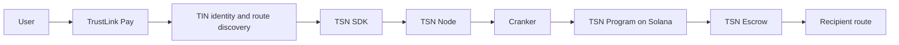

# TrustLink Labs / TrustLink Pay

TrustLink Labs is building the **Transfer Settlement Network (TSN)**: an
identity-aware payment coordination and settlement infrastructure that runs on
Solana. TrustLink Pay is the application experience built on that network.

TSN is not a new blockchain and it is not one smart contract. It combines
identity, recipient discovery, protected receiving and spending, authorization,
payment intents, an application-level work queue, transaction execution,
escrow, settlement, receipts, replay protection, and recovery tracking.

```mermaid
flowchart LR
    U[User] --> A[TrustLink Pay]
    A --> T[TIN identity and route discovery]
    T --> S[TSN SDK]
    S --> N[TSN Node]
    N --> C[Cranker]
    C --> P[TSN Program on Solana]
    P --> E[TSN Escrow]
    E --> R[Recipient route]
```

## Core terms

- **TSN:** the complete payment coordination and settlement network.
- **TIN:** a 10-digit Transfer Identity Number used to discover an authorized
  payment route without exchanging a normal wallet address.
- **ZK-PRU:** TSN's protected receiving and spending subsystem. It uses
  device-local encrypted derivation material, scoped child authorities, and
  policy-driven receiving/spending routes.
- **TSN SDK:** the local planner and authorization layer that creates the
  immutable payment route.
- **TSN Node:** the off-chain verification, reservation, work-queue, and status
  service. The current source directory retains a historical `mempool` name,
  but the architecture term is TSN Node.
- **Cranker:** an independent fee-paying executor that submits already
  authorized transactions. It does not receive user private keys or replan a
  payment.
- **TSN Program:** the Solana program that verifies authorization and state and
  performs the enforced token movement.
- **TSN Escrow:** a program-controlled vault that temporarily holds funded
  assets between funding and settlement.

Solana validators provide transaction execution, ordering, consensus, and
finality. They are not TSN Nodes or Crankers. TSN uses Solana; it does not
replace Solana consensus.

## Supported routes

1. Native TIN-to-TIN: protected ZK-PRU source to protected ZK-PRU destination.
2. Wallet-to-TIN: public wallet source to protected TIN destination.
3. TIN-to-wallet: protected source route to a public wallet exit.
4. Wallet-to-wallet: public compatibility settlement.

The full two-stage lifecycle and diagrams are in
[TSN Transaction Explorer](./docs/tsn-transaction-explorer.md).

## Start reading

- [Protocol architecture](./docs/protocol-architecture.md)
- [Identity and TIN](./docs/identity-and-tin.md)
- [ZK-PRU](./docs/zk-pru.md)
- [Execution plan](./docs/execution-plan-v2.md)
- [Network and runtime](./docs/network-and-runtime.md)
- [Security model](./docs/security-model.md)
- [Operations and testing](./docs/operations-and-testing.md)
- [Implementation status](./docs/implementation-status.md)
- [TSN Private View Lit architecture](./docs/tsn-private-view-lit.md)

## Status boundaries

The TSN Node, SDK, Cranker, TSN Program, and TSN Escrow are the active runtime
architecture. Recurring payments remain disabled. TCAP is a separate
experimental confidential-asset direction, not the current settlement actor.
Formal zero-knowledge proofs are not claimed unless the implementation and
verification evidence are present.

TrustLink Pay is experimental software. Always verify program IDs, cluster,
wallet authority, and transaction evidence before using Devnet.
