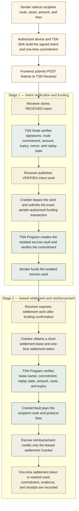

# TrustLink Labs / TrustLink Pay

TrustLink Labs is building the **Transfer Settlement Network (TSN)**: an
identity-aware payment coordination and settlement infrastructure that runs on
Solana. TrustLink Pay is the application experience built on that network.

## TrustLink Labs resources

- [TrustLink Pay live application](https://trustlink-pay.vercel.app/)
- [TSN Protocol research blog](https://tsn-protocol.blogspot.com/)
- [TrustLink Labs GitHub organization](https://github.com/Trustlink-Labs)
- [TrustLink Pay source repository](https://github.com/bigdreamsweb3/trustlink-pay)

TSN combines identity, recipient discovery, protected receiving and spending,
authorization, payment intents, Receiver work queues, TSN Node verification,
Cranker execution, commitment checks, escrow, reimbursement, receipts, replay
protection, and recovery tracking.

## A finalized TSN payment

TSN separates payment intent, verification, settlement execution, and Cranker
reimbursement. The Receiver stores the intent, the TSN Node verifies it, and a
short lease gives one Cranker the right to submit the exact settlement work.
The Cranker pays the recipient from its own protocol vault. The isolated escrow
then reimburses the Cranker that actually completed the leased settlement.

The one-time commitment and lease are checked by the TSN Program. They prevent
replay and prevent a different Cranker from claiming the same settlement. The
intent record, recipient route, and settlement evidence are coordinated through
the Receiver; the on-chain payout is not a direct public sender-to-recipient
transfer.

```mermaid
flowchart TD
    A["Sender selects recipient route, asset, amount, and fees"]
    B["Authorized device and TSN SDK build the signed intent and one-time commitment"]
    C["Frontend submits POST /intents to TSN Receiver"]

    subgraph STAGE1["Stage 1 — intent verification and funding"]
        D["Receiver stores RECEIVED intent"]
        E["TSN Node verifies signatures, route commitment, amount, expiry, nonce, and replay state"]
        F["Receiver publishes VERIFIED intent work"]
        G["Cranker leases the work and submits the exact sender-authorized funding transaction"]
        H["TSN Program creates the isolated escrow vault and verifies the commitment"]
        I["Sender funds the isolated escrow vault"]
    end

    subgraph STAGE2["Stage 2 — leased settlement and reimbursement"]
        J["Receiver exposes settlement work after funding confirmation"]
        K["Cranker obtains a short settlement lease and one-time settlement token"]
        L["TSN Program verifies lease owner, commitment, replay state, amount, route, and expiry"]
        M["CrankerVault pays the recipient route and protocol fees"]
        N["Escrow reimbursement credits only the leased settlement Cranker"]
        O["One-time settlement token is marked used;<br/>commitment, evidence, and receipts are recorded"]
    end

    A --> B --> C --> D --> E --> F --> G --> H --> I --> J --> K --> L --> M --> N --> O

    classDef user fill:#fbf6e9,stroke:#8b7131,color:#30240d;
    classDef receiver fill:#f6f0df,stroke:#8b7131,color:#30240d;
    classDef node fill:#e9efed,stroke:#4e6e60,color:#14241c;
    classDef cranker fill:#f2eee6,stroke:#6b6254,color:#211f1a;
    classDef chain fill:#e7eee9,stroke:#1f5038,color:#10251a;
    class A,B,C user;
    class D,F,J,O receiver;
    class E node;
    class G,K,N cranker;
    class H,I,L,M chain;
```

The public settlement proof is commitment-based. Observers can see Solana
transactions and token-account addresses, but the tested route keeps the
sender intent, recipient route, and Cranker reimbursement as separate protocol
records rather than exposing a direct sender-to-recipient payment edge.

## Core terms

- **TSN:** the complete payment coordination and settlement network.
- **TIN:** a 10-digit Transfer Identity Number used to discover an authorized
  payment route without exchanging a normal wallet address.
- **ZK-PRU:** TSN's protected receiving and spending subsystem. It uses
  device-local encrypted derivation material, scoped child authorities, and
  policy-driven receiving/spending routes.
- **TSN SDK:** the local planner and authorization layer that creates the
  immutable payment route and commitment.
- **TSN Receiver:** the durable ingress, work queue, leases, and status-read
  service.
- **TSN Node:** the off-chain protocol verifier and processor. It verifies work,
  resolves eligible routes, prevents replay, and publishes claimable work.
- **Cranker:** an independent fee-paying executor that submits already
  authorized transactions. It does not receive user private keys or replan a
  payment.
- **TSN Program:** the Solana program that verifies authorization, leases,
  commitments, replay state, and enforced token movement.
- **TSN Escrow:** a program-controlled isolated vault used to reimburse the
  Cranker that completed the active settlement lease.
- **CrankerVault:** the protocol-controlled liquidity vault from which the
  leased Cranker pays the recipient and protocol fees.

Solana validators provide transaction execution, ordering, consensus, and
finality. They are not TSN Nodes or Crankers. TSN uses Solana; it does not
replace Solana consensus.

## Supported routes

1. Native TIN-to-TIN: protected ZK-PRU source to protected ZK-PRU destination.
2. Wallet-to-TIN: public wallet source to protected TIN destination.
3. TIN-to-wallet: protected source route to a public wallet exit.
4. Wallet-to-wallet: public compatibility settlement.

The complete stage-by-stage flow is in
[TSN Transaction Explorer](./docs/tsn-transaction-explorer.md).

## Start reading

- [Protocol architecture](./docs/protocol-architecture.md)
- [Identity and TIN](./docs/identity-and-tin.md)
- [ZK-PRU](./docs/zk-pru.md)
- [Network and runtime](./docs/network-and-runtime.md)
- [Security model](./docs/security-model.md)
- [Operations and testing](./docs/operations-and-testing.md)
- [Security](./docs/SECURITY.md)
- [Metadata use and compliance](./docs/META-DATA-USE-COMPLIANCE.md)
- [TSN Private View Lit architecture](./docs/tsn-private-view-lit.md)

## Status boundaries

The TSN Node, SDK, Cranker, TSN Program, Receiver, and TSN Escrow are the
active runtime architecture. Recurring payments remain disabled. TCAP is a
separate experimental confidential-asset direction, not the current settlement
actor. Formal zero-knowledge proofs are not claimed unless implementation and
verification evidence are present.

TrustLink Pay is experimental software. Always verify program IDs, cluster,
wallet authority, and transaction evidence before using Devnet.
