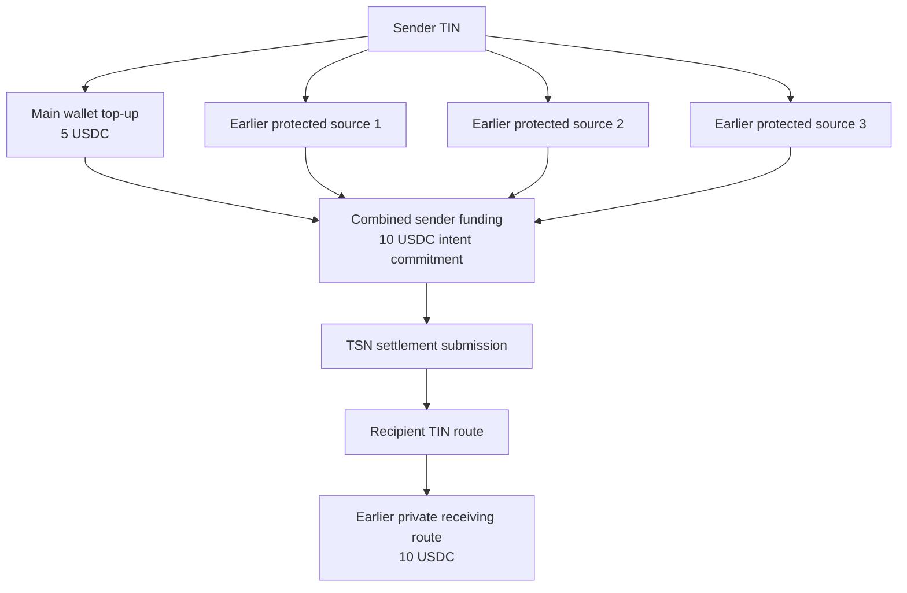

# TrustLink Pay / TSN

TrustLink Labs is building **TSN (Transfer Settlement Network)**, an
identity-aware payment coordination and settlement infrastructure on Solana.
TrustLink Pay is the application experience built on that network. **TCAP
(Transfer Confidential Asset Protocol)** provides the commitment-backed private
balance accounting used by the current credit architecture.

## TrustLink Labs resources

- [TrustLink Pay application](https://trustlink-pay.vercel.app/)
- [TSN Protocol research blog](https://tsn-protocol.blogspot.com/)
- [TrustLink Labs GitHub organization](https://github.com/Trustlink-Labs)
- [Service hosting and deployment map](docs/SERVICE-HOSTING.md)
- [Live testing and contributor guide](docs/GETTING-STARTED-LIVE.md)
- [Cranker operator guide](docs/CRANKER-OPERATOR-GUIDE.md)
- [Receiver, Node and settlement verification](docs/tsn-receiver-verification-settlement.md)
- [GPRU ownership and TCAP custody](docs/GPRU-TCAP-LINK-BREAKING.md)

TSN coordinates identity resolution, signed payment intents, redacted Receiver
work, Node verification, leases, and exact transaction submission. GPRU is the
opaque ownership and routing commitment; TCAP is the custody and private
balance layer. Funding and recipient ownership are never joined by a public
per-transfer intent or receipt account.

## Link-breaking transfer architecture

The legacy ZK-PRU implementation established the privacy boundary preserved by
the GPRU/TCAP design: the public funding transaction and the recipient's
opaque ownership commitment are separate protocol objects. The current V1
receipt path is legacy compatibility; the V2 source path below is the intended
architecture and must be deployed before it is used on Devnet.

```text
TIN identity
  -> GPRU ownership and route commitment
  -> TSN Node resolves and verifies the intent
  -> Cranker funds the governed TSN/TCAP custody pool
  -> TSN Node activates the opaque settlement intent
  -> Cranker vault pays the selected destination
  -> TSN verifies the proof and reimburses only the leased Cranker
  -> TCAP advances the GPRU commitment without an intent or receipt PDA
  -> owner device reads its encrypted balance snapshot
```


```mermaid
flowchart TD
    A["1. Sender chooses recipient TIN, asset, amount and policy"]

    subgraph DEVICE["Authorized sender device"]
        B["2. TSN SDK resolves the TIN and privacy-receiving-root relationship"]
        C["3. SDK builds the signed payment intent, route commitment, nonce and expiry"]
        D["4. Owner signs locally; private roots, GPRU scope and snapshot key remain on device"]
    end

    F["5. Frontend submits the signed intent to the TSN Receiver"]

    subgraph RECEIVER["TSN Receiver — durable ingress, leases and evidence"]
        G["6. Opaque payment work stored as RECEIVED"]
        H["7. Node-verification work becomes leaseable"]
        O["15. Funding proof accepted; settlement work activated"]
        R["24. Redacted status and transaction evidence stored"]
    end

    subgraph VERIFIER["TSN Node and verifier services — decision authority"]
        I["8. Node leases and verifies the payment intent"]
        J["9. Node decrypts the route envelope and selects the recipient destination"]
        P["10. Node verifies signatures, source, amount, token, policy, expiry, commitment and replay"]
        Q["11. Node creates the settlement intent; inactive until funding is verified"]
        P2["12. Node confirms the work is valid and leaseable"]
    end

    subgraph FUNDING["Funding transaction"]
        K["13. Cranker leases the verified payment intent"]
        L["14. Cranker submits the exact sender-authorized funding transaction"]
        L2["Only governed funding fields and protocol accounts are public"]
    end

    subgraph SOLANA["Solana — TSN, Epoch Treasury and TCAP programs"]
        AA["16. TSN program verifies the funding accounts and exact amount"]
        M["17. Treasury liability is recorded without a recipient TIN"]
        V["21. TSN verifies the leased settlement proof and one-time bindings"]
        W["22. TSN authorizes reimbursement only to the leased Cranker"]
        X["23. TCAP advances the opaque GPRU commitment; no intent or receipt PDA"]
    end

    subgraph SETTLEMENT["Settlement work"]
        S["18. Receiver publishes the active settlement work"]
        T["19. Cranker leases and submits the exact settlement from its vault"]
        T2["Settlement carries the destination and opaque proof, not the sender intent or TIN"]
    end

    subgraph PRIVATE["Owner-private balance state"]
        Y["26. Owner encrypts and persists the new balance snapshot"]
        Z["27. Owner reads and decrypts the matching snapshot locally"]
    end

    A --> B --> C --> D --> F --> G --> I --> J --> P
    P -->|"valid"| Q --> P2 --> H --> K --> L --> L2 --> AA --> M --> O --> S --> T --> V --> W --> X --> Y --> Z --> R
    P -->|"invalid or expired"| REJECT["Reject, requeue or refund according to TSN policy"] --> R
    T --> T2 --> R

    classDef device fill:#edf3ec,stroke:#284c36,color:#17251b;
    classDef receiver fill:#f6f0df,stroke:#8b7131,color:#30240d;
    classDef verifier fill:#e9efed,stroke:#4e6e60,color:#14241c;
    classDef cranker fill:#f2eee6,stroke:#6b6254,color:#211f1a;
    classDef chain fill:#e7eee9,stroke:#1f5038,color:#10251a;
    classDef private fill:#fbf6e9,stroke:#8b7131,color:#30240d;
    classDef outcome fill:#fbf6e9,stroke:#8b7131,color:#30240d;
    class A,B,C,D device;
    class F,G,H,O,R receiver;
    class I,J,P,Q,P2 verifier;
    class K,L,L2,S,T,T2 cranker;
    class AA,M,V,W,X chain;
    class Y,Z private;
    class REJECT outcome;
```

The device signs the payment intent locally and retains the privacy-receiving
root, GPRU authorization material, and snapshot key. The Receiver stores only
authenticated redacted work. The Node resolves the recipient route, creates a
settlement intent, and activates it only after the funding proof is verified.
The Cranker pays from its own governed vault; TSN reimburses only the Cranker
that held the valid lease. The funding and settlement transactions do not
share an intent ID, recipient TIN, AcceptedIntent account, epoch receipt, or
TCAP authorization receipt. The V1 receipt path is legacy compatibility; the
V2 source path is not claimed as deployed until its program upgrade is
completed.

## Core terms and authority boundaries

- **TSN:** Transfer Settlement Network, coordinating authorization, leases,
  epoch liability and settlement execution.
- **TIN:** Transfer Identity Number, a 10-digit identity and route-discovery
  handle; it is not a private key, token account or balance.
- **TIP:** Transfer Identity Protocol and the Transfer Identity stack that
  issues and resolves TIN relationships.
- **GPRU:** Guard Privacy Routing Unit, a non-custodial authorization and
  routing layer that never holds funds or balances.
- **TCAP:** Transfer Confidential Asset Protocol, the private balance accounting
  layer for tip transitions and encrypted owner snapshots.
- **Receiver:** durable ingress, redacted work storage, leases and status
  evidence; it does not receive plaintext roots or spend keys.
- **TSN Node:** off-chain verifier that checks signatures, policy, commitments,
  sequence, expiry, replay material and account bindings.
- **Mother and Epoch Treasury:** protocol-controlled authorization and aggregate
  liability boundaries for an epoch.
- **Cranker:** fee-paying submitter of already authorized work; it cannot change
  amount, token, recipient binding, commitments, sequence, policy, scope,
  nullifier or expiry.
- **TCAP program:** on-chain custody and opaque GPRU tip-commitment enforcement.

Solana validators provide execution, ordering, consensus and finality. They are
not TSN Nodes or Crankers; TSN uses Solana and does not replace Solana
consensus.

## Legacy and privacy-safe TCAP authorization

`AcceptedIntentV1`, `EpochCommitmentStateV1`, and
`TsnAuthorizationReceiptV1` belong to the legacy V1 authorization path. They
must not be used for new transfers because their public accounts join a TSN
intent to a TCAP transition. The privacy-safe V2 path carries only the opaque
tip transition, GPRU scope commitment, replay nullifier, validity window, and
TSN authorization signer. Replay protection is the monotonic tip sequence plus
the previous commitment; no per-transfer receipt or nullifier account is
created.

## Supported route boundaries

1. **TIN-to-TIN credit:** the current private receiving route through GPRU, TSN
   authorization and TCAP tip credit.
2. **Wallet-to-TIN credit:** a public source can be coordinated with the same
   private receiving and credit boundary when the governed asset path is ready.
3. **Wallet-to-wallet compatibility:** public settlement remains a separate
   compatibility route with public chain visibility.
4. **Debit and exit:** interfaces may exist, but live confidential debit and
   exit remain proof-gated and disabled. A GPRU signature, hash-only payload or
   placeholder proof cannot spend or drain liquidity.

## Historical architecture boundary

ZK-PRU was an earlier protected receiving and spending experiment. It was
superseded by the privacy-receiving-root, GPRU and TCAP model and is retained
only for historical auditability. New integrations must not target ZK-PRU as a
receiving, balance or spending architecture. See the [ZK-PRU retirement note](docs/ZK-PRU-RETIRED.md).

## Evidence and Devnet policy

TrustLink distinguishes code evidence, build evidence, Devnet transaction
evidence and production-readiness evidence. A checked-in helper or successful
simulation does not prove that a program is deployed. Reviewers should record
the program ID, cluster, upgrade authority, deployment slot, transaction
signature and post-transaction account state.

Program-dependent testing is Devnet-only. After any on-chain code or ABI change,
build the SBF artifact, deploy it to Devnet, verify the deployment slot and only
then run simulation or live transactions. See [Devnet build and deploy](docs/DEVNET-BUILD-DEPLOY.md), the [TCAP V2 Devnet preparation](docs/TCAP-V2-DEVNET.md), the [TCAP V2 debit and credit design](docs/TCAP-V2-DEBIT-CREDIT-DESIGN.md), and the [legacy TCAP smoke notice](docs/tcap-devnet-credit-smoke.md).

## Historical Devnet evidence: first wallet-assisted TIN-to-TIN test

The project&#8217;s first recorded Devnet payment test used the earlier ZK-PRU
receiving path. It is preserved here as historical transaction evidence only;
it is not the current TSN receiving or TCAP credit architecture. The test used a
sender TIN route and recipient TIN route, combined a 5 USDC main-wallet top-up
with the sender-side sources for a 10 USDC intent, and settled into a new
private receiving route.


```mermaid
flowchart TD
    A["Sender TIN"]
    B["Main wallet top-up<br/>5 USDC"]
    C["Earlier protected source 1"]
    D["Earlier protected source 2"]
    E["Earlier protected source 3"]
    F["Combined sender funding<br/>10 USDC intent commitment"]
    G["TSN settlement submission"]
    H["Recipient TIN route"]
    I["Earlier private receiving route<br/>10 USDC"]

    A --> B
    A --> C
    A --> D
    A --> E
    B --> F
    C --> F
    D --> F
    E --> F
    F --> G --> H --> I
```

| Stage | Recorded role | Devnet signature |
| --- | --- | --- |
| Wallet funding | 5 USDC main-wallet top-up used in the sender funding set | [5u9HmqD5...](https://solscan.io/tx/5u9HmqD5wNmBmHWfDWmw3vhpMhN42j15YPTmUVgpcMtbuwdGdhqRVqGrZAVF5ic1CiS1ZzuF1D2tMyVaanf4eqye?cluster=devnet) |
| Protected source batch A | Earlier protected source movement; part of the sender funding set | [3wgVPZYz...](https://solscan.io/tx/3wgVPZYzEqvht5pkPRetF8tFsXoWmy8obbSSqYYTmxaR1fw6oci2y93P96GhK4xXqu4ttSSD7mMYPyEoDjXVporU?cluster=devnet) |
| Protected source batch B | Earlier protected source movement; completed the recorded source set | [2M26JcpS...](https://solscan.io/tx/2M26JcpSVhKAQvB5yC3Pp4L6NYLHiU8UTMFMsrMbJwt2Jj23dd3pqRG8nWTxerYrcXqm7R78Jt4992smK7jh7eWJ?cluster=devnet) |
| Settlement | 10 USDC settlement into the recipient TIN&#8217;s recorded private receiving route | [46wGVb9s...](https://solscan.io/tx/46wGVb9sfBqWWonk3CQ14xZCc6Qzf2ksYyZMpG4TDhqzhh49pRS59CjhCgq9oPVnfEVhSKdJyb3Rib7HM99A8TfU?cluster=devnet) |

These signatures are preserved as supplied Devnet evidence. They document the
earlier route and must not be used as evidence that the current GPRU, TSN Epoch
Treasury and TCAP credit path has been deployed or validated.

Current Devnet program IDs:

| Program | Address |
| --- | --- |
| TSN / `trustlink_escrow` | `TSN31jddtsmUg4D5aEdhY31nwB1e53VJJg9X8NoRP8V` |
| TCAP / `tcap` | `TcApT4CytBqvqEDpRYVB7Wfi6aFzmtSZdWvDsq6bp9x` |
| TIP / Transfer Identity / TIN registrar | `TinseNnU588NkmRZBe4ADJbxqrqQma92678UFP6VuwT` |

## Repository map

| Path | Purpose |
| --- | --- |
| `frontend/` | TrustLink Pay application |
| `backend/` | API, application records and notifications |
| `transfer-identity-protocol/` | TIP/TIN registrar and SDK |
| `tsn-protocol/` | TSN programs, SDK, Receiver, Node and Cranker tooling |
| `tcap-protocol/` | TCAP program, SDK and credit tooling |
| `protocol-tests/` | Devnet-only protocol scenarios and UI |
| `docs/` | Architecture, security, operations and evidence documentation |

## Milestones and ecosystem support

TrustLink Pay has progressed through StableHacks, and received support through
the Superteam Agentic Engineering Grant program for fraud-protection
development. The factual project history and acknowledgements are in [Project
Journey](https://github.com/bigdreamsweb3/trustlink-pay/blob/bb833d563f283bc9690963faa5a3c2c16b9e1d5f/docs/PROJECT-JOURNEY.md).

See what people are saying about the project: [Community Mentions](https://github.com/bigdreamsweb3/trustlink-pay/blob/bb833d563f283bc9690963faa5a3c2c16b9e1d5f/docs/mentions.md).

## Maintainer

TrustLink Pay is created and led by **Agbaka Matthew Daniel U. E. (Big Dreams Web3)**.

- [X / @0xbigdream](https://x.com/0xbigdream)
- [GitHub / @bigdreamsweb3](https://github.com/bigdreamsweb3)
- [LinkedIn / Big Dreams Web3](https://www.linkedin.com/in/bigdreamsweb3/)
- [TrustLink Labs](https://github.com/Trustlink-Labs)

## License

[MIT](LICENSE)
