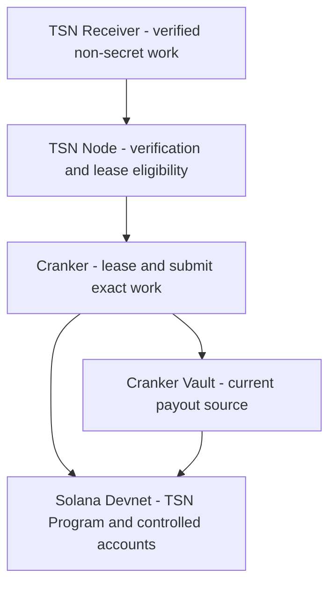
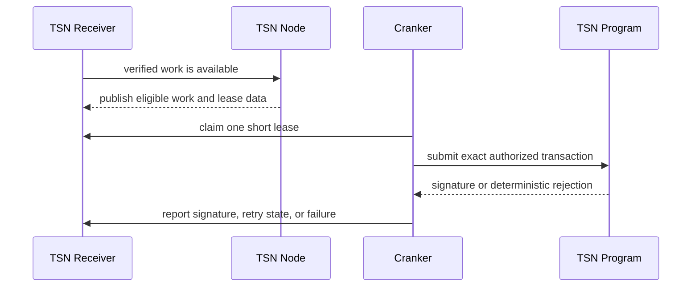

# TSN Cranker Operator Guide

This guide explains how to run an independent **TSN Cranker** for TrustLink
Labs' Transfer Settlement Network (TSN) on Devnet. A Cranker is an operator
process, not a public API and not a Solana program deployment. It watches the
TSN Receiver for non-secret work, leases work that the TSN Node has verified,
and submits the exact authorized transaction while paying Solana fees.

This describes the current operator tooling. It does not claim that a Cranker
is production-ready for mainnet, and it does not replace a Devnet program,
Receiver, or Node deployment.

## Cranker role

The current execution boundary is:



The Cranker may:

- claim or lease work that is already eligible;
- submit the immutable funding or settlement transaction supplied by the
  protocol;
- pay Solana fees from its operator wallet;
- report transaction signatures and retry safe failures;
- participate in explicitly authorized recovery or reimbursement work.

The Cranker must not:

- decrypt a user's master seed or reconstruct a user's PRU private key;
- choose a different source, recipient, amount, tranche, fee, or change route;
- sign as a user, a user PRU, or any Mother-controlled settlement authority;
- mark an intent paid, recoverable, or reimbursable by itself;
- expose Receiver API keys, operator secret keys, or private route material.

The current Devnet implementation uses a registered Cranker Vault as the
payout source. This is an implementation detail of the current TSN runtime;
it is not a claim that TCAP has replaced the vault or that mainnet liquidity
policy is finalized.

## What must already exist

Before an operator starts a Cranker, the deployment owner must provide:

1. A deployed TSN Program ID and matching build/IDL.
2. A reachable TSN Receiver with Cranker work endpoints.
3. A running or reachable TSN Node that verifies and publishes work.
4. The current Receiver Cranker API credential. Obtain it from the
   deployment owner; do not invent one.
5. Direct Solana Devnet RPC and WebSocket access. Crankers submit to Solana
   directly; the TSN RPC Gateway is used by the browser and application
   services, not as a replacement for the operator's submission RPC.
6. A funded operator keypair. Use a dedicated keypair, never the upgrade
   authority, a user wallet, or a TIN/PRU key.
7. A supported token mint and enough Devnet SOL for fees and account creation.
   If policy requires a funded Cranker Vault, initialize and fund it first.

The public service URLs are deployment configuration, not constants in this
guide. Set `TSN_RECEIVER_URL=https://tsn-receiver-kappa.vercel.app`.

## Deployment boundary

There is no separate “Cranker program” to deploy. The Cranker is a signed
operator process that uses the already deployed TSN Program. Only the
deployment owner should build or upgrade the on-chain program:

```bash
npm run tsn:program:build
npm run tsn:program:deploy
```

Run those commands from the project's supported Solana/Anchor environment,
verify the resulting Program ID, and initialize Mother Escrow before asking
independent operators to register. A Cranker operator normally needs only the
operator package, its keypair, the Receiver credential, and the public
program/cluster configuration.

## Install the operator

From the repository root:

```powershell
npm --prefix tsn-protocol/tsn-cranker-op-daemon install
```

Or from inside the operator package:

```powershell
cd tsn-protocol/tsn-cranker-op-daemon
npm install
```

The daemon runs on an operator workstation, VM, or private worker. It does
not need to be hosted as a public HTTP service. Keep one long-running process
per operator identity to avoid competing leases.

## Create the operator keypair

Run this once on the machine that will operate the Cranker. These commands are
instructions for the operator; this guide does not run them.

```bash
cd tsn-protocol/tsn-cranker-op-daemon
mkdir -p keys
solana-keygen new --outfile keys/cranker-keypair.json --no-bip39-passphrase
chmod 600 keys/cranker-keypair.json
solana-keygen pubkey keys/cranker-keypair.json
solana airdrop 2 "$$(solana-keygen pubkey keys/cranker-keypair.json)" --url devnet
```

On Windows, protect the file with equivalent filesystem ACLs. The repository
ignores `keys/*.json` and local operator state, but verify that before making
a deployment image.

## Configure the environment

Create `tsn-protocol/tsn-cranker-op-daemon/.env` from `.env.example`. Use
real values only on the private operator machine:

```dotenv
SOLANA_MOCK_MODE=false
TSN_RPC_GATEWAY_URL=https://tsn-rpc-gateway.vercel.app
# Optional; use a direct Solana provider websocket only when subscriptions are enabled.
# SOLANA_WS_URL=wss://<solana-provider-websocket-endpoint>
PROGRAM_ID=TSN31jddtsmUg4D5aEdhY31nwB1e53VJJg9X8NoRP8V
TINS_PROGRAM_ID=TinseNnU588NkmRZBe4ADJbxqrqQma92678UFP6VuwT
KEYPAIR_PATH=./keys/cranker-keypair.json
TSN_ENABLED=true
TSN_CREATE_INTENTS_ONCHAIN=true
TSN_RECEIVER_URL=https://tsn-receiver-kappa.vercel.app
TSN_CRANKER_OPERATOR_PUBKEY=<registered operator public key>
TSN_CRANKER_POLL_MS=2000
TSN_CRANKER_IDLE_MAX_MS=60000
```

Optional fee and policy settings are documented in `.env.example`. Do not
commit `.env`, `.env.local`, keypair JSON, Receiver credentials, or
`operator-state.json`. Never put them in frontend configuration.

## Mother Escrow “DNA”

“Mother Escrow DNA” means the public PDA derivation recipe. It is not a
private key or a secret credential. The address is determined by the deployed
TSN Program ID and this fixed seed:

```text
motherEscrow = PDA(["tsn_mother_escrow"], TSN_PROGRAM_ID)
```

The operator-specific Cranker PDA is derived from the Mother Escrow and the
operator public key:

```text
cranker = PDA(
  ["tsn_cranker", motherEscrow, operatorPublicKey],
  TSN_PROGRAM_ID
)
```

The setup code derives token vault accounts as follows:

```text
crankerVault      = PDA(["tsn_cranker_vault", cranker, tokenMint], program)
vaultAuthority    = PDA(["tsn_cranker_vault_authority", crankerVault], program)
vaultTokenAccount = PDA(["tsn_cranker_vault_token", crankerVault], program)
liquidityPosition = PDA(
  ["tsn_liquidity_position", crankerVault, funderPublicKey],
  program
)
```

These seeds must remain identical to the deployed program. Do not manually
choose an address or paste one from another cluster. The CLI derives and
records the addresses in local `operator-state.json`.

## Initialize the shared Mother Escrow

Mother Escrow initialization is a deployment-owner operation, not something
every untrusted operator should repeat. Run it once for a new Devnet program
or when the TSN Program explicitly requires migration:

```powershell
npm run tsn:mother:init
# Only when the deployed program requires an account-layout migration:
npm run tsn:mother:migrate
```

The signer must have the authority required by the deployed TSN Program. A
Cranker operator cannot initialize or migrate Mother Escrow merely because it
has an operator keypair. Confirm program ID and cluster before signing.

## Register a Cranker

Registration creates or updates the operator-specific Cranker PDA using the
operator keypair in `KEYPAIR_PATH`:

```powershell
npm run tsn:cranker:register
```

The command records the derived context locally. The public operator key,
Mother Escrow PDA, and Cranker PDA may be shared as verification metadata. The
keypair must never be shared.

To inspect available setup commands:

```powershell
npm run tsn:cranker:help
```

## Initialize and fund a token vault

The guided setup exposes registration, funding-policy configuration, vault
initialization, vault funding, withdrawals, and epoch settlement:

```powershell
npm run tsn:cranker:setup
```

Raw commands are available inside the operator package:

```powershell
cd tsn-protocol/tsn-cranker-op-daemon
npm run setup:raw -- init-vault <TOKEN_MINT_OR_SYMBOL>
npm run setup:raw -- fund-cranker <TOKEN_MINT_OR_SYMBOL> <FUNDER_KEYPAIR> <FUNDER_TOKEN_ACCOUNT> <BASE_UNITS>
npm run policy:open
```

Only enable external funding after the deployment policy and accounting model
have been reviewed. To close it again:

```powershell
npm run policy:closed
```

Do not describe a funded vault as a user wallet or as the TSN Program itself.
The vault is a controlled settlement account whose authority is enforced by
the deployed program.

## Run the Cranker

Start the daemon from the repository root:

```powershell
npm run tsn:cranker:start
```

Or inside its package:

```powershell
cd tsn-protocol/tsn-cranker-op-daemon
npm run crank:start
```

Healthy startup logs identify the operator, Receiver source, execution mode,
Mother Escrow, and Cranker PDA. A healthy process may be idle when the
Receiver has no verified claimable work; idle polling is not a failed
deployment.

The normal lifecycle is:



The Cranker does not replan work between the Receiver and Solana. If a lease
expires, Receiver/Node policy decides whether to requeue, recover, or reject
it; the Cranker must not invent a new route.

## Verify the deployment

Use the same Devnet RPC and program ID as the operator environment:

```bash
solana address -k tsn-protocol/tsn-cranker-op-daemon/keys/cranker-keypair.json
solana account <MOTHER_ESCROW_PDA> --url devnet
solana account <CRANKER_PDA> --url devnet
solana program show TSN31jddtsmUg4D5aEdhY31nwB1e53VJJg9X8NoRP8V --url devnet
```

Keep startup output and every submitted transaction signature as operator
evidence. A successful signature proves Solana accepted a transaction; it does
not alone prove authorization or recipient credit. Confirm Receiver state,
TSN Node decision, program logs, and token balances together.

## Troubleshooting

**Receiver returns 401.** Check that `TSN_RECEIVER_URL` is
`https://tsn-receiver-kappa.vercel.app`, the operator public key is registered
in `TSN_RECEIVER_CRANKER_OPERATORS`, and the daemon can read its keypair.
Remove accidental surrounding quotes from environment values and restart.

**Mother Escrow or Cranker PDA is not initialized.** Verify program ID, cluster,
operator keypair, and seed recipe. Ask the deployment owner to run authorized
`mother:init` or migration, then run registration.

**No work is claimed.** Confirm Receiver reachability, TSN Node verification,
Cranker registration, and an eligible Receiver work state. Do not bypass
verification by submitting directly from the Cranker.

Idle Crankers use exponential backoff (up to `TSN_CRANKER_IDLE_MAX_MS`) so an
empty Receiver does not create a continuous high-frequency request stream. A
local CLI Cranker cannot be directly pinged by a Vercel Receiver unless the
operator exposes a secure callback endpoint; a future push broker or callback
can wake it immediately.

**Blockhash or send failures.** Check direct Devnet RPC health, operator SOL,
token-account rent, compute price, and lease expiry. Retry only through the
daemon's deterministic retry path.

**Vault has insufficient funds.** Fund the configured Cranker Vault through the
reviewed setup path. Do not load a user private key or make the Cranker a user
PRU authority.

## Security checklist

- Use a dedicated operator keypair per Cranker instance.
- Keep keypair files, `.env`, Receiver API keys, and operator state private.
- Never paste secrets into issue reports, logs, screenshots, or frontend config.
- Run one daemon per operator identity to avoid lease races.
- Pin the TSN Program ID and Solana cluster in deployment configuration.
- Review Mother Escrow, Cranker PDA, and vault addresses before funding.
- Stop the daemon and rotate credentials if a key or API secret may be exposed.

## Operator evidence to retain

For each Devnet run, retain:

- cluster and RPC endpoint label (never the API key);
- TSN Program ID;
- operator public key, Mother Escrow PDA, Cranker PDA, and vault PDAs;
- registration and vault initialization signatures;
- Receiver work/lease identifiers;
- settlement and reimbursement signatures, if any;
- source, vault, and recipient balances before and after;
- daemon version/commit and configuration template used.

Do not claim a live payment, TCAP settlement, or production readiness without
the corresponding on-chain and Receiver evidence.

## Related documentation

- [Service hosting map](./SERVICE-HOSTING.md)
- [Live testing and contributor guide](./GETTING-STARTED-LIVE.md)
- [TSN operations and testing](./operations-and-testing.md)
- [TSN receiver and node architecture](./tsn-receiver-node-architecture.md)
- [TSN security model](./security-model.md)
- [Cranker source package](../tsn-protocol/tsn-cranker-op-daemon/)
