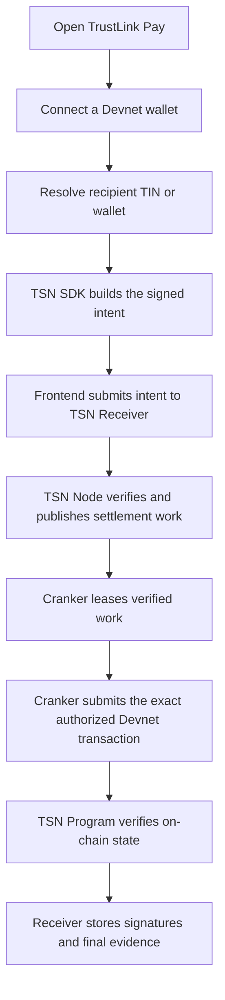

# TrustLink Labs: Live Testing and Contributor Guide

This is the shortest path for a reviewer, SDK user, or contributor who wants
to understand and test the current TrustLink Labs Devnet stack.

The project is experimental Devnet infrastructure. Do not use these services
for production funds, real stablecoins, or private keys that hold value.

## Live entry points

| Service | Live location | What to use it for |
| --- | --- | --- |
| TrustLink Pay | [trustlink-pay.vercel.app](https://trustlink-pay.vercel.app/) | Browser wallet and payment experience |
| TrustLink backend | [trustlink-pay-backend.vercel.app](https://trustlink-pay-backend.vercel.app/) | Authentication and application APIs |
| TSN Receiver | [tsn-receiver-kappa.vercel.app](https://tsn-receiver-kappa.vercel.app/) | Intent ingress, durable work, leases, and evidence |
| TSN Node | [tsn-node.wasmer.app](https://tsn-node.wasmer.app/) | Verification and Receiver work processing |
| TSN RPC Gateway | [tsn-rpc-gateway.wasmer.app](https://tsn-rpc-gateway.wasmer.app/) | Controlled Solana RPC access |
| TSN Protocol | Solana Devnet program account | On-chain authorization and settlement |

Use these canonical Devnet endpoints:

```text
TSN_RPC_GATEWAY_URL=https://tsn-rpc-gateway.wasmer.app
NEXT_PUBLIC_TSN_RPC_GATEWAY_URL=https://tsn-rpc-gateway.wasmer.app
TSN_RECEIVER_URL=https://tsn-receiver-kappa.vercel.app
```

The TSN Node and TIN registry are pinned to the deployed program IDs below.

## What a live payment test does



A successful HTTP response or work poll is only a connectivity signal. A
payment is confirmed only when a Devnet signature is returned and the relevant
account state is fetched from Solana.

## Browser tester

1. Open [TrustLink Pay](https://trustlink-pay.vercel.app/).
2. Connect a Devnet wallet with test SOL and the supported test token.
3. Use the Send or Identity experience.
4. Approve wallet messages and transactions only when the review screen shows
   the expected recipient, amount, asset, and network.
5. Save the returned intent ID and transaction signature.
6. Verify the signature on Solana Explorer using the Devnet cluster.

The browser must never receive service API keys, Firebase credentials, Cranker
keys, route-decryption keys, or private PRU material.

## SDK user

The SDK is a private workspace package at `tsn-protocol/tsn-sdk`. Build and test
it locally:

```powershell
npm --prefix tsn-protocol/tsn-sdk install
npm --prefix tsn-protocol/tsn-sdk run build
npm --prefix tsn-protocol/tsn-sdk test
```

For a client or test harness, configure the RPC and Receiver URLs without
embedding secrets:

```text
TSN_RPC_GATEWAY_URL=https://tsn-rpc-gateway.wasmer.app
TSN_RECEIVER_URL=https://tsn-receiver-kappa.vercel.app
```

## Deployed Devnet program IDs

| Program | Program ID |
| --- | --- |
| TSN / TrustLink Escrow | `TSN31jddtsmUg4D5aEdhY31nwB1e53VJJg9X8NoRP8V` |
| TIN registry | `TinseNnU588NkmRZBe4ADJbxqrqQma92678UFP6VuwT` |

The SDK owns canonical plan construction, commitments, source selection,
route policy, bigint accounting, and local authorization helpers. Applications
should call SDK APIs instead of rebuilding settlement instructions in React or
another application layer.

## Contributor setup

Install the workspace dependencies first:

```powershell
npm install
npm run tsn:sdk:build
npm run frontend:typecheck
npm run backend:typecheck
```

For frontend-only work:

```powershell
npm run frontend:dev
```

For backend-only work:

```powershell
npm run backend:dev
```

Local services are optional for ordinary UI work. The frontend and SDK use the
configured live services when localhost is unavailable. Local development
addresses and their fallbacks are documented in
[`SERVICE-HOSTING.md`](SERVICE-HOSTING.md).

## TSN Node and Receiver contributors

The TSN Node is hosted at Wasmer and the Receiver is hosted at Vercel. Their
source repositories are separate:

- [TSN Node](https://github.com/bigdreamsweb3/tsn-node)
- [TSN Receiver](https://github.com/bigdreamsweb3/tsn-receiver) (Vercel deployment)

The Node requires server-only configuration for its Receiver credential,
route-verification keys, and RPC settings. The Receiver requires Firebase and
server-to-server credentials. Do not commit `.env` files or copy production
secrets into example files.

## Cranker operator

Crankers are not hosted as public web services. An operator runs one on a
private workstation, VM, or supervised machine:

```powershell
npm install
npm run tsn:cranker:start
```

The operator configures:

- the live Receiver URL;
- the Cranker service credential;
- a dedicated operator/fee-payer keypair;
- direct Solana Devnet RPC and WebSocket endpoints;
- the deployed TSN and TIN program IDs.

Crankers must not receive user private keys, master seeds, serialized PRU
authorities, or browser secrets. They lease verified work and submit the exact
authorized transaction; they do not replan it.

## Evidence checklist

For every live test, record:

- cluster: `devnet`;
- intent ID and plan commitment;
- Receiver and Node status transitions;
- Cranker lease and submission result;
- Devnet transaction signature;
- source, escrow, and recipient account state before and after;
- fees and slot;
- any rejection reason.

Never describe a simulation, an HTTP `200 OK`, or a queued intent as a settled
payment.

## Related documentation

- [`SERVICE-HOSTING.md`](SERVICE-HOSTING.md) — hosting and runtime topology
- [`operations-and-testing.md`](operations-and-testing.md) — test layers and evidence
- [`protocol-architecture.md`](protocol-architecture.md) — protocol roles
- [`security-model.md`](security-model.md) — security boundaries
- [`tsn-receiver-node-architecture.md`](tsn-receiver-node-architecture.md) — Receiver and Node boundary
- [`../tsn-protocol/tsn-sdk/README.md`](../tsn-protocol/tsn-sdk/README.md) — SDK responsibilities
