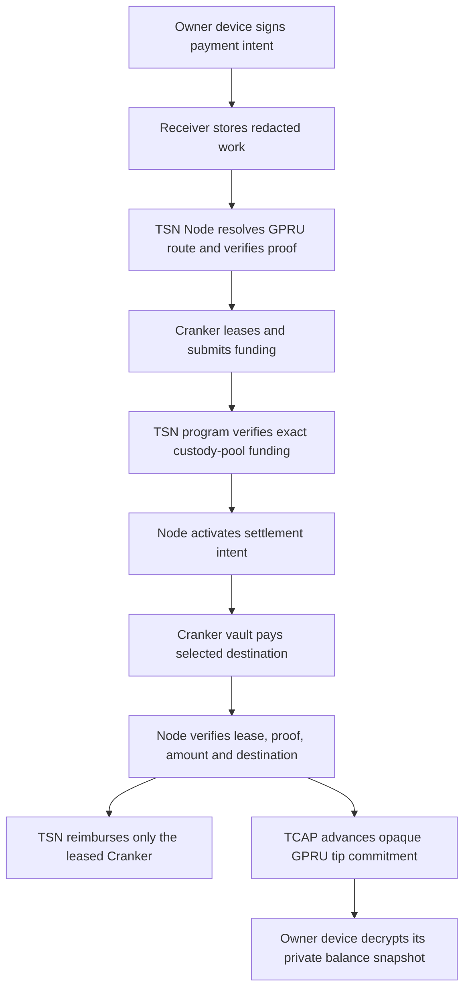

# GPRU ownership and TCAP custody

This document records the intended privacy boundary for the current TrustLink
design. ZK-PRU is retained as historical research; GPRU is the current opaque
ownership and route commitment, while TCAP advances a private balance
commitment. The deployed custody path must still be verified separately.

## What is deliberately not linked

The sender's payment intent and the recipient's GPRU/TCAP transition are not
joined by a protocol-level on-chain payment identifier in the V2 source. The
privacy-safe path does not pass
an intent commitment, recipient TIN, settlement commitment, accepted-intent
root, epoch receipt, or TCAP authorization receipt into the TCAP credit
instruction. It also does not create a per-transfer nullifier account.

The funding transaction therefore proves only that the governed custody pool
received the authorized amount. A later settlement transaction proves that a
leased Cranker paid the selected destination. The V2 source does not provide a
protocol-level public join key for asserting that the funding and the GPRU owner
are the same transfer. Timing, amount and wallet-level correlations remain
outside this instruction's guarantee.

## What remains bound for safety

TCAP still checks the governed asset, active policy, GPRU scope commitment,
validity window, previous commitment, next sequence, and transition nullifier.
The TSN authorization signer is a PDA derived from an opaque authorization
digest and can only be marked as a signer by the approved TSN program during a
CPI. The tip's monotonic sequence and previous commitment provide successor
continuity without a durable per-transfer receipt account. The Node proof must
bind this authorization to verified funding and settlement before deployment.

## Runtime flow

The V1 `AcceptedIntentV1`/`TsnAuthorizationReceiptV1` path remains in source
only for migration and historical auditability. It is not the privacy-safe
transfer path. The V2 instruction source is present but requires an on-chain
program upgrade, an exercised Node proof gate, and a verified custody/funding
integration before it can be used on Devnet or mainnet.
