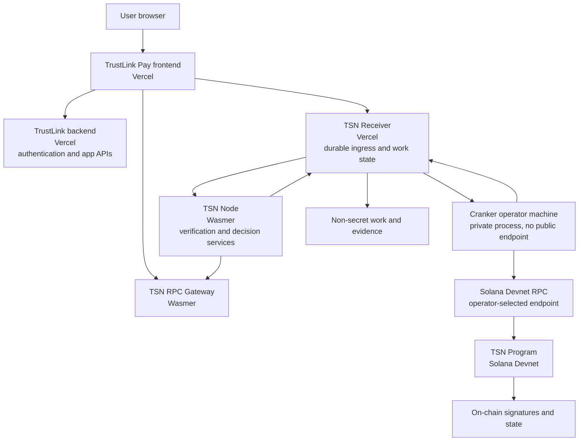

# TrustLink Labs Service Hosting

This document records where the TrustLink Pay and Transfer Settlement Network
(TSN) components run. It describes the current Devnet/test deployment, not a
mainnet production guarantee.

## Public service map

| Component | Responsibility | Hosting | Public endpoint | Source |
| --- | --- | --- | --- | --- |
| TrustLink Pay frontend | Browser application, wallet connection, local authorization, UI | Vercel | [trustlink-pay.vercel.app](https://trustlink-pay.vercel.app/) | `trustlink-pay` repository, `frontend/` |
| TrustLink backend | User authentication, application APIs, non-secret application data | Vercel | [trustlink-pay-backend.vercel.app](https://trustlink-pay-backend.vercel.app/) | `trustlink-pay` repository, `backend/` |
| TSN Receiver | Durable ingress, Firestore-backed work records, leases, transitions, and evidence | Vercel endpoint supplied | [tsn-receiver-kappa.vercel.app](https://tsn-receiver-kappa.vercel.app/) | [bigdreamsweb3/tsn-receiver](https://github.com/bigdreamsweb3/tsn-receiver) |
| TSN RPC Gateway | Controlled Solana RPC access and upstream selection | Wasmer | [tsn-rpc-gateway.wasmer.app](https://tsn-rpc-gateway.wasmer.app/) | [bigdreamsweb3/tsn-rpc-gateway](https://github.com/bigdreamsweb3/tsn-rpc-gateway) |
| TSN Node | Stateless verification, route resolution, epoch work, and Receiver work processing | Wasmer | [tsn-node.wasmer.app](https://tsn-node.wasmer.app/) | [bigdreamsweb3/tsn-node](https://github.com/bigdreamsweb3/tsn-node) |
| Cranker operator | Leases verified work and submits the exact authorized Solana transaction | Operator machine | No public service URL | `tsn-protocol/tsn-cranker-op-daemon/` |
| TSN Program | On-chain authorization, commitments, escrow, replay, and settlement state | Solana Devnet | Program account, not HTTP | `tsn-protocol/tsn/protocol/` |
| TIN Program | On-chain Transfer Identity Number registry | Solana Devnet | Program account, not HTTP | `transfer-identity-protocol/` |

The Cranker is intentionally not hosted as a public API. An operator runs it
on a workstation, VM, or private machine with its fee-payer/operator key. The
Cranker receives only authenticated, non-secret work from the Receiver and
submits transactions to Solana.

## Runtime topology



## Transaction responsibility

1. The frontend and authorized device create and sign public execution data.
2. The frontend submits the intent to the TSN Receiver.
3. The Receiver stores the intent as durable work and exposes it to the TSN
   Node.
4. The TSN Node verifies signatures, commitments, route data, expiry, replay
   state, and required policy conditions. It writes the verification result
   back to the Receiver.
5. A Cranker leases only verified work from the Receiver.
6. The Cranker submits the exact authorized transaction and pays Solana fees.
7. The TSN Program performs on-chain verification and state transitions.
8. The Cranker and TSN Node return signatures and non-secret evidence to the
   Receiver.

The Receiver stores coordination state; it does not become the cryptographic
decision authority. The TSN Node verifies work; it does not replace the
on-chain TSN Program. The Cranker submits transactions; it does not choose
sources, rewrite amounts, decrypt user secrets, or decide that a payment is
settled.

## Local-to-live endpoint policy

Local development may use localhost services, but the runtime has live
fallbacks when a local service is stopped:

| Local component | Local address | Live fallback |
| --- | --- | --- |
| Frontend backend proxy | `http://localhost:3000` | `https://trustlink-pay-backend.vercel.app` |
| RPC Gateway | `http://127.0.0.1:8787` | `https://tsn-rpc-gateway.wasmer.app` |
| TSN Receiver | `http://127.0.0.1:8010` | `https://tsn-receiver-kappa.vercel.app` |
| TSN Node | `http://127.0.0.1:8000` | `https://tsn-node.wasmer.app` |

Relevant fallback variables are server-side unless they begin with
`NEXT_PUBLIC_`:

- `NEXT_PUBLIC_BACKEND_URL`
- `NEXT_PUBLIC_TSN_RPC_GATEWAY_URL`
- `TSN_RPC_GATEWAY_URL`
- `TSN_RECEIVER_URL` and `TSN_RECEIVER_FALLBACK_URL`
- `TSN_NODE_URL` and `TSN_NODE_FALLBACK_URL`

Only public HTTPS URLs may be exposed to the browser. API keys, Firebase
credentials, route-decryption keys, operator keys, and Cranker key material
must remain in Vercel/Wasmer secret configuration or the Cranker operator
machine. They must never be placed in `NEXT_PUBLIC_*` variables.

## Cranker operator setup

Crankers run independently from the hosted services. A machine running a
Cranker needs:

- Node.js and the Cranker dependencies;
- the live TSN Receiver URL and Cranker service credential;
- a Cranker operator/fee-payer key held only by that operator;
- a direct Solana Devnet RPC endpoint for transaction submission;
- access to the public TSN Program ID and token metadata.

From the repository root, the operator process is started with:

```powershell
npm run tsn:cranker:start
```

The Cranker should be supervised by the operator’s process manager (for
example, a system service, Docker restart policy, or a workstation task). It
does not need to be reachable from the public internet.

## Deploying updates

- Frontend and backend: deploy through their Vercel projects.
- TSN Receiver: deploy the standalone `tsn-receiver` repository and set
  `TSN_RECEIVER_URL=https://tsn-receiver-kappa.vercel.app`.
- TSN RPC Gateway: deploy the standalone Wasmer app from
  `tsn-rpc-gateway` and set
  `TSN_RPC_GATEWAY_URL=https://tsn-rpc-gateway.wasmer.app` and
  `NEXT_PUBLIC_TSN_RPC_GATEWAY_URL=https://tsn-rpc-gateway.wasmer.app`
  where browser access is required.
- TSN Node: deploy the standalone Wasmer app from `tsn-node`.
- Cranker: update the operator machine and restart its supervised process.
- TSN/TIN Programs: deploy or upgrade explicitly on Solana Devnet; an HTTP
  service deployment does not upgrade an on-chain program.

After any service update, verify the service’s own logs and then submit a
small Devnet test intent. A `200 OK` work poll confirms connectivity, but it
does not by itself prove that a payment settled on-chain.

> **Canonical Devnet endpoints:** the Receiver is
> `https://tsn-receiver-kappa.vercel.app` and the RPC Gateway is
> `https://tsn-rpc-gateway.wasmer.app`. Keep these values in deployment
> environment configuration and update all aliases together if hosting changes.

## Deployed Devnet program IDs

| Program | Program ID |
| --- | --- |
| TSN / TrustLink Escrow | `TSN31jddtsmUg4D5aEdhY31nwB1e53VJJg9X8NoRP8V` |
| TIN registry | `TinseNnU588NkmRZBe4ADJbxqrqQma92678UFP6VuwT` |
