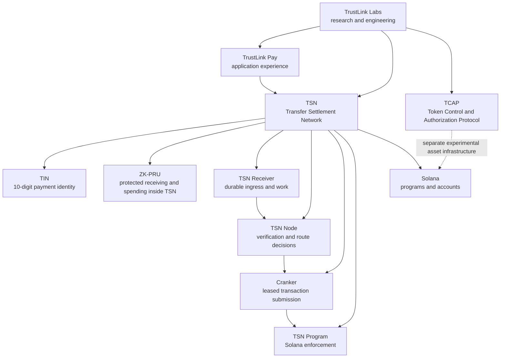
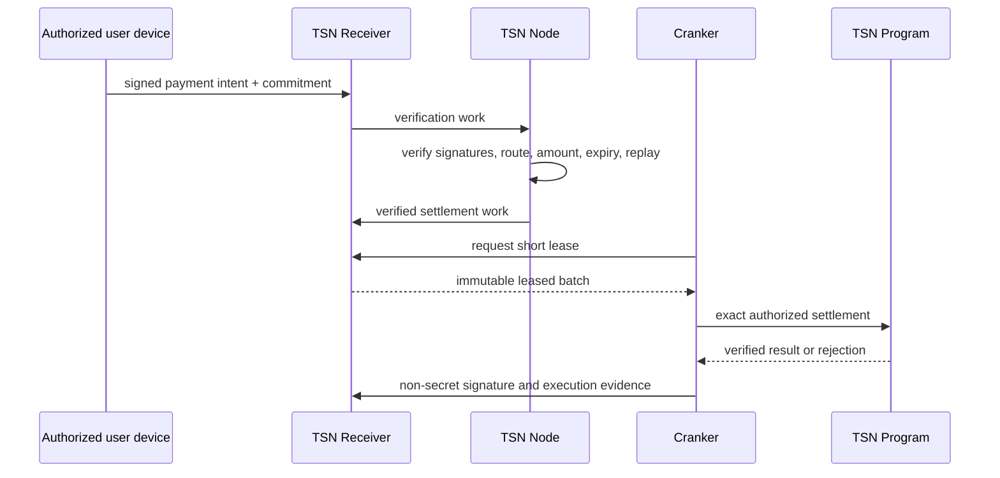

# TrustLink Labs

## Open infrastructure for identity-first, privacy-aware blockchain payments

TrustLink Labs is a research and engineering organization building the Transfer Settlement Network (TSN): an open payment infrastructure stack designed to make stablecoin payments easier to use without giving up user ownership or verifiability.

TrustLink Labs develops protocols, SDKs, Solana programs, research papers, and reference applications. TrustLink Pay is the application experience; TSN is the network beneath it.

## The current architecture

### TSN — the network

TSN coordinates the payment lifecycle:

- signed payment intents from authorized user devices;
- durable Receiver storage and work queues;
- TSN Node verification, route resolution, and decision state;
- short Cranker leases and exact settlement submission;
- commitment, replay, expiry, and authorization checks;
- Solana program enforcement and settlement evidence.

TSN is the complete network. TIN, ZK‑PRU, and TCAP are protocol components with distinct responsibilities; they are not separate products added together as a marketing stack.

### TIN — payment identity

A Transfer Identity Number (TIN) is a human-facing 10-digit payment identity. It separates the identity a user shares from the wallet or protected receiving route used for settlement.

TIN can bind identity metadata, owner authority, route commitments, encrypted envelopes, and versioned integrity state. It does not turn a wallet address into a user's permanent public identity.

### ZK‑PRU — protected receiving and spending inside TSN

ZK‑PRU is TSN's protected receiving and spending subsystem. It manages ZK‑PRU receiving units (PRUs), route commitments, local child-authority derivation, receiving accumulation, adaptive spending, and change routing.

The authorized user device decrypts private seed material and derives selected authorities locally. TSN services receive public keys, signatures, commitments, and non-secret execution data—not the master seed or user private keys.

ZK‑PRU is not a claim of formal zero-knowledge proofs or perfect transaction unlinkability. Commitments and architectural separation reduce unnecessary disclosure while preserving on-chain verification.

### TCAP — Token Control and Authorization Protocol

TCAP is TrustLink Labs' separate experimental protocol for governed token control, asset registration, mint and token-program binding, reserve relationships, authorization, and confidential-asset research.

TCAP is not the current TSN settlement actor. Current Devnet TSN payments use the TSN Program, controlled settlement accounts, and Cranker execution. TCAP may be integrated later after its asset and confidential-transfer controls are independently verified.

Stable-TCAP is a Devnet-only, valueless test asset. It is not USDC and is not a production stablecoin.

## How a TSN payment moves

Native TIN-to-TIN is the privacy-focused route. Wallet-to-TIN, TIN-to-wallet public exit, and wallet-to-wallet compatibility routes use the same intent, verification, lease, commitment, and settlement boundaries.

## Research and implementation

- [TrustLink Pay](https://github.com/bigdreamsweb3/trustlink-pay) — reference application and integrated protocol workspace
- [TrustLink Labs Research](https://github.com/Trustlink-Labs/Trustlink-Research) — canonical research papers
- [TSN Receiver](https://github.com/bigdreamsweb3/tsn-receiver) — durable ingress, work, leases, and evidence
- [TSN Node](https://github.com/bigdreamsweb3/tsn-node) — stateless verification and route decisions
- [TSN RPC Gateway](https://github.com/bigdreamsweb3/tsn-rpc-gateway) — controlled Solana RPC transport
- [TSN research blog](https://tsn-protocol.blogspot.com/)

## Devnet reference identifiers

| Component | Identifier | Status |
| --- | --- | --- |
| TSN / TrustLink Escrow program | `TSN31jddtsmUg4D5aEdhY31nwB1e53VJJg9X8NoRP8V` | Active Devnet program |
| TIN registry program | `TinseNnU588NkmRZBe4ADJbxqrqQma92678UFP6VuwT` | Active Devnet program |
| TCAP experimental program | `TcApT4CytBqvqEDpRYVB7Wfi6aFzmtSZdWvDsq6bp9x` | Separate experimental Devnet program |
| Stable-TCAP faucet program | `E7jSHdPLzgGafBou5PswKcsS5JxiPnek7TxquFAxXm6h` | Devnet test infrastructure |

Identifiers are provided for reproducible Devnet research. They do not imply mainnet readiness or completed TCAP integration.

## Engineering principles

### Privacy by architecture

Privacy begins by limiting unnecessary relationships and disclosures before a transaction reaches the ledger. Cryptographic commitments and confidential-asset research complement that architecture; they do not replace careful system boundaries.

### User ownership

Users control their identity authorities, device authorization, keys, and assets. Infrastructure coordinates execution without receiving user private keys.

### Verifiable execution

Receiver records, Node decisions, Cranker leases, canonical commitments, and Solana program checks provide an auditable path from intent to settlement.

### Modular open infrastructure

Identity, protected receiving, settlement coordination, asset control, SDKs, and applications have distinct interfaces so researchers and developers can review or build on the part they need.

## Current scope

TrustLink Labs is actively developing and testing TSN, TIN, ZK‑PRU, TCAP, Token-2022 asset tooling, commitment-based settlement, authorized-device private views, and developer infrastructure on Solana Devnet.

Recurring payments and subscription-provider execution are not presented as active production capabilities. Mainnet readiness, formal cryptographic audits, perfect unlinkability, and full TCAP confidential settlement remain separate milestones.

## Join the work

We welcome protocol engineers, cryptographers, security researchers, distributed-systems developers, technical writers, and open-source contributors.

Follow the research, inspect the code, reproduce the Devnet flows, and help build open payment infrastructure with TrustLink Labs.
