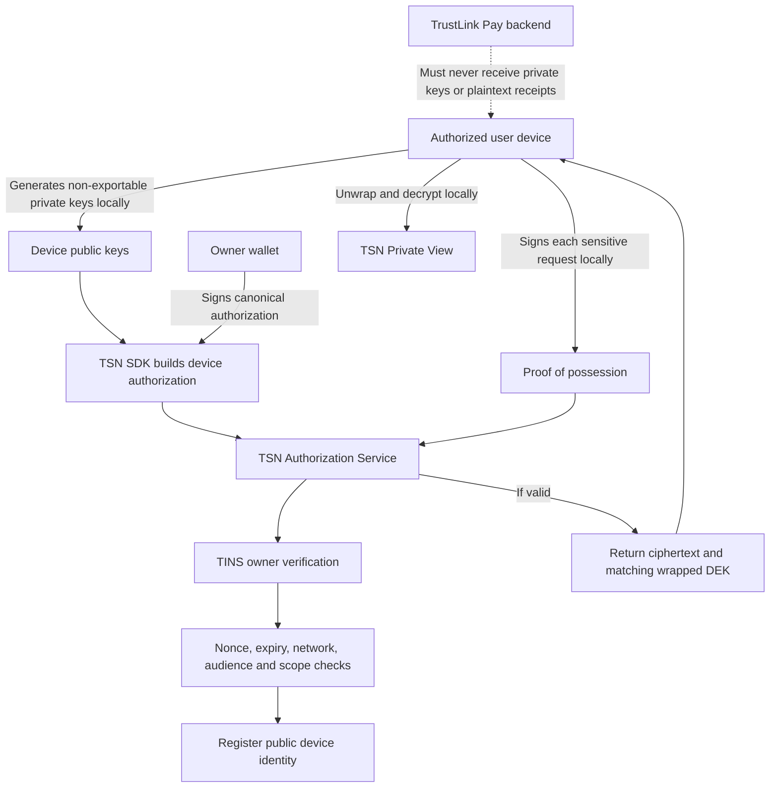

# TSN Device Authorization

TSN device authorization lets a wallet owner approve a user-controlled device for private settlement access without giving TrustLink Pay or any platform service custody of private keys or decrypted records.

The owner wallet is the root authorization authority. The actual TINS account is the source of the owner commitment. TrustLink Pay login records are not an authorization source for TSN private data.

## Responsibility boundary

| Authorized user device | TSN authorization infrastructure | TrustLink Pay |
|---|---|---|
| Generates Ed25519 signing and X25519 encryption keys with non-exportable Web Crypto private keys | Issues short-lived registration challenges | Requests authorization through the TSN SDK |
| Performs passkey or WebAuthn user verification when configured | Verifies the canonical owner-wallet signature | Mounts TSN private-view components |
| Retains private keys in device-controlled secure storage | Reads the TINS account and verifies its owner commitment | Receives privacy-safe state and lifecycle events |
| Signs every sensitive request | Validates network, audience, TIN, device fingerprints, permission scope, nonce, and expiry | Never receives private keys, unwrapped DEKs, or decrypted receipts |
| Unwraps receipt DEKs and decrypts receipts locally | Stores public device keys, commitments, permissions, and revocation status | Is not the device registry authority |
| Renders plaintext through the TSN private-view runtime | Returns ciphertext and the matching wrapped-DEK envelope after proof verification | Is not the source of TIN ownership |

Private keys, unwrapped DEKs, and decrypted receipt objects never cross the device boundary.

## Authorization flow



The current deployment hosts the TSN authorization transport and persistence adapters inside the backend process. The public contracts and verification rules live in TSN SDK server modules, so the same endpoints can move to a standalone TSN Authorization Service without changing an integrating application's authorization contract.

## Registration challenge

The device requests a registration challenge from:

```text
POST /api/tsn/privacy/devices/challenge
```

The request supplies the TIN. The response contains a random 256-bit nonce, TIN commitment, network, audience, issue time, and expiry. The challenge expires after five minutes.

The infrastructure stores only a commitment to the nonce. Registration atomically marks the matching issued challenge as consumed. The comparison includes the TIN commitment, network, audience, issue time, and expiry, so a challenge cannot be moved to another authorization context. The challenge expiry limits the enrollment proof; it does not expire the registered device. A device remains active until revocation or an independently configured device-expiry policy.

## Canonical wallet authorization

The SDK authorization binds:

```text
protocol version
authorization domain
network
TIN commitment
owner identity commitment
device signing-key fingerprint
device encryption-key fingerprint
permission scopes
history recovery scope
selected receipt identifiers when applicable
nonce
issued-at time
expiry
audience
```

The TSN Authorization Service first verifies the canonical wallet signature and device fingerprints. It then resolves the actual TINS account and compares its stored owner commitment with the signing wallet. Registration fails if either check fails.

Supported device permissions are defined by the TSN SDK. Unknown scopes are rejected rather than stored as application-defined authority.

## V1 owner-verification boundary

The V1 authorization verifier receives the signing wallet public key only as transient signature-verification material. It verifies the Ed25519 signature, hashes the signer public key, compares the result with the owner commitment stored by TINS, and then discards the raw key reference. The registration result contains only:

~~~ts
{
  ownerVerified: true,
  deviceAuthorized: true,
}
~~~

The raw signer public key is not written to the TrustLink Pay database, the TSN device registry, logs, caches, analytics, application responses, or private-session records. Device records contain the TIN commitment, owner identity commitment, public device keys, device-key fingerprints, permissions, status, and authorization commitment.

A standard wallet adapter exposes the connected wallet public key to JavaScript running in the same application origin. TSN V1 does not claim that this connection hides the wallet key from a malicious host application. The current guarantee is narrower and enforceable: TrustLink Pay does not persist, return, cache, render, or treat that raw key as the TIN identity. During device registration it exists transiently in the TSN SDK authorization client and in the TSN Authorization Service verifier only for signature and TINS commitment verification.

The ZK-PRU authorization design replaces this transitional signer-key handling with a privacy-preserving ownership proof. That proof will demonstrate control of the TIN owner authority while binding the device keys, registration nonce, permission scope, TIN commitment, network, audience, issue time, and expiry. Integrating applications will receive no main-wallet identity, and each application can receive a distinct unlinkable application-facing identity without changing the public device-authorization result.

## Stored device record

The TSN device registry stores:

- device identifier;
- TIN commitment;
- owner identity commitment;
- signing public JWK and fingerprint;
- encryption public JWK and fingerprint;
- permission scopes;
- history recovery scope;
- authorized network and audience;
- authorization commitment;
- authorization, expiry, last-use, and revocation status.

It does not store signing private keys, encryption private keys, recovery private keys, raw DEKs, decrypted receipts, or a universal decryption key.

## Private sessions and proof of possession

A private session token is stored only as a domain-separated hash. The token alone is insufficient for a sensitive request.

Every session creation and private receipt request includes a fresh Ed25519 device signature over:

```text
protocol version
proof domain
session ID
device ID and signing-key fingerprint
permission
HTTP method
resource path
request-body commitment
nonce
issued-at time
expiry
audience
```

The TSN verifier checks the active session, active device, TIN binding, registered public key, session and device permissions, request target, body commitment, audience, expiry, and signature. It then atomically consumes the request nonce. Reusing the proof, changing the receipt, or presenting a stolen session token without the device key fails.

## Encrypted receipt delivery

After successful session and proof verification, the private receipt endpoint returns only:

- encrypted receipt ciphertext and authentication metadata;
- the key envelope addressed to the authorized device's encryption-key fingerprint.

The service does not unwrap the envelope or decrypt the receipt. Those operations happen on the authorized device inside TSN SDK private-view code.

## Revocation

Revoking a device changes its authorization status, revokes its active private sessions, blocks future receipt access, and removes it from future key-envelope creation. Revocation cannot erase plaintext or key material that a device legitimately accessed while authorized.

## Verified implementation status

The current implementation has been verified to provide:

- no server-side device private-key generation;
- no private-key fields in registration, session, or receipt API schemas;
- no dependency on TrustLink Pay login or user records for TSN authority;
- owner verification against the TINS account on Solana;
- public-only device registry records;
- fresh signed proof-of-possession on session creation and receipt access;
- TSN SDK server contracts that are independent of the current backend host;
- transient raw signer processing only inside the SDK authorization client and TSN server verifier;
- no raw owner-wallet field in authorization results, device records, sessions, or application responses.

The SDK currently generates non-exportable Web Crypto credentials. Persistent WebAuthn/passkey enrollment and secure browser credential storage are device-side integration work and are not represented as active until the live client flow is connected and verified. The legacy TrustLink claim-key path remains isolated from this authorization contract and is not removed until that verified cutover is complete.
