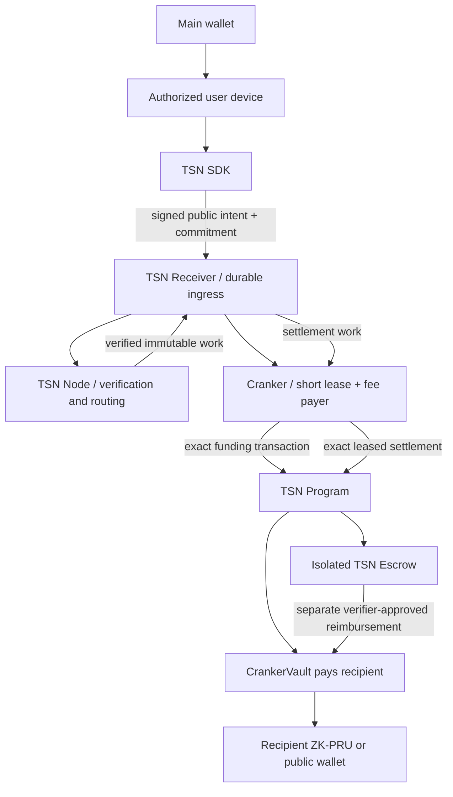
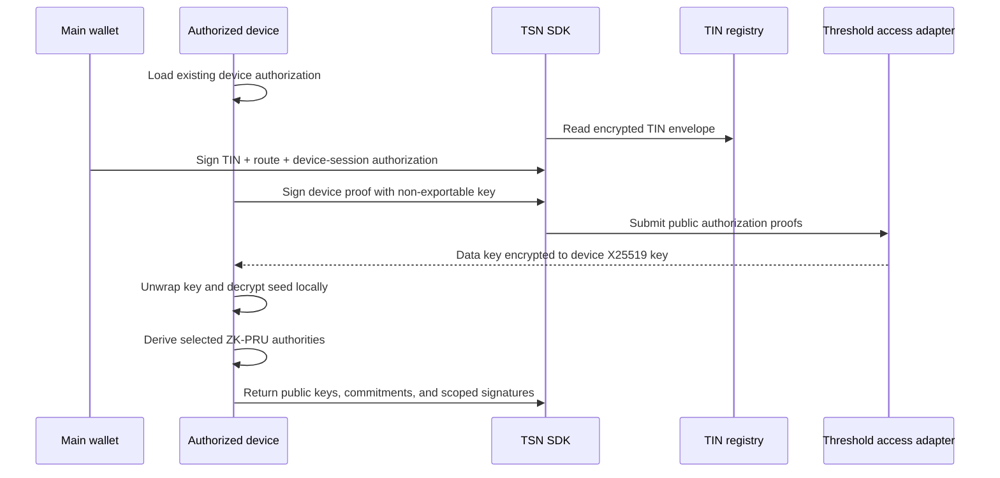
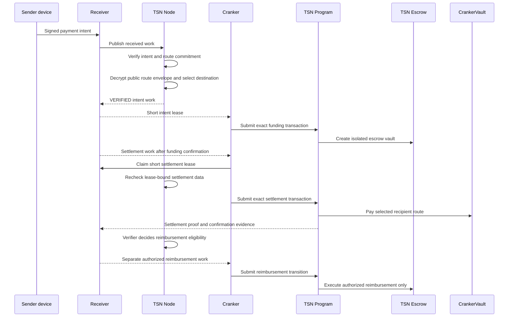

# TrustLink / TSN Final Architecture

This document describes the architecture used for the current TrustLink
development network. It is the canonical explanation of how TIN, ZK-PRU,
the TSN Receiver, TSN Node, Cranker, and the on-chain TSN Program work
together.

## Network model

TSN is the payment infrastructure. TIN is the payment identity. ZK-PRU is the
private receiving and authorization technology used by a TIN. TrustLink Pay
is the application that lets a user operate the system.

The Receiver stores durable public work and status in Firestore. The Node is
stateless and performs protocol verification. The Cranker submits only work
that the Node has verified. The Cranker is paid from its protocol vault first;
the isolated escrow reimburses only the Cranker that held the successful lease.
None of these services receives a TIN master seed, a PRU private key, or a
serialized user signer.

## TIN account

A finalized TIN account contains:

- the TIN number and public display name;
- the main-wallet authority commitment;
- an encrypted master-seed envelope;
- a ZK-PRU configuration commitment;
- a separately encrypted public-route envelope;
- route version and route nonce.

The TIN does not store an authorized-device list. Device authorization remains
in the existing Private View device system. Authorizing a new device therefore
does not require changing the TIN account.

## Master seed and authorized devices

The TSN SDK generates a random master seed on the user device. It is never
derived from the wallet signature. The wallet signs a canonical authorization
that binds the TIN, route version, ZK-PRU commitment, resource commitment, and
the current authorized-device session.

The seed is encrypted locally. The independent data key is released only as an
envelope encrypted to the authorized device's non-exportable X25519 key. The
device unwraps the key and decrypts the seed locally. A copied wallet
signature is not sufficient on an unauthorized device.

Plaintext seed material never enters the Receiver, Node, Cranker, backend,
logs, analytics, or payment records. It is cleared after the selected public
keys and signatures are produced.

## ZK-PRU derivation and balances

The SDK derives a deterministic set of ZK-PRU child authorities from the
random master seed and the TIN identifier. It computes a configuration
commitment over the ordered public set. To load a user's balance, the
authorized device:

1. unlocks the encrypted seed locally;
2. derives the public ZK-PRU addresses;
3. verifies the derived set against the TIN commitment;
4. queries public token accounts for those addresses;
5. aggregates balances for the signed-in user interface.

The public token accounts are observable on Solana. The private association
between a TIN and its derived ZK-PRU set is not sent to the application
backend.

## Receiving a payment

The recipient does not need to be online. The TIN stores a separate encrypted
route envelope containing only public ZK-PRU routing metadata. The TSN Node
decrypts this envelope with its routing key, verifies the configuration
commitment, and selects an eligible receiving public key according to the
allocation policy.

The route envelope never contains the master seed or a private key. The
Cranker receives only the minimized route authorization required to submit the
already-verified work.

## Spending from a TIN

Every ZK-PRU spend requires both authorizations over the same canonical plan
commitment:

1. the main wallet authorizes the complete payment plan;
2. the selected ZK-PRU child authority signs the exact source and amount.

The TSN Program rejects a missing signature, mismatched commitment, wrong
source, stale state version, expired plan, replay, wrong delegate, or
insufficient allowance. The Cranker never reconstructs a user key and never
replans a payment.

## Receiver, Node, and Cranker responsibilities

| Component | Responsibility | Must never do |
| --- | --- | --- |
| TrustLink Pay | Authenticate the user and collect wallet/device approvals | Hold TIN master seeds |
| TSN SDK | Derive local ZK-PRU data, build commitments, create scoped signatures | Export plaintext private keys |
| TSN Receiver | Store public ingress, leases, immutable work, and status | Verify cryptography or decrypt private data |
| TSN Node | Verify plans, commitments, signatures, replay and route state | Sign as a user or choose a private key |
| Cranker | Pay fees and submit exact verified batches | Change amount, route, fee, or destination |
| TSN Program | Enforce on-chain signatures, delegate authority, escrow and state transitions | Trust an unverified route |

## Current Devnet migration gate

TIN `1000000008` is currently a legacy on-chain account. It has no finalized
encrypted public-route envelope, so the Node correctly rejects new work with
`Recipient TIN ... has no finalized PRU route`.

The safe migration sequence is:

1. build and deploy the current TIN Registrar program from WSL;
2. verify the deployed program ID and upgrade authority;
3. authorize the current browser device through Private View;
4. have the owner wallet sign the finalized TIN upgrade in the frontend;
5. create the encrypted master-seed and public-route envelopes locally;
6. submit the owner-signed update transaction;
7. verify the new route commitment and route version on Devnet;
8. retry a small funding transaction.

The old `tin:update:legacy` helper is not part of this flow. It prints seed
material and does not construct the finalized route envelope; it must not be
used for the production-shaped migration.

## Deployment boundary

Program builds and deployments require the pinned Solana/SBF toolchain in WSL.
The Windows shell in this repository does not provide `cargo build-sbf`, so a
Windows `npm run tip:build` failure with “no such command: build-sbf” is a
toolchain limitation, not evidence that the Rust program is invalid.

No Devnet signature is claimed until the WSL build, deploy, upgrade, and route
verification commands have completed successfully.
