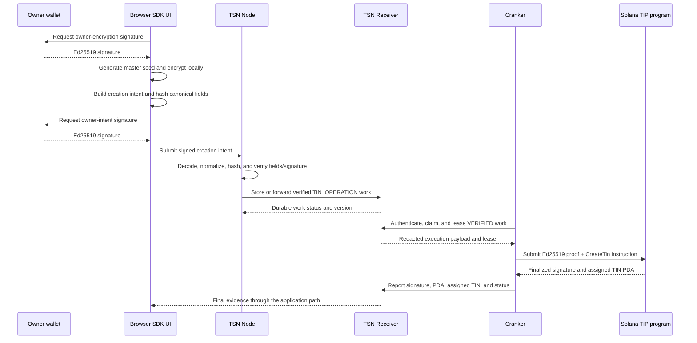

# TIN creation: Receiver, Node, and Cranker data flow

This document describes the program-assigned TIN creation path used by the
protocol UI. It separates the data visible to each service from the private
material retained by the owner device. A Node acceptance or Cranker lease is
not an on-chain TIN: the TIN exists only after the TIP program finalizes the
creation transaction.

## End-to-end sequence



## Boundary names for the recorded UI flow

Use these names exactly when describing a run:

1. **Browser → TSN Receiver ingress** — the protocol UI calls the Receiver's
   `POST /tin-operations` endpoint through the SDK. The Receiver creates a
   durable `TIN_OPERATION` record before any Node verification.
   A browser request sent directly to the Node's `/tin-operations` endpoint is
   rejected because that endpoint requires the internal Node service key.
2. **TSN Receiver → TSN Node wake** — after the Firebase transaction commits,
   the Receiver sends an authenticated, payload-free wake to the Node.
3. **TSN Node queue lease and verification** — the Node leases `RECEIVED` work
   from the Receiver, logs the Receiver work ID, state version, kind, and
   payload commitment, validates the leased payload, and records those lease
   fields with the verified result. This is the evidence that the Node checked
   the data held by the Receiver rather than a browser-local copy.
4. **Cranker → TSN Receiver lease** — the Cranker asks the Receiver for
   `TIN_OPERATION` work and receives only the redacted verified view after
   Ed25519 admission and leasing.
5. **Cranker → Solana TIP program submission** — the Cranker builds and sends
   the exact `CreateTin` transaction, then reports the signature and decoded
   TIN back to the Receiver.

For the video recorded on 2026-09-25, the correct status label is:

```text
Browser -> live TSN Receiver/Firebase: RECEIVED
TSN Receiver -> local TSN Node: WAKE SENT (no payload)
local TSN Node: QUEUED, THEN LEASED FOR VERIFICATION
Cranker -> Solana: NOT YET SUBMITTED
TIN finalization: NOT YET CONFIRMED
```

## 1. Browser and wallet boundary

The owner supplies only a connected wallet and display name. The browser then:

1. Requests a readable owner-encryption approval message from the SDK.
2. Generates a random 32-byte master seed locally.
3. Derives an AES-256-GCM data key from the owner signature and encrypts the
   master seed with a fresh 12-byte nonce and canonical additional data.
4. Builds the encrypted owner envelope and its integrity commitments.
5. Builds the program-assigned creation intent through the TSN SDK.
6. Requests a second wallet signature over the owner intent message.

The plaintext master seed, wallet secret key, and encryption signature do not
leave the browser. The wallet signs with Ed25519; the browser sends signatures,
commitments, and opaque encrypted bytes.

## 2. Browser to Node payload

The UI submits a signed JSON request to the Node. The important fields are:

| Field | Node-visible form | Purpose |
| --- | --- | --- |
| `intentType` | `tin_creation` | Selects the TIN creation verifier. |
| `programAssigned` | `true` | The program assigns the TIN; the user does not choose it. |
| `ownerPubkey` | Base58 Solana public key | Binds the request to the wallet owner. |
| `displayName` | UTF-8 text | Name stored with the identity record. |
| `encryptedMasterSeed` | Base64 opaque bytes | Browser-encrypted seed envelope; Node does not decrypt it. |
| `encryptedMetadataHash` | 32-byte hash | Commitment to encrypted metadata. |
| `pruConfigurationHash` | 32-byte hash | Route configuration commitment. |
| `encryptedPublicRouteEnvelope` | Base64 opaque bytes or empty | Node-readable encrypted route material when the route requires it. |
| `routeVersion` and `routeNonce` | Integer and opaque nonce | Version and replay binding for the route. |
| `ownerIntentHash` | 32-byte SHA-256 digest | Canonical commitment to the complete creation request. |
| `ownerSignature` | 64-byte Ed25519 signature, Base64 encoded | Authorizes the exact owner intent. |
| `expiry` and `nonce` | Integer and opaque nonce | Validity window and replay protection. |

The request does not contain a plaintext seed, private key, or user-selected
TIN. The complete serialized field order and domain separators are defined in
[the TIN creation handoff](./TSN-TIN-CREATION-INTENT-HANDOFF.md).

## 3. Node validation

The Node performs validation before durable work can become Cranker-eligible:

1. Parse the request and enforce required types, lengths, and Base64/hex
   encodings.
2. Confirm `programAssigned`, the supported intent type, positive route version,
   nonce, expiry, and owner public-key format.
3. Recompute the canonical intent hash from the exact byte fields.
4. Verify the 64-byte Ed25519 owner signature against the owner public key.
5. Reject expired, malformed, duplicate, or replayed intents.
6. Validate route commitments and encrypted envelope bindings.
7. Store a `TIN_OPERATION` with a monotonic status/version and an opaque
   operation identifier.

The Node may read the encrypted public route envelope using
`TSN_ROUTE_DECRYPTION_PRIVATE_KEY` when route resolution requires it. It does
not decrypt the owner master-seed envelope. Private fields are removed from
Cranker coordination views before work is exposed for leasing.

## Example submission records

The following examples show the shape of a real run with values shortened or
replaced. They are safe documentation examples; they are not fabricated
transaction evidence.

### Browser to Node: signed creation intent

```json
{
  "intentType": "tin_creation",
  "programAssigned": true,
  "ownerPubkey": "7m...OwnerWallet",
  "displayName": "Demo User",
  "encryptedMasterSeed": "base64:AES_GCM_ENVELOPE...",
  "encryptedMetadataHash": "0000...64_hex_chars",
  "pruConfigurationHash": "0000...64_hex_chars",
  "encryptedPublicRouteEnvelope": "",
  "routeVersion": 1,
  "routeNonce": "a1...64_hex_chars",
  "tcapRouteVersion": 1,
  "tcapRelationshipCommitment": "b2...64_hex_chars",
  "tcapRelationshipReference": "c3...64_hex_chars",
  "tcapPolicyCommitment": "d4...64_hex_chars",
  "nonce": "e5...64_hex_chars",
  "ownerIntentHash": "f6...64_hex_chars",
  "expiry": 1780000000,
  "ownerSignature": "base64:64_byte_Ed25519_signature"
}
```

### Receiver durable work record

The Receiver keeps the ingress payload for the Node projection, plus durable
coordination metadata. A representative record is:

```json
{
  "id": "tin-op-uuid",
  "kind": "TIN_OPERATION",
  "status": "RECEIVED",
  "stateVersion": 1,
  "payload": {
    "intentType": "tin_creation",
    "ownerPubkey": "7m...OwnerWallet",
    "encryptedMasterSeed": "base64:AES_GCM_ENVELOPE...",
    "ownerIntentHash": "f6...64_hex_chars"
  },
  "verification": null,
  "receivedAt": "2026-09-25T12:20:00.000Z"
}
```

The Receiver wakes the Node with an authenticated, payload-free internal wake.
The Node then reads the durable work through the Receiver's authenticated
internal work endpoint, verifies it, and writes the verification result back.

### Receiver after Node verification

```json
{
  "id": "tin-op-uuid",
  "kind": "TIN_OPERATION",
  "status": "VERIFIED",
  "stateVersion": 2,
  "verification": {
    "verificationType": "TSN_TIN_OPERATION",
    "verifiedPayload": {
      "intentType": "tin_creation",
      "programAssigned": true,
      "ownerPubkey": "7m...OwnerWallet",
      "ownerIntentHash": "f6...64_hex_chars",
      "routeVersion": 1,
      "expiry": 1780000000
    }
  }
}
```

The stored verification evidence can include private fields for the Node's
internal projection, but the Receiver's Cranker endpoint applies a separate
redaction projection before returning work.

### Cranker work view

The Cranker receives only the privacy-minimized verified view needed to build
the exact transaction:

```json
{
  "id": "tin-op-uuid",
  "kind": "TIN_OPERATION",
  "status": "LEASED",
  "stateVersion": 3,
  "crankerLease": {
    "owner": "9x...CrankerOperator",
    "expiresAt": "2026-09-25T12:25:00.000Z"
  },
  "verification": {
    "verificationType": "TSN_TIN_OPERATION",
    "verifiedPayload": {
      "intentType": "tin_creation",
      "ownerPubkey": "7m...OwnerWallet",
      "ownerSignature": "base64:64_byte_Ed25519_signature",
      "ownerIntentHash": "f6...64_hex_chars",
      "encryptedMasterSeed": "base64:AES_GCM_ENVELOPE...",
      "encryptedMetadataHash": "0000...64_hex_chars",
      "routeVersion": 1,
      "routeNonce": "a1...64_hex_chars"
    }
  }
}
```

The Cranker does not receive browser private keys, plaintext master seeds, or
the complete private route map. It uses the owner proof and opaque payload to
construct the on-chain instruction, then reports a result such as:

```json
{
  "status": "CONFIRMED",
  "stage": "TIN_CREATED",
  "signature": "5x...SolanaSignature",
  "registry": "8p...IdentityRegistryPda",
  "tin": "1234567890"
}
```

## 4. Receiver storage and service boundary

The Receiver owns durable coordination state. It records the operation, status,
lease, version, timestamps, verification evidence, and the redacted execution
view. The Receiver does not validate the owner cryptography; the Node is the
verification authority. The Node and Receiver authenticate with
`TSN_RECEIVER_NODE_API_KEY`.

Typical state progression is:

```text
RECEIVED -> NODE_VERIFYING -> VERIFIED -> LEASED -> SUBMITTED -> FINALIZED
                         \-> REJECTED / EXPIRED / FAILED
```

The Receiver never sends plaintext master seeds or browser private keys to a
Cranker. It wakes the Node after durable ingress and exposes only the fields
needed for verification, leasing, and evidence reporting.

## 5. Cranker lease and on-chain submission

A Cranker authenticates to the Receiver with its Ed25519 challenge-response
identity and proves that its operator account is registered on Solana. It can
claim only `VERIFIED` work and receives a bounded lease containing:

- operation ID and lease expiry;
- owner public key and canonical creation fields;
- encrypted blobs and commitments required by the program;
- the owner authorization evidence;
- the exact instruction inputs needed for `CreateTin`;
- the Cranker/operator identity used for fee payment and submission.

The Cranker cannot change the display name, owner key, route commitments,
nonce, expiry, or encrypted payload without invalidating the owner hash and
on-chain proof. It adds the required fee-payer/operator signature and the
Ed25519 proof instruction, then submits the exact transaction to Solana Devnet.

The program assigns the 10-digit TIN and creates the identity PDA. The Cranker
then reports the confirmed transaction signature, PDA, assigned TIN, slot, and
final status to the Receiver. The owner-facing UI should show a TIN only after
that evidence is confirmed.

## Encryption and signature inventory

| Material | Created by | Protection | Who can read it |
| --- | --- | --- | --- |
| Master seed | Browser | AES-256-GCM, fresh nonce, canonical AAD, commitment | Owner device after local authorization; it is opaque to Node and Cranker. |
| Owner-encryption approval | Wallet | Ed25519 signature over a human-readable SDK message | Node can verify the signature; it cannot derive the wallet secret. |
| Owner intent approval | Wallet | Ed25519 signature over the canonical intent message | Node verifies it; Solana receives the proof needed by the program. |
| Public route envelope | SDK/browser | Encrypted route payload plus route/version commitments | Node may decrypt the route-specific envelope; Cranker receives only the redacted execution view. |
| Cranker lease proof | Cranker | Ed25519 challenge-response and lease authorization | Receiver verifies the operator identity and lease binding. |
| On-chain transaction | Cranker | Solana signatures and program constraints | Solana validators and public account state; private envelope contents remain opaque. |

## Current completion gate

The UI can currently demonstrate browser encryption, SDK construction, wallet
signatures, Node acceptance, and Receiver coordination when those services are
configured. Do not call the flow a completed TIN creation until the Cranker
lease, Solana transaction signature, assigned TIN PDA, and finalized account
state are all recorded. If the Ed25519 proof message used by the Cranker and
the message verified by the program differ, stop at the handoff and fix that
contract before submitting transactions.
