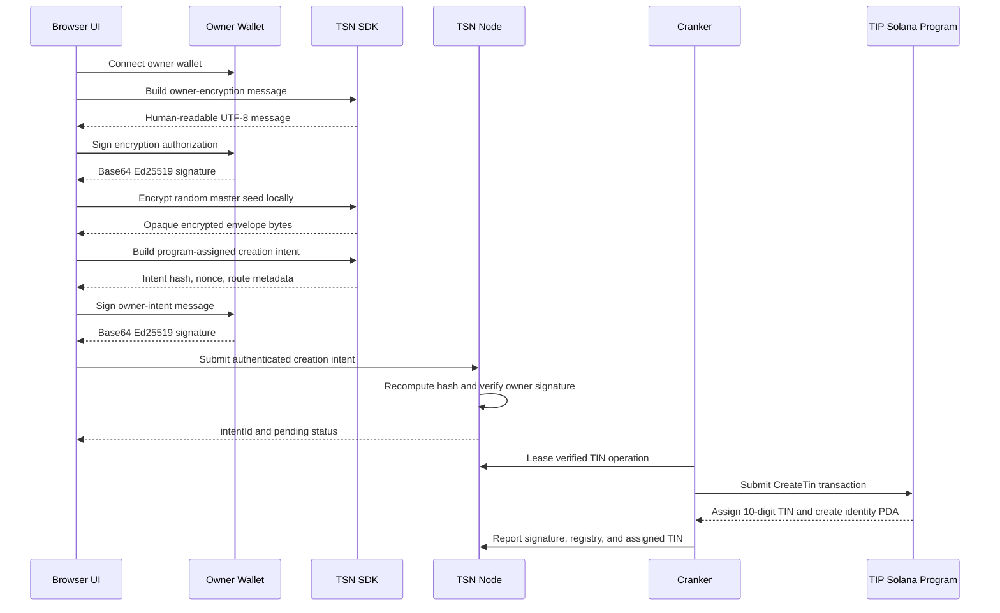

# TSN Program-Assigned TIN Creation Intent

## Status

The browser-to-Node creation flow is working. The Node accepted this creation
intent from the protocol test UI:

```text
TIN CREATION SUBMITTED
intentId: f4c36c8a-76a7-428e-92ec-8336fc9523a2
```

This means the request passed Node-side validation and was written as a
`tin_creation` operation. It does **not** mean that a TIN exists on Solana yet.
The TIN is assigned only when the Cranker submits the on-chain creation
instruction and the Solana program finalizes it.

There is one Cranker handoff issue documented in [Cranker handoff gap](#cranker-handoff-gap).
It must be resolved before treating this flow as production-ready.

## Current Architecture



## User Inputs

The current program-assigned path accepts only:

| Input         | Type                             | Meaning                        |
| ------------- | -------------------------------- | ------------------------------ |
| `ownerPubkey` | Solana public key, base58 string | Wallet that owns the TIN       |
| `displayName` | UTF-8 string                     | Name stored in the TIN account |

The user does not provide:

- a TIN number;
- a phone number;
- a lookup secret;
- a private key;
- a plaintext master seed;
- a Solana transaction.

The program assigns the 10-digit TIN from its global sequence during on-chain
finalization.

## Authorization 1: Owner Encryption Approval

The first wallet prompt authorizes creation of the local encrypted identity
envelope. It is built by:

```text
@trustlink/tsn-sdk.buildProgramAssignedTinOwnerEncryptionMessage
```

The message is UTF-8 text with paragraphs:

```text
TrustLink TIN security approval

You are authorizing private protection for a new TIN identity.

APPROVAL DETAILS
Owner wallet: <base58 wallet>

Display name: <display name>

Version: 1

Request reference: <64 hex characters>

NEXT STEP
Your encrypted identity request will be submitted to TSN.

No funds are transferred by this approval.
```

The request reference is 32 random bytes encoded as 64 lowercase hexadecimal
characters. The wallet signs the UTF-8 bytes of the message with Ed25519.

The browser then derives a 32-byte AES data key from:

```text
SHA-256(owner-encryption-signature-bytes)
```

The browser generates a separate random 32-byte master seed and encrypts it
locally with AES-256-GCM. The plaintext seed never goes to the UI server, TSN
Node, Receiver, or Cranker.

### Owner encryption envelope

The browser serializes the envelope as UTF-8 JSON and sends its bytes to the
UI server as standard base64. The envelope contains:

| Field                      | Type             | Meaning                                                           |
| -------------------------- | ---------------- | ----------------------------------------------------------------- |
| `version`                  | string           | `tsn-tin-master-seed-envelope`                                    |
| `provider`                 | string           | `wallet-owner-signature-v1`                                       |
| `tin`                      | string           | Temporary `program-assigned` marker before Solana assigns the TIN |
| `ownerPublicKey`           | base58 string    | Owner wallet                                                      |
| `routeVersion`             | integer          | `1`                                                               |
| `pruConfigurationHash`     | 64 hex string    | Zero hash for the program-assigned TCap route                     |
| `resourceCommitment`       | 64 hex string    | SHA-256 commitment to fresh random bytes                          |
| `seedEncryptionAlgorithm`  | string           | `aes-256-gcm-local-master-seed`                                   |
| `seedCiphertext`           | base64url string | AES-GCM ciphertext plus authentication tag                        |
| `seedNonce`                | base64url string | 12-byte AES-GCM nonce                                             |
| `seedCiphertextCommitment` | 64 hex string    | Commitment to the ciphertext context                              |
| `protectedKey`             | string           | `wallet-owner-signature-derived`                                  |
| `protectedKeyCommitment`   | 64 hex string    | SHA-256 commitment to the protected-key label                     |
| `accessControlHash`        | 64 hex string    | SHA-256 of the readable encryption message                        |
| `integrityCommitment`      | 64 hex string    | SHA-256 of the canonical envelope fields                          |

The envelope is opaque protocol data. It is not a plaintext identity record.

## Program-Assigned Creation Builder

The SDK builder is:

```text
@trustlink/tsn-sdk.buildProgramAssignedTinCreation
```

It receives:

```ts
{
  ownerPubkey: PublicKey;
  displayName: string;
  encryptedMasterSeed: Uint8Array;
  expiryTs?: bigint | number;
  nonce?: Uint8Array;
}
```

The current UI does not invent the seed or hash. It passes the browser-created
`encryptedMasterSeed` to the SDK builder.

The builder creates:

| Field                          | Type and encoding                        | Meaning                                             |
| ------------------------------ | ---------------------------------------- | --------------------------------------------------- |
| `intentHash`                   | 32 bytes, SHA-256 digest                 | Authenticated commitment to the complete request    |
| `nonce`                        | 32 random bytes, sent as lowercase hex   | Replay protection                                   |
| `expiryTs`                     | signed 64-bit integer seconds            | Request expiry; default is approximately 15 minutes |
| `encryptedMetadataHash`        | 32 zero bytes, sent as 64 hex characters | Empty metadata commitment in this route             |
| `pruConfigurationHash`         | 32 zero bytes, sent as 64 hex characters | No public PRU inventory in the active TCap route    |
| `encryptedPublicRouteEnvelope` | empty byte array, sent as empty string   | TCap route does not send a PRU envelope             |
| `routeVersion`                 | unsigned 64-bit little-endian integer    | `1`                                                 |
| `routeNonce`                   | 32 random bytes, sent as lowercase hex   | Route version nonce                                 |
| `tcapRouteVersion`             | one byte                                 | `1`                                                 |
| `tcapRelationshipCommitment`   | 32 random bytes, sent as lowercase hex   | TCap relationship commitment                        |
| `tcapRelationshipReference`    | 32 random bytes, sent as lowercase hex   | TCap relationship reference                         |
| `tcapPolicyCommitment`         | 32 random bytes, sent as lowercase hex   | TCap policy commitment                              |
| `instructionData`              | serialized byte buffer                   | SDK-generated on-chain mutation payload             |

## Intent Hash

The creation intent hash is computed over these bytes, in this exact order:

```text
SHA-256(
  UTF-8("TINS_CREATE_INTENT_V1") ||
  ownerPubkey[32] ||
  UTF-8(displayName) ||
  encryptedMasterSeed ||
  encryptedMetadataHash[32] ||
  pruConfigurationHash[32] ||
  encryptedPublicRouteEnvelope ||
  routeVersion[8] little-endian ||
  routeNonce[32] ||
  tcapRouteVersion[1] ||
  tcapRelationshipCommitment[32] ||
  tcapRelationshipReference[32] ||
  tcapPolicyCommitment[32] ||
  nonce[32] ||
  expiryTs[8] signed little-endian
)
```

Important distinctions:

- A hash is 32 bytes internally and is displayed or transported as 64 hex
  characters.
- `encryptedMasterSeed` is variable-length opaque bytes, transported as
  standard base64 in the HTTP JSON request.
- `routeVersion` and `expiryTs` are integers in the serialized instruction,
  not strings.
- `nonce`, route nonce, and commitments are fixed 32-byte values.
- The hash is over bytes, not over the JSON text or its base64 representation.

## Authorization 2: Owner Creation Approval

After the encrypted envelope exists, the SDK computes `ownerIntentHash`. The
SDK then creates a second wallet-displayable message:

```text
TrustLink TIN creation approval

You are approving the encrypted creation request for your TIN.

REQUEST DETAILS
Intent reference: <64 lowercase hex characters>

Protocol: Transfer Identity Network

Version: 1

NEXT STEP
TSN will verify this approval before submission to Solana.

No funds are transferred by this approval.
```

The second signature is over the UTF-8 bytes returned by:

```text
@trustlink/tsn-sdk.buildTinOwnerIntentMessage(ownerIntentHash)
```

The UI sends the following signature fields to the SDK submission helper:

| Field                | Type                       | Encoding               |
| -------------------- | -------------------------- | ---------------------- |
| `ownerPubkey`        | Solana public key          | base58 string          |
| `ownerSignature`     | 64 Ed25519 signature bytes | standard base64 string |
| `ownerIntentHash`    | 32-byte hash               | lowercase hex string   |
| `ownerIntentMessage` | readable signed message    | UTF-8 string           |

The SDK forwards the same `ownerIntentMessage` to the Node. This forwarding is
required: the Node must verify the exact readable bytes that the wallet signed,
not the raw 32-byte hash.

## Node Validation

The protocol UI calls:

```text
POST /tin-operations
```

The Node normalizes and checks:

1. `intentType` is `tin_creation`.
2. `programAssigned` is `true`.
3. `ownerPubkey` is valid base58 and decodes to exactly 32 bytes.
4. `ownerIntentHash` is exactly 32 bytes represented by 64 hex characters.
5. `nonce` is exactly 32 bytes represented by 64 hex characters.
6. `ownerSignature` is valid base64 and decodes to 64 bytes.
7. `encryptedMasterSeed` is valid non-empty base64.
8. `expiry` is a future Unix timestamp in seconds.
9. `routeVersion` is a positive integer.
10. `routeNonce` is exactly 32 bytes.
11. TCap route version and relationship commitments are valid.
12. The Node recomputes the intent hash from the normalized byte fields.
13. The submitted hash must equal the recomputed hash.
14. The Node verifies the owner signature against `ownerIntentMessage`.
15. The nonce cannot already be consumed by the same owner.

On success, the Node stores a pending `TinOperationRecord` and returns an
`intentId`. The public response removes private ciphertext, signatures, route
nonce, and other sensitive fields.

## What Was Rejected Before This Worked

### Missing encrypted master seed

The original UI called the program-assigned builder with only the wallet and
display name. The SDK correctly rejected it:

```text
encryptedMasterSeed must come from the SDK owner-encryption flow
```

A random placeholder would have been unsafe because it would create an
unrecoverable identity. The fix was to generate and encrypt the seed in the
browser before calling the builder.

### Message format mismatch

The SDK changed the owner message to a readable multi-paragraph format while
the Node still expected the old `TSN TIN Upgrade` text. The Node rejected the
signature until its verifier was synchronized with the SDK formatter.

### Dropped owner-intent message

The browser signed `ownerIntentMessage`, but the SDK submission helper initially
did not forward that field to the Node. The Node then verified the signature
against the wrong bytes. The SDK submission payload now includes
`ownerIntentMessage`.

### Duplicate local Node

Starting a second local Node produced Windows error `10048` because port 8000
was already occupied. The existing Node was healthy; the duplicate process was
stopped before continuing.

### Device authorization confusion

Initial TIN creation uses owner-wallet authorization. Device authorization is
not required for this first creation step. Device authorization is used for
private balance access, legacy envelope migration, and threshold-protected
operations.

## Node to Cranker Handoff

The Node record contains the data the Cranker needs:

```ts
{
  intentType: "tin_creation";
  programAssigned: true;
  ownerPubkey: string;
  ownerSignature: string; // base64
  ownerIntentHash: string; // 64 hex characters
  nonce: string; // 64 hex characters
  expiry: number; // Unix seconds
  displayName: string;
  encryptedMasterSeed: string; // base64
  encryptedMetadataHash: string; // 64 hex characters
  pruConfigurationHash: string; // 64 hex characters
  encryptedPublicRouteEnvelope: string; // empty for TCap route
  routeVersion: number;
  routeNonce: string; // 64 hex characters
  tcapRouteVersion: number;
  tcapRelationshipCommitment: string; // 64 hex characters
  tcapRelationshipReference: string; // 64 hex characters
  tcapPolicyCommitment: string; // 64 hex characters
}
```

The current Cranker program-assigned branch:

1. Reads the verified `tin_creation` payload.
2. Uses the owner's wallet public key to derive the identity PDA.
3. Uses the TSN/TIN program ID.
4. Converts base64 ciphertext to bytes.
5. Converts 64-character hex fields to 32-byte buffers.
6. Serializes the TCap-backed creation instruction.
7. Adds an Ed25519 proof instruction and the TIN creation instruction to one
   Solana transaction.
8. Signs and submits with the Cranker operator key.
9. Confirms the transaction.
10. Reads the created identity account and decodes the assigned 10-digit TIN.
11. Reports the Solana signature, registry PDA, and assigned TIN to the Node.

## Cranker Handoff Gap

The current Cranker creates its on-chain Ed25519 proof with:

```text
message = ownerIntentHash[32]
signature = payload.ownerSignature
```

However, the browser signature currently signs the readable SDK message:

```text
message = buildTinOwnerIntentMessage(ownerIntentHash)
```

Those are different byte sequences. The Node accepts the readable message
because it receives and verifies `ownerIntentMessage`, but the Solana program
currently expects the Ed25519 proof to cover the raw 32-byte intent hash.

Before enabling Cranker execution, choose and implement one consistent rule:

- **Option A: raw-hash owner signature.** The wallet signs the 32-byte hash, the
  Node verifies raw hash bytes, and the Cranker reuses that signature on-chain.
  This is compact but some browser wallets reject arbitrary binary messages.
- **Option B: readable-message owner signature.** The wallet signs the readable
  SDK message, the Node verifies it, the Cranker places that same readable
  message in the Ed25519 instruction, and the Solana program accepts the
  readable canonical message and binds it to the expected hash.
- **Option C: two proofs.** Keep the readable wallet approval for Node
  authorization and add a separately generated raw-hash proof where the wallet
  and SDK can safely produce it. This requires an explicit protocol contract and
  must not pretend that one signature authenticates two different messages.

Do not start Cranker execution until the chosen proof rule is implemented in all
three locations:

1. SDK signing and submission payload.
2. Node signature verification.
3. Cranker transaction construction and on-chain program verification.

## On-Chain CreateTin Result

For the program-assigned path, the Solana processor:

1. Requires the Cranker account to sign the transaction.
2. Validates display name and expiry.
3. Validates the TCap route.
4. Recomputes and checks the owner intent hash.
5. Derives the identity PDA from the owner public key and program salt.
6. Verifies the owner Ed25519 proof.
7. Allocates the next 10-digit TIN from global state.
8. Creates the identity account.
9. Stores the encrypted seed envelope, display name, commitments, route
   version, and route nonce.
10. Increments the global sequence.

The assigned TIN is therefore not known to the UI at intent creation time. The
Cranker must read it from the finalized identity account after confirmation.

## Source Map

| Responsibility                              | Source                                                                                                  |
| ------------------------------------------- | ------------------------------------------------------------------------------------------------------- |
| Browser creation flow                       | `protocol-tests/ui/public/tsn-dapp.js`                                                                  |
| UI SDK bridge                               | `protocol-tests/ui/server.mjs`                                                                          |
| SDK owner encryption                        | `tsn-protocol/sdks/tsn-sdk/src/tin-private-controller.ts`                                               |
| SDK intent builder and submitter            | `tsn-protocol/sdks/tsn-sdk/src/tins.ts`                                                                 |
| Node request normalization and verification | `tsn-protocol/services/tsn-node/server.py`                                                              |
| Node operation schema                       | `tsn-protocol/services/tsn-node/app/schemas/tin.py`                                                     |
| Cranker TIN execution                       | `tsn-protocol/services/tsn-cranker-op-daemon/scripts/cranker.ts`                                        |
| On-chain program-assigned creation          | `tsn-protocol/programs/transfer-identity-protocol/tin-registrar/program/src/processor/create_tin.rs`    |
| On-chain legacy TIN V1 creation             | `tsn-protocol/programs/transfer-identity-protocol/tin-registrar/program/src/processor/create_tin_v1.rs` |

## Current Acceptance Boundary

At the end of the successful UI run:

```text
Browser wallet connected              YES
Owner encryption envelope created     YES
Program-assigned intent hash created  YES
Owner intent accepted by Node         YES
Operation ID returned                 YES
TIN assigned on Solana                NO
Cranker transaction submitted         NO
On-chain identity finalized           NO
```

The next engineering task is to resolve the Cranker proof rule, then execute a
leased and verified `tin_creation` operation against the configured devnet.
