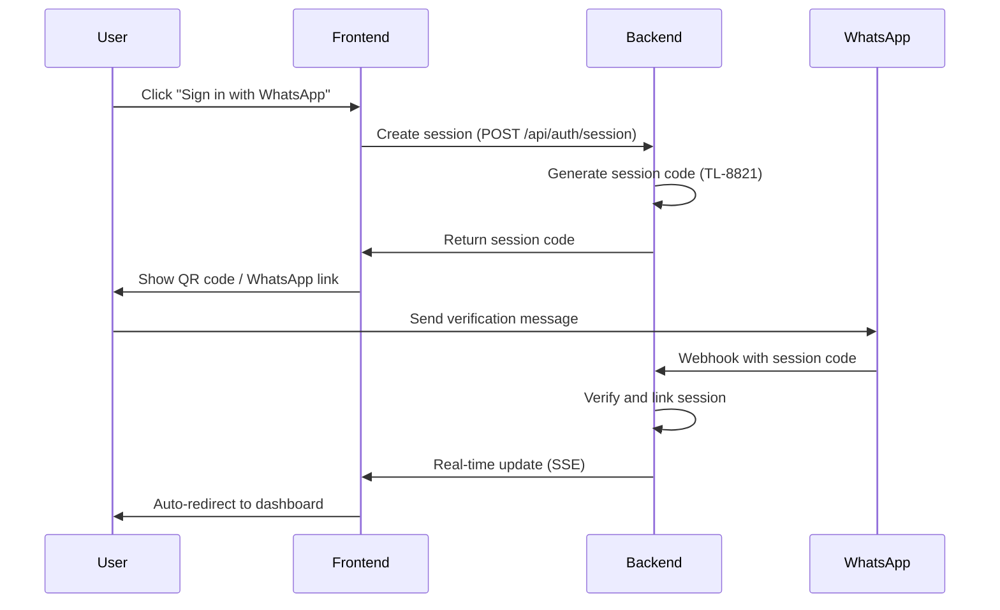
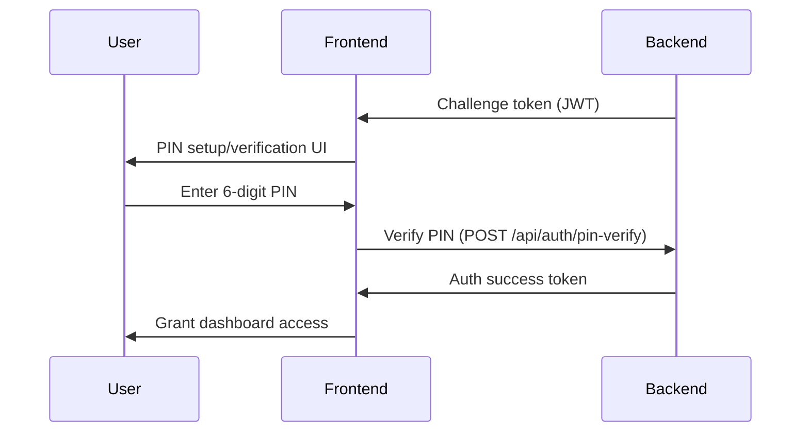
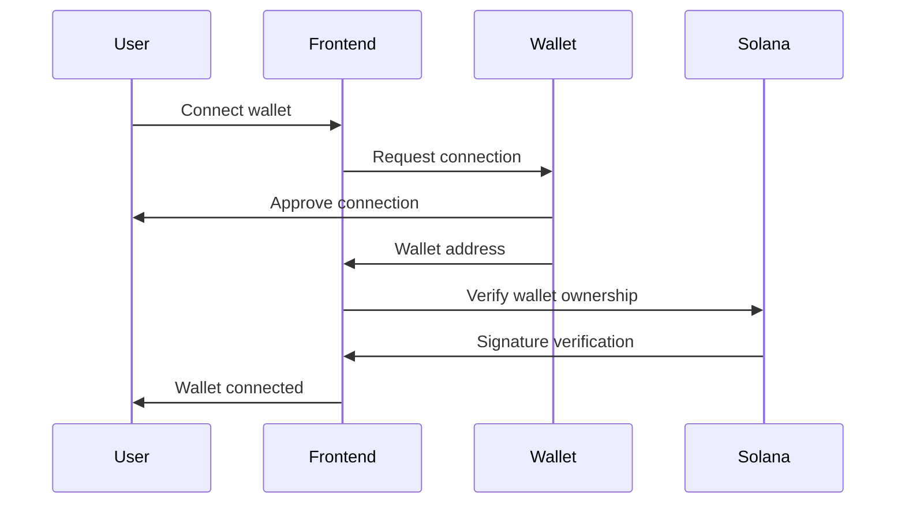

# TrustLink Pay Authentication Guide

## Overview

This guide provides a comprehensive understanding of the authentication system in TrustLink Pay, covering the architecture, security model, implementation details, and troubleshooting.

## Authentication Philosophy

TrustLink Pay's authentication is built around three core principles:

1. **Phone-Number-First Identity** - Users authenticate with their WhatsApp number as their primary identity
2. **Zero-Knowledge Security** - TrustLink never stores or has access to user private keys
3. **Progressive Verification** - Multiple layers of verification that build trust incrementally

## Authentication Layers

### Layer 1: Phone Number Verification

#### WhatsApp OTP System
- **Purpose**: Confirm physical control of the phone number
- **Method**: One-time password sent via WhatsApp
- **Security**: Time-limited codes, rate limiting, device binding

#### Session Code Authentication (New)
- **Purpose**: Modern, frictionless verification experience
- **Method**: Unique session codes (TL-XXXXXX) sent via WhatsApp
- **Technology**: Server-Sent Events + fallback polling
- **Benefits**: Zero typing, device-aware, real-time verification

### Layer 2: Access Control

#### 6-Digit PIN
- **Purpose**: Second-factor authentication for sensitive operations
- **Features**: 
  - Account recovery options
  - Failed attempt lockouts
  - Secure storage using bcrypt
- **Use Cases**: 
  - Payment confirmations
  - Settings changes
  - Wallet connections

#### Session Tokens
- **Type**: JWT-based tokens
- **Claims**: User ID, phone hash, permissions, expiry
- **Storage**: Secure HTTP-only cookies + localStorage fallback
- **Refresh**: Automatic token refresh with sliding expiry

### Layer 3: Cryptographic Identity

#### Master Privacy Keys
- **Purpose**: Root cryptographic identity for payment operations
- **Generation**: Client-side key generation
- **Storage**: Never stored on TrustLink servers
- **Backup**: User-controlled seed phrases

#### Ephemeral Child Keys
- **Purpose**: Per-payment privacy and isolation
- **Derivation**: Deterministic derivation from master key
- **Benefits**: Privacy preservation, reduced blast radius
- **Expiry**: Single-use per payment context

## Authentication Flow Architecture

### Phase 1: Identity Establishment



### Phase 2: Access Control Setup



### Phase 3: Wallet Integration



## Security Architecture

### Identity Binding

#### Phone Hash Storage
```typescript
// On-chain identity binding
const identityBinding = {
  phoneHash: sha256(phoneNumber),  // Stored on-chain
  walletAddress: userWallet,        // Linked wallet
  createdAt: timestamp,
  verified: true
};
```

#### Session Code Security
- **Format**: TL-XXXXXX (6 alphanumeric characters)
- **Entropy**: 36^6 ≈ 2.2 billion possible combinations
- **Expiry**: 10 minutes (600 seconds)
- **Storage**: In-memory with automatic cleanup
- **Usage**: One-time use, marked as verified after first use

### Cryptographic Proofs

#### Derivation Proofs
```typescript
// Master key signs child key derivation
const derivationProof = await masterKey.sign(
  JSON.stringify({
    childPubkey: derivedChildKey.publicKey,
    escrowId: paymentEscrowId,
    nonce: uniqueNonce,
    expiry: timestamp,
    destination: recipientWallet
  })
);
```

#### Claim Signatures
```typescript
// Child key signs claim attempt
const claimSignature = await childKey.sign(
  JSON.stringify({
    escrowId: paymentEscrowId,
    nonce: uniqueNonce,
    destination: recipientWallet,
    expiry: timestamp
  })
);
```

### Replay Prevention

#### On-Chain Nonce System
```typescript
// Nonce consumption PDA
const nonceAccount = {
  masterPubkey: userMasterKey,
  nonce: uniqueNonce,
  consumed: true  // Set atomically with transfer
};
```

#### Session Code Expiry
```typescript
// Automatic cleanup
setInterval(() => {
  cleanupExpiredSessions(); // Remove codes > 10 minutes
}, 300000); // Run every 5 minutes
```

## Implementation Components

### Backend Services

#### Session Management
```typescript
// backend/app/lib/session-codes.ts
export class SessionCodeManager {
  generateSessionCode(): string {
    return `TL-${randomAlphanumeric(6)}`;
  }
  
  validateSessionCode(code: string): boolean {
    return this.codes.has(code) && !this.codes.get(code).expired;
  }
  
  markAsVerified(code: string, phoneNumber: string): void {
    const session = this.codes.get(code);
    session.verified = true;
    session.phoneNumber = phoneNumber;
  }
}
```

#### WhatsApp Webhook Processing
```typescript
// backend/app/services/whatsapp-webhook.ts
export async function processWhatsAppMessage(message: WhatsAppMessage) {
  const sessionCodeMatch = message.text.match(/Verify\s+TLinkPay\s+Code:\s+(TL-[A-Z0-9]{6})/i);
  
  if (sessionCodeMatch) {
    const sessionCode = sessionCodeMatch[1];
    const phoneNumber = message.from;
    
    await sessionManager.verifySession(sessionCode, phoneNumber);
    await notificationService.notifyVerification(sessionCode);
  }
}
```

#### Real-time Events
```typescript
// backend/app/api/auth/session/events/route.ts
export async function GET(request: NextRequest) {
  const sessionId = request.nextUrl.searchParams.get('sessionId');
  
  const stream = new ReadableStream({
    start(controller) {
      sessionConnections.get(sessionId)?.add(controller);
      
      // Send initial connection event
      controller.enqueue(`data: ${JSON.stringify({ type: "connected" })}\n\n`);
      
      // Cleanup on disconnect
      request.signal.addEventListener('abort', () => {
        sessionConnections.get(sessionId)?.delete(controller);
        controller.close();
      });
    }
  });
  
  return new Response(stream, {
    headers: {
      'Content-Type': 'text/event-stream',
      'Cache-Control': 'no-cache',
      'Connection': 'keep-alive',
    },
  });
}
```

### Frontend Components

#### Device Detection
```typescript
// frontend/src/lib/device-detection.ts
export function detectDevice() {
  const userAgent = navigator.userAgent;
  const isMobile = /Android|iPhone|iPad|iPod|BlackBerry|IEMobile|Opera Mini/i.test(userAgent);
  
  return {
    isMobile,
    isDesktop: !isMobile,
    supportsWhatsApp: isMobile || 'share' in navigator,
    platform: getPlatform(userAgent)
  };
}

export function shouldUseQRCode(deviceInfo: DeviceInfo): boolean {
  return deviceInfo.isDesktop || !deviceInfo.supportsWhatsApp;
}
```

#### Session Event Management
```typescript
// frontend/src/lib/session-events.ts
export class SessionEventManager {
  private eventSource: EventSource | null = null;
  private fallbackInterval: NodeJS.Timeout | null = null;
  
  async connect(sessionId: string) {
    try {
      // Try Server-Sent Events first
      this.eventSource = new EventSource(`/backend/api/auth/session/events?sessionId=${sessionId}`);
      
      this.eventSource.onmessage = (event) => {
        const data = JSON.parse(event.data);
        if (data.type === 'verified') {
          this.onVerification(data);
          this.stop();
        }
      };
      
      this.eventSource.onerror = () => {
        // Fall back to polling
        this.startFallbackPolling(sessionId);
      };
    } catch (error) {
      // Direct to polling if SSE fails
      this.startFallbackPolling(sessionId);
    }
  }
  
  private startFallbackPolling(sessionId: string) {
    this.fallbackInterval = setInterval(async () => {
      try {
        const response = await apiPost('/api/auth/session/verify', { sessionId });
        if (response.success) {
          this.onVerification(response);
          this.stop();
        }
      } catch (error) {
        console.error('Polling error:', error);
      }
    }, 10000);
  }
}
```

#### QR Code Generation
```typescript
// frontend/src/components/qr-code-display.tsx
export function QRCodeDisplay({ sessionCode, whatsappLink }: QRCodeProps) {
  const qrData = whatsappLink; // Contains the WhatsApp deep link
  
  return (
    <div className="qr-code-container">
      <QRCode
        value={qrData}
        size={256}
        level="H"
        includeMargin={true}
        imageSettings={{
          src: "/trustlink-logo.png",
          height: 32,
          width: 32,
          excavate: true,
        }}
      />
      <p className="qr-instructions">
        Scan with your phone camera to verify
      </p>
    </div>
  );
}
```

## API Reference

### Authentication Endpoints

#### POST /api/auth/session
Create a new authentication session.

**Request:**
```json
{
  "sessionId": "uuid-v4-string"
}
```

**Response:**
```json
{
  "success": true,
  "sessionCode": "TL-8821",
  "expiresAt": "2024-04-30T12:00:00Z"
}
```

#### GET /api/auth/session/events
Real-time session events via Server-Sent Events.

**Request:**
```
GET /api/auth/session/events?sessionId=uuid-v4-string
```

**Response Stream:**
```
data: {"type": "connected"}

data: {"type": "verified", "challengeToken": "jwt-token", "user": {...}}

```

#### POST /api/auth/session/verify
Check session verification status (fallback polling).

**Request:**
```json
{
  "sessionId": "uuid-v4-string",
  "sessionCode": "TL-8821"
}
```

**Response:**
```json
{
  "success": true,
  "challengeToken": "jwt-token",
  "user": {
    "id": "user-id",
    "phoneNumber": "+1234567890",
    "displayName": "John Doe"
  },
  "stage": "pin_verify"
}
```

#### POST /api/auth/pin-setup
Set up initial PIN for new users.

**Request:**
```json
{
  "pin": "123456",
  "confirmPin": "123456"
}
```

**Response:**
```json
{
  "success": true,
  "message": "PIN set successfully"
}
```

#### POST /api/auth/pin-verify
Verify existing PIN.

**Request:**
```json
{
  "pin": "123456"
}
```

**Response:**
```json
{
  "success": true,
  "authToken": "jwt-token",
  "expiresIn": 3600
}
```

## Security Best Practices

### Rate Limiting
```typescript
// Session creation rate limiting
const sessionCreationLimiter = rateLimit({
  windowMs: 15 * 60 * 1000, // 15 minutes
  max: 10, // 10 sessions per 15 minutes
  message: "Too many session requests, please try again later"
});

// OTP request rate limiting
const otpRequestLimiter = rateLimit({
  windowMs: 5 * 60 * 1000, // 5 minutes
  max: 3, // 3 OTP requests per 5 minutes
  message: "Too many OTP requests, please try again later"
});
```

### Input Validation
```typescript
// Phone number validation
const phoneRegex = /^\+[1-9]\d{1,14}$/; // E.164 format

// Session code validation
const sessionCodeRegex = /^TL-[A-Z0-9]{6}$/;

// PIN validation
const pinRegex = /^\d{6}$/;
```

### Secure Storage
```typescript
// JWT token storage
export const tokenStorage = {
  setToken: (token: string) => {
    document.cookie = `auth-token=${token}; HttpOnly; Secure; SameSite=Strict; Max-Age=3600`;
  },
  
  getToken: () => {
    return document.cookie.split('; ')
      .find(row => row.startsWith('auth-token='))
      ?.split('=')[1];
  }
};
```

## Monitoring and Analytics

### Key Metrics
- **Authentication Success Rate**: Percentage of successful logins
- **Time to Verification**: Average time from session start to verification
- **Device Type Distribution**: Mobile vs desktop authentication breakdown
- **Failure Rate Analysis**: Common failure reasons and frequencies

### Logging Strategy
```typescript
// Structured logging
const authLogger = {
  sessionCreated: (sessionId: string, deviceInfo: DeviceInfo) => {
    logger.info('Session created', {
      sessionId,
      deviceType: deviceInfo.isMobile ? 'mobile' : 'desktop',
      timestamp: new Date().toISOString()
    });
  },
  
  verificationCompleted: (sessionId: string, phoneNumber: string, duration: number) => {
    logger.info('Verification completed', {
      sessionId,
      phoneNumber: hashPhoneNumber(phoneNumber),
      verificationTime: duration,
      timestamp: new Date().toISOString()
    });
  },
  
  verificationFailed: (sessionId: string, reason: string) => {
    logger.warn('Verification failed', {
      sessionId,
      reason,
      timestamp: new Date().toISOString()
    });
  }
};
```

## Troubleshooting Guide

### Common Issues

#### Session Code Not Working
**Symptoms**: User sends session code but verification doesn't complete

**Debugging Steps**:
1. Check if session code is expired (10-minute window)
2. Verify WhatsApp webhook is receiving messages
3. Check session storage backend connectivity
4. Review webhook processing logs

**Solutions**:
- Ensure backend server is running on port 3000
- Verify WhatsApp Business API configuration
- Check session cleanup service is running
- Validate session code format (TL-XXXXXX)

#### Real-time Updates Not Working
**Symptoms**: User verifies via WhatsApp but frontend doesn't update

**Debugging Steps**:
1. Check Server-Sent Events connection status
2. Verify frontend middleware proxy configuration
3. Ensure both frontend (3001) and backend (3000) are running
4. Check browser console for EventSource errors

**Solutions**:
- Restart frontend server to load middleware changes
- Verify middleware.ts proxy configuration
- Check network tab for failed SSE requests
- Ensure fallback polling is active

#### PIN Verification Failed
**Symptoms**: User enters correct PIN but verification fails

**Debugging Steps**:
1. Check PIN hash storage and comparison
2. Verify JWT token validation
3. Check for account lockout after failed attempts
4. Review PIN validation logic

**Solutions**:
- Reset PIN using recovery flow
- Check bcrypt hash comparison
- Verify token expiration and refresh logic
- Review rate limiting configuration

### Debug Mode

Enable detailed debugging:

```typescript
// Frontend debug mode
localStorage.setItem('debug-auth', 'true');

// Backend debug logging
DEBUG=auth:* npm run dev

// Check debug information in browser console
console.log('Auth debug info:', {
  sessionId,
  sessionCode,
  deviceInfo,
  eventSourceState: eventSource?.readyState
});
```

### Performance Optimization

#### Frontend Optimizations
- Implement connection pooling for SSE
- Use request deduplication for polling
- Add progressive loading for auth UI
- Optimize QR code generation with caching

#### Backend Optimizations
- Use Redis for session storage in production
- Implement connection pooling for database
- Add CDN caching for static assets
- Optimize webhook processing with queues

## Future Enhancements

### Planned Improvements

#### Biometric Authentication
- Fingerprint/face recognition integration
- WebAuthn API support
- Hardware security key support

#### Multi-Device Support
- Simultaneous device authentication
- Device management dashboard
- Cross-device session synchronization

#### Enhanced Security
- Zero-knowledge proof implementations
- Hardware-backed key storage
- Advanced replay protection mechanisms

#### Analytics Dashboard
- Real-time authentication metrics
- User behavior analytics
- Security event monitoring

### Migration Path

#### Phase 1: Current Implementation
- Session code authentication with SSE
- Basic PIN security
- WhatsApp integration

#### Phase 2: Enhanced Security
- Hardware security key support
- Advanced biometric options
- Improved replay protection

#### Phase 3: Full Zero-Knowledge
- Complete ZK proof implementation
- Decentralized identity options
- Privacy-preserving analytics

## Conclusion

TrustLink Pay's authentication system provides a secure, user-friendly experience that balances convenience with cryptographic security. The multi-layer approach ensures that users can authenticate easily while maintaining the security guarantees necessary for a financial application.

The system is designed to be scalable, maintainable, and extensible, with clear separation of concerns and comprehensive error handling throughout the authentication flow.

For implementation details, refer to the specific component documentation and API references provided in this guide.
