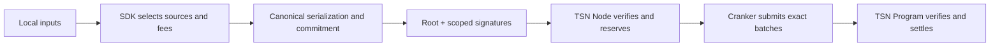

# Execution plan

The execution plan is the canonical signed payment-route representation. It
binds the exact source, destination, amount, fees, change, state, expiry,
cluster, and program so downstream components can verify rather than replan.

## Purpose

The TSN SDK builds an immutable plan before the TSN Node or Cranker can act.
The plan is an implementation object, not a public protocol-generation label.

## Funding modes

The current source uses these internal funding identifiers:

- `wallet_only_v2`: connected wallet funds the route.
- `zk_pru_only_v2`: selected ZK-PRU sources fund the route.
- `mixed_zk_pru_wallet_v2`: selected ZK-PRU sources plus wallet top-up.

These are compatibility identifiers in the current code, not separate public
architecture generations. They should be renamed by the implementation
migration when the runtime is ready.

## Canonical fields

The SDK execution plan contains:

| Group | Fields |
| --- | --- |
| Identity | `planId`, `version`, `tinId`, `assetMint`, `assetSymbol` |
| Payment | `requestedAmountBaseUnits`, `recipientIdentity` |
| Selection | `selectionStrategy`, `strategiesEvaluated`, `selectedPrus`, `totalSpendFromPrus`, `walletTopupAmountBaseUnits` |
| Outputs | `paymentOutput`, `changeOutputs`, `totalChangeAmount` |
| Fees | `protocolFeeBaseUnits`, estimated network fee, Cranker reward, maximum authorized fee |
| Execution | expected instruction, transaction, and change-account counts |
| State | `status`, `spendNonce`, `expiryTimestamp`, `routePlanHash` |
| Decisions | selection reasoning, change reasoning, and wallet-top-up reasoning |
| Replay | `inputHash` and canonical route commitment |

All token values use base-unit integers. Display decimals are a UI concern and
must not replace exact integer authorization.

## Scoped authorizations

Each selected source authorization binds:

- source PRU index and authority public key;
- exact source amount;
- source nonce and state version;
- intent/plan commitment;
- destination, payment amount, and change route;
- fee cap, cluster, program ID, and expiry.

The root wallet signs the complete route. The authorized device signs only the
selected scoped child authorities. The node verifies signatures and reserves
state; it cannot select a different source or modify the plan.

## Planner policy

The SDK prefers one sufficient source, minimizes input and transaction count,
supports fragmented sources and wallet top-up, chooses adaptive non-fixed
tranches, calculates dynamic fees before authorization, and routes change to
an authorized fresh/empty route. The planner does not use a fixed 1,000-token
movement policy.

## Lifecycle

## Rejection rules

The node and program must reject changed amounts, sources, recipients, change
accounts, fees, nonces, state versions, cluster, program ID, expiry, malformed
signatures, replayed plans, wrong delegates, and insufficient allowances.

The Cranker receives only public plan data, signatures, and deterministic
authorized batches. It pays fees and submits; it does not derive keys, decrypt
envelopes, or replan settlement.
