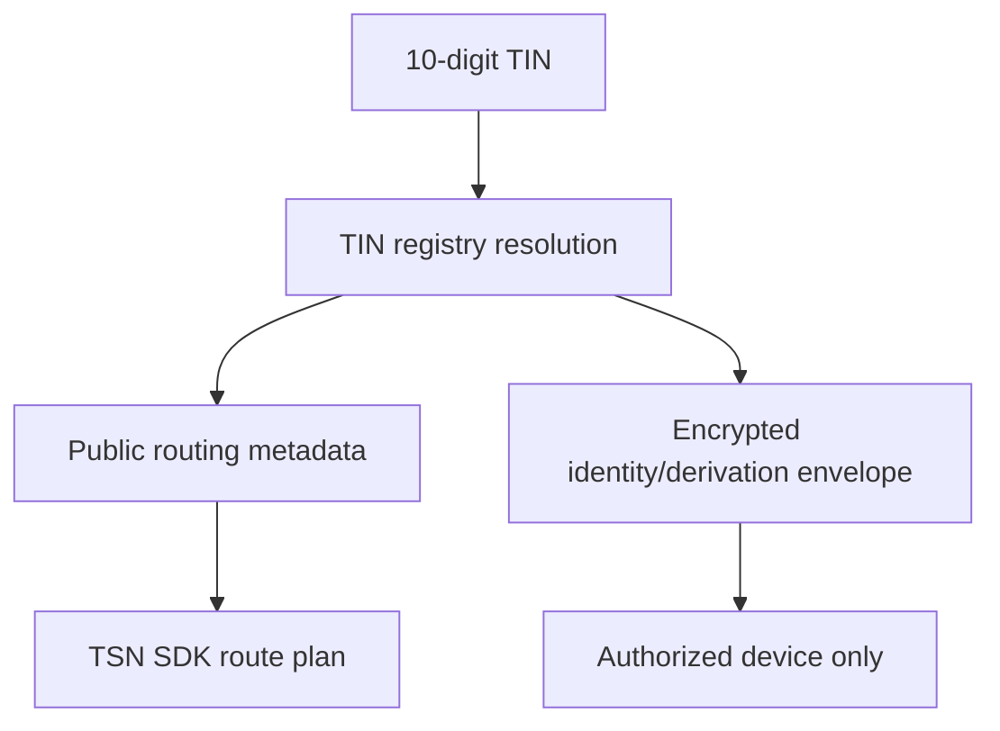

# Identity and TIN

## Purpose

A **Transfer Identity Number (TIN)** is a portable 10-digit TSN payment
identity. It lets a sender discover an authorized payment route without
asking the recipient to exchange a normal wallet address.

## TIN versus a wallet address

| Wallet address | TIN |
| --- | --- |
| Public cryptographic account identifier | TSN payment identity and route-discovery identifier |
| Identifies a public key/account authority | Resolves permitted payment routing metadata |
| May own token accounts | Does not itself hold tokens or act as a private key |
| Usually exposes the address directly | Can route to protected ZK-PRU receiving state |

A TIN does not replace all Solana addresses on-chain. The final transaction
still uses public keys, token accounts, PDAs, and program accounts as required.

## Ownership and fields

The root wallet or implemented root signer owns and authorizes the TIN. A TIN
record may contain the following classes of data:

| Class | Examples | Boundary |
| --- | --- | --- |
| Public | TIN number, display label, active status, route version | Can be returned for resolution subject to anti-enumeration controls |
| Integrity metadata | Owner-key commitment, route commitment, state version | Public verification material, not private authority |
| Encrypted | ZK-PRU derivation envelope, private metadata, recovery material | Ciphertext only outside the authorized device |
| Off-chain application data | Optional profile or notification references | Stored by the application under its own access policy |

The exact on-chain layout is implementation-specific; do not infer private
plaintext from a public account or registry response.

## Resolution flow

1. A sender supplies a 10-digit TIN to the TrustLink Pay interface.
2. The TIN service or program resolves the active public routing metadata.
3. The TSN SDK determines whether the route is wallet-only, ZK-PRU, or mixed.
4. The recipient route is bound into the signed plan commitment.
5. Encrypted material is delivered only to an authorized device when the
   sender's or recipient's local action requires it.

Resolution must not return plaintext seeds, child private keys, or an
unrestricted wallet-to-person mapping. Implemented services must apply
non-enumeration, rate limiting, revocation, and state-version checks.

## ZK-PRU association

TIN identifies the payment identity; ZK-PRU supplies the protected receiving
and spending subsystem associated with that identity. ZK-PRU state may include
active receiving routes, funded or sealed source accounts, state versions,
nonces, and policy metadata. The TIN record points to authorized route data; it
does not become a ZK-PRU private key or token account.

## Recovery and revocation

The root authority controls device authorization, recovery, and revocation.
Device credentials and encrypted envelopes are not substitutes for root
authority. A revoked device must not decrypt new envelopes or sign new scoped
spend authorizations. Recovery behavior remains subject to the implementation
status and deployed program support; this document does not claim portability
or recovery features that are not verified in code.

## API boundary

Current consumers should use the TIN/TSN SDK route-resolution interfaces and
the public TIN-facing APIs. Integrators must treat a resolved route as input to
an immutable TSN plan, not as permission to construct an arbitrary transaction.

TIN is not a username, bank-account number, or legal identity by itself. Any
legal-name, business, phone, or verification context is optional enrichment
and must not be confused with payment authorization.
