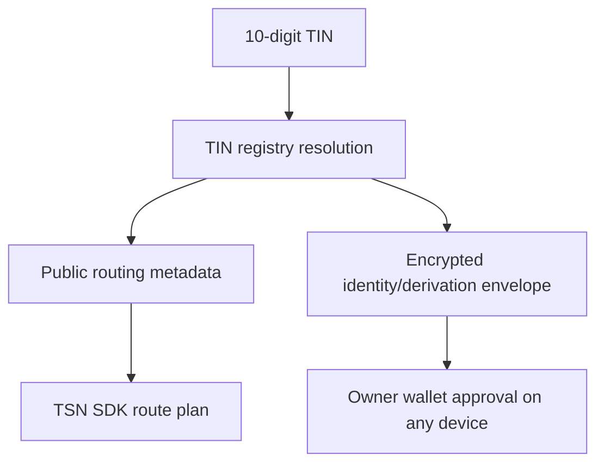

# Identity and TIN

## Purpose

A **Transfer Identity Number (TIN)** is a portable 10-digit identity issued
and resolved by the **Transfer Identity Protocol (TIP)** for TSN payments. It
lets a sender discover an authorized payment route without
asking the recipient to exchange a normal wallet address.

## TIN versus a wallet address

| Wallet address | TIN |
| --- | --- |
| Public cryptographic account identifier | TSN payment identity and route-discovery identifier |
| Identifies a public key/account authority | Resolves permitted payment routing metadata |
| May own token accounts | Does not itself hold tokens or act as a private key |
| Usually exposes the address directly | Binds to the TCAP relationship and encrypted snapshot path |

A TIN does not replace all Solana addresses on-chain. The final transaction
still uses public keys, token accounts, PDAs, and program accounts as required.

## Ownership and fields

The root wallet or implemented root signer owns and authorizes the TIN. A TIN
record may contain the following classes of data:

| Class | Examples | Boundary |
| --- | --- | --- |
| Public | TIN number, display label, active status, route version | Can be returned for resolution subject to anti-enumeration controls |
| Integrity metadata | Owner-key commitment, route commitment, state version | Public verification material, not private authority |
| Encrypted | Privacy-receiving-root metadata, private snapshot references, recovery material | Ciphertext; unlock requires the owning wallet's fresh approval |
| Off-chain application data | Optional profile or notification references | Stored by the application under its own access policy |

The exact on-chain layout is implementation-specific; do not infer private
plaintext from a public account or registry response.

## Resolution flow

1. A sender supplies a 10-digit TIN to the TrustLink Pay interface.
2. The TIN service or program resolves the active public routing metadata.
3. The TSN SDK resolves the GPRU/TCAP relationship commitment and policy.
4. The recipient route is bound into the signed plan commitment.
5. When local private derivation is required, the owning wallet gives a fresh
   approval on that device. A TIN is not tied to one browser or one device.

Resolution must not return plaintext seeds, child private keys, or an
unrestricted wallet-to-person mapping. Implemented services must apply
non-enumeration, rate limiting, revocation, and state-version checks.

## Historical ZK-PRU association

The following section describes the retired route model. It is not used by
new TCAP/GPRU accounts; see [CURRENT-ARCHITECTURE.md](./CURRENT-ARCHITECTURE.md).

TIN identifies the payment identity; GPRU supplies authorization/routing and
TCAP supplies the owner-encrypted private balance snapshot. No PRU receiving
units, funded source accounts, or public route inventories are created for the
live path.

## Recovery and revocation

The root wallet is the TIN authority. It can approve access from any device;
the encrypted TIN material is still never sent in plaintext to a backend, Node,
Receiver, or Cranker. Older device-bound envelopes require a one-time upgrade
from a device that can already unlock them. New and upgraded TINs use the
wallet-owned envelope model.

## API boundary

Current consumers should use the TIN/TSN SDK route-resolution interfaces and
the public TIN-facing APIs. Integrators must treat a resolved route as input to
an immutable TSN plan, not as permission to construct an arbitrary transaction.

TIN is not a username, bank-account number, or legal identity by itself. Any
legal-name, business, phone, or verification context is optional enrichment
and must not be confused with payment authorization.
