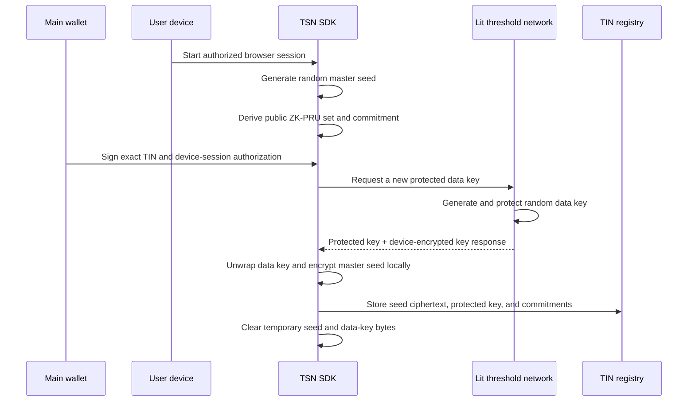
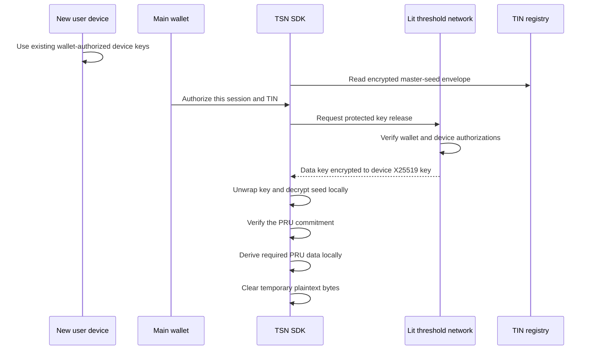
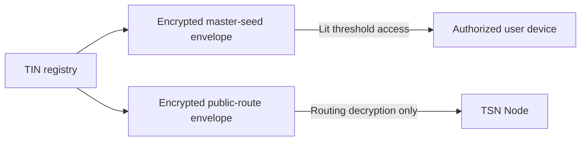
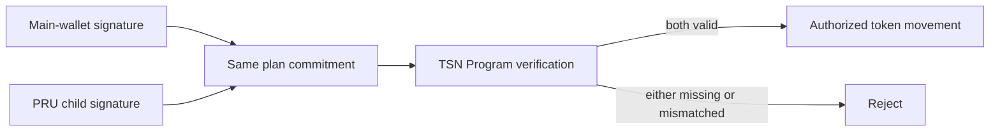

# Lit Protocol in TSN

## Purpose

Lit Protocol is the threshold-access layer used to unlock a TIN's encrypted
ZK-PRU master seed on a wallet-authorized user device.

It exists to satisfy these requirements together:

- the master seed remains encrypted outside the user's device;
- the TrustLink application backend, TSN Node, and Cranker never receive it;
- a newly authorized device can unlock the same TIN without the old device;
- the TIN does not store an authorized-device list or per-device key;
- a copied wallet signature cannot be reused as a general decryption key.

Lit Protocol is not TSN, TIN, or ZK-PRU. It is an external threshold
cryptography dependency behind a TSN SDK interface.

## Two different uses of the word Lit

The repository uses two unrelated technologies whose names contain `Lit`:

| Technology | Duty |
| --- | --- |
| Lit Protocol | Threshold protection and authorized-device release of the random key that encrypts the TIN master seed locally |
| Lit web-component library | Rendering private values inside the SDK-owned `<tsn-private-value>` component |

The Lit web-component library does not hold threshold keys and does not decide
who may decrypt a TIN master seed. Lit Protocol does not render private data.

## Exact duty in TSN

Lit Protocol may:

1. protect only the random data-encryption key used by the local seed envelope;
2. evaluate the owner-wallet access condition;
3. validate a short-lived browser session authorization;
4. release only key material encrypted to the authorized device;
5. refuse access when wallet or session authorization is invalid.

Lit Protocol must never:

- generate the TIN or choose its number;
- derive or select ZK-PRUs;
- calculate TIN balances;
- receive a PRU private key;
- sign a ZK-PRU spend;
- resolve the recipient's public receiving route;
- operate the TSN Node or Cranker;
- submit a Solana transaction;
- authorize token movement by itself;
- replace TSN Program signature verification;
- be described as a zero-knowledge proof system.

## Master-seed creation

The TSN SDK generates the random master seed on the user's device. The seed is
not derived from the wallet signature. After wallet-and-device authorization,
the threshold action generates a separate random data key, protects it under
the action's PKP, and returns a copy encrypted to the authorized device's
X25519 public key. The SDK then encrypts the seed locally with AES-256-GCM.
Neither the seed nor the data key is passed in action request parameters.

Only the encrypted envelope and public commitments may be stored with the TIN.

## Unlock on an authorized device

Device authorization does not require an authorized-device commitment in the
TIN. The browser first proves that it is authorized through the existing TSN
Private View device system. The main wallet signs an authorization bound to
that device session, the TIN, and the ZK-PRU commitment. Lit Protocol releases
the protected data key only after the access request succeeds.

The SDK now also requires a separate proof of possession from the authorized
device's non-exportable Ed25519 signing key. Both proofs bind the same TIN,
route version, ZK-PRU commitment, threshold session, protected-resource
commitment, operation, request nonce, and expiry. Neither proof is serialized
into the TIN envelope.

The threshold service must not receive or decrypt the master seed. The seed is
encrypted locally with random key material. After authorization, the threshold
action releases only that key material, re-encrypted to the existing
authorized device's non-exportable X25519 key. The device unwraps it and
decrypts the master seed locally.

The decrypted seed exists temporarily inside the authorized browser process.
The SDK derives only the required ZK-PRU material and clears temporary secret
buffers as far as the JavaScript runtime permits.

The old device is not required. Reloading the page destroys the old in-memory
session, so the main wallet must authorize a new session.

## Separation from TSN routing

The TIN has two distinct encrypted objects:

The device envelope contains the master seed and is never available to the
TSN Node. The Node envelope contains only public ZK-PRU routing metadata. It
must never contain the master seed, child private keys, or device secrets.

## Separation from spending authorization

Unlocking the seed does not move funds. A ZK-PRU spend still requires:

1. the main wallet's authorization over the exact plan commitment; and
2. the selected PRU child authority's signature over that same commitment.

The TSN Program verifies both signatures. Lit Protocol neither creates nor
replaces either on-chain authorization.

## Privacy and trust boundary

Lit nodes participate in threshold cryptography; no single Lit node should
possess the complete decryption key. TSN still treats Lit Protocol as an
external dependency and fails closed when it is unavailable.

Lit Protocol protects access to ciphertext. It does not protect plaintext
from a compromised browser, malicious extension, screen capture, or code
running with the same privileges after a legitimate unlock.

## Current implementation

The experimental SDK adapter is:

- `tsn-protocol/tsn-sdk/src/lit-threshold-provider.ts`
- `tsn-protocol/tsn-sdk/src/tin-private-controller.ts`
- `tsn-protocol/tsn-sdk/src/tin-envelopes.ts`

The frontend contains only a browser lifecycle adapter:

- `frontend/src/lib/tsn-threshold-provider.ts`

The adapter targets Lit `DatilDev` and Solana Devnet. It creates an in-memory
Lit session key and disconnects it when the page is hidden or closed. No
session private key is intentionally written to TIN data, browser storage,
TSN Node data, or application APIs.

## Verification status

The SDK compiles and its local envelope, session-binding, and wrong-session
tests pass. The frontend typecheck passes. These local checks do not prove
that Lit's threshold nodes enforce TSN's authorized-device factor.

The adapter therefore fails closed with:

`BLOCKED_UNVERIFIED_DEVICE_BINDING`

The pinned Lit SDK's Solana `AuthSig` proves control of a Solana address. It
has not yet been proven to the required standard that a captured Solana
`AuthSig` cannot be presented from another client to authorize a new Lit
session. A browser-only comparison against a device-session identifier is not
sufficient because an attacker can bypass application code and call the
threshold network directly.

The canonical wallet-plus-device proof contract and provider-side verifier are
implemented in `tsn-protocol/tsn-sdk/src/tin-device-access.ts`. The verifier
checks the exact wallet message and signature, the non-exportable device-key
proof, device fingerprint, protected resource, operation, five-minute validity
window, and a consumable one-time nonce.

The device-only key response format is implemented in
`tsn-protocol/tsn-sdk/src/tin-device-key-envelope.ts`. It uses X25519, HKDF
SHA-256, and AES-256-GCM. The authenticated context binds the response to the
TIN, owner, route, PRU commitment, protected resource, operation, request
nonce, expiry, signing-device key, and encryption-device key.

The encryption-device key is the same non-exportable key already used by TSN
Private View. No second device identity system is introduced. Its public key
is included in the short-lived authorization proof but is not stored in the
TIN.

This is the enforcement contract that any threshold provider must execute
before releasing shares. It does not make the current Lit adapter safe by
itself. The pinned Lit adapter's ordinary Solana access-control condition is
wallet-gated and does not evaluate this TSN-specific device proof. Allowing
ordinary direct decryption would therefore bypass the second factor.

A Lit deployment is acceptable only if an audited immutable action is the sole
authority allowed to release the wrapping key. It must execute the same
provider-side verifier and return the key encrypted to the device public key
bound into the signed request. It must never receive the master-seed
ciphertext, master seed, or a PRU private key.

Ordinary wallet-only decryption cannot be enabled for this resource. Until
that network-level action is deployed, permissioned, and tested, the Lit
adapter remains blocked.

The public action configuration contract is implemented in
`tsn-protocol/tsn-sdk/src/lit-tin-action-configuration.ts`. It requires an
immutable IPFS CID, audited source SHA-256, PKP ID, group ID, HTTPS action
endpoint, and an atomic replay-nonce registry. It deliberately has no API-key
or secret fields. Missing or mutable configuration returns
`BLOCKED_ACTION_CONFIGURATION`.

Replay protection is provided by the TSN Node's
`/threshold-access/nonces/consume` endpoint. The Node independently verifies
the exact main-wallet signature and authorized-device signature, atomically
consumes the proof nonce, and returns an Ed25519-signed receipt. The dedicated
receipt key can attest only to nonce consumption; it is not a TIN decryption,
PRU signing, routing, Cranker, or token authority. The immutable action must
verify that receipt against its pinned public key before protecting or
releasing a data key.

The live threshold round trip is also blocked on this workstation because the
official Yellowstone RPC hostname currently presents a certificate for its
underlying Conduit hostname. Node and Windows correctly reject it with
`ERR_TLS_CERT_ALTNAME_INVALID`. TLS certificate checking must not be disabled.

Neither blocker is evidence that live decryption works. TIN migration must
wait until the device factor is enforced by Lit or an audited Lit Action and
the browser-wallet round-trip and negative authorization tests pass.

## Required acceptance tests

Before using this path for a live TIN:

1. create a disposable encrypted seed envelope in the browser;
2. unlock it with the same wallet in the authorized session;
3. reload and prove that a fresh wallet authorization unlocks it;
4. prove that a copied authorization from the old session fails;
5. prove that a different wallet fails;
6. prove that the TSN Node cannot decrypt the device envelope;
7. prove that the application backend receives no plaintext seed or PRU key;
8. load the locally derived PRU balances and verify the TIN commitment;
9. test dual main-wallet and PRU authorization independently.
10. prove a direct wallet-only decryption request cannot bypass the device proof;
11. prove replaying an already accepted device-proof nonce fails.
