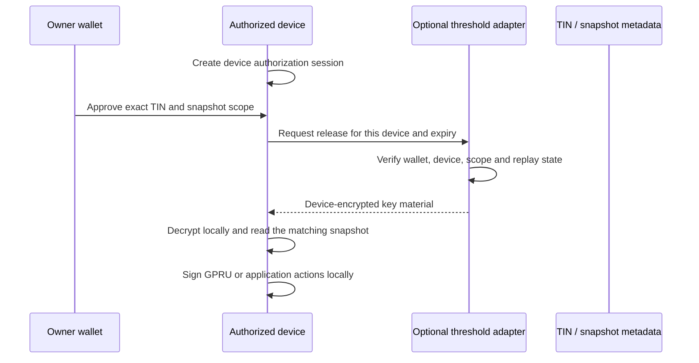

# Optional threshold access in TSN

Lit Protocol is an optional threshold-access adapter for releasing encrypted
privacy-receiving-root metadata or an encrypted TCAP snapshot key to an
owner-authorized device. It is not TSN, TIN, GPRU, TCAP or a proof verifier,
and it is not required for the live credit path.

## Boundary

The authorized device remains the only place where plaintext roots, snapshot
keys and private balances are available. A threshold adapter may evaluate a
wallet and device authorization and release key material encrypted to that
device. It must never:

- create a TIN or choose a route;
- hold balances or token accounts;
- turn GPRU into a custodial credential;
- sign a debit, exit or credit on behalf of the owner;
- submit a Solana transaction;
- replace TSN or TCAP verification.

## Current data flow

The adapter never receives a plaintext seed, private route, decrypted balance
or spend authority. Unavailability must fail closed and must not disable the
on-chain ConfidentialSettlement credit checks.

## Historical note

Older repository material describes this duty as unlocking a ZK-PRU master seed.
ZK-PRU is retired and must not be targeted by new implementations. The current
objects are privacy-receiving-root metadata, GPRU authorization scope and
encrypted TCAP snapshot state. See [ZK-PRU retired](./ZK-PRU-RETIRED.md).
