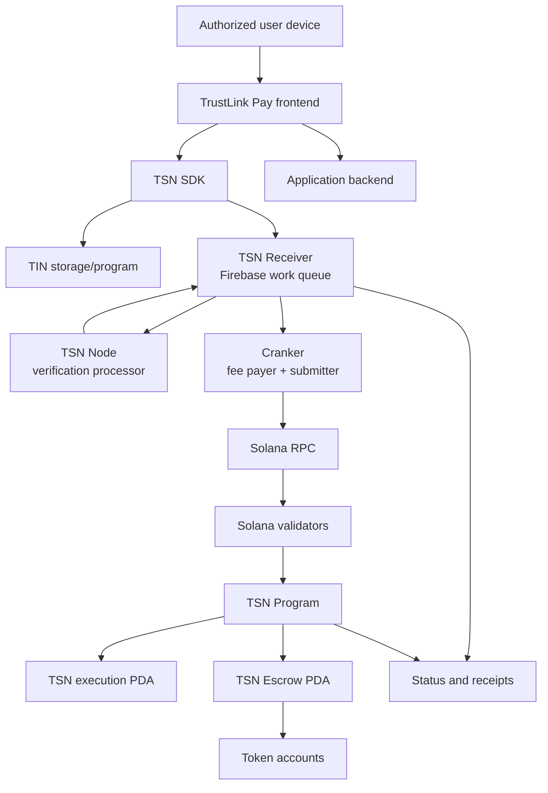

# Network and runtime

## Topology

The TSN Node source directory is `tsn-node`. Its
runtime responsibility is verification and protocol processing. The Receiver
owns durable Firebase work, atomic leases, replay records, and status. Neither
service is a Solana validator.

The complete request-to-transaction sequence is documented in
[Protocol architecture — how an intent becomes a Solana transaction](./protocol-architecture.md#8-how-an-intent-becomes-a-solana-transaction).
In short, the Receiver accepts signed work, the Node leases and verifies it,
and Crankers lease only Receiver records marked `VERIFIED`. Crankers submit
through Solana RPC and post signatures and results back to the Receiver.

## Runtime boundaries

### User device and frontend

The frontend collects input, displays recipient and plan details, requests
wallet/device signatures, submits public data, and displays evidence. The
authorized device performs local decryption and derives selected ZK-PRU child
authorities. Plaintext seed material must not enter application state, logs,
requests, or records.

### Application backend and TIN storage

The application backend handles authentication, profiles, notifications,
TIN-facing access, and encrypted-envelope delivery where implemented. It may
return ciphertext and public metadata; it must not decrypt user secrets or
construct user signing authority.

### TSN Node

The node receives signed public plans, reconstructs canonical commitments,
verifies signatures, reserves state versions, prevents replay, exposes
claimable work, and tracks status. It cannot select PRUs, modify a route, or
issue a private-key permit.

### Cranker

The Cranker claims verified work, pays Solana fees, submits exact authorized
transactions, retries safely, and reports signatures. It uses only its own
operator/fee-payer key and public execution data.

### Solana program and accounts

The TSN Program verifies scoped authorization, commitments, state, delegates,
allowances, nonces, and expiry. The execution PDA performs restricted token
movement through program signing. TSN Escrow is program-controlled and holds
assets only during the authorized settlement lifecycle.

## Clusters and deployment

| Environment | Purpose | Trust boundary |
| --- | --- | --- |
| Local validator/localnet | Fast development and deterministic tests | Local process; never evidence of Devnet/mainnet deployment |
| Devnet | Integration testing and public test evidence | Solana Devnet RPC, funded test wallets, deployed program IDs |
| Mainnet-beta | Future production target | Not production-ready until the status and security gates pass |

Cluster identity must be included in the signed plan and verified by the node
and program. RPC endpoints are transport boundaries; they do not become TSN
authorities. Solana validators execute and confirm the submitted transaction,
while TSN components plan, authorize, coordinate, and enforce application
state.

## On-chain and off-chain data

| On-chain | Off-chain or device-local |
| --- | --- |
| Programs, PDAs, token accounts, signatures, account state, escrow balances, transaction logs | Encrypted envelopes, local child derivation, plan assembly, node reservations, claim queues, status records, receipts, UI state |

Public transaction data remains observable on Solana. ZK-PRU improves protected
identity and routing but does not make every amount, timing signal, or public
exit confidential.

## Current program identifiers

Program IDs and cluster configuration are environment-specific. Use the
verified values in the active deployment configuration and operations runbook;
never copy a historical ID into a new environment without checking the deployed
program account and upgrade authority.
