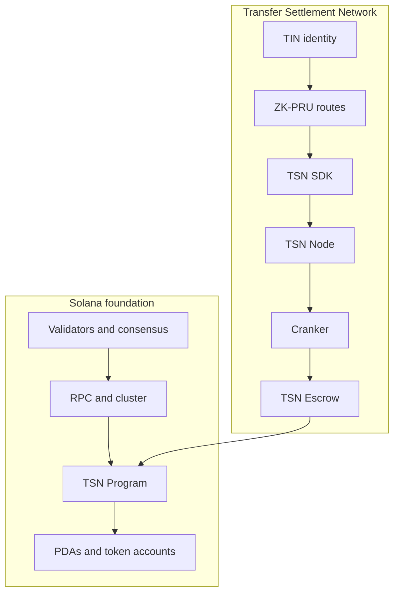
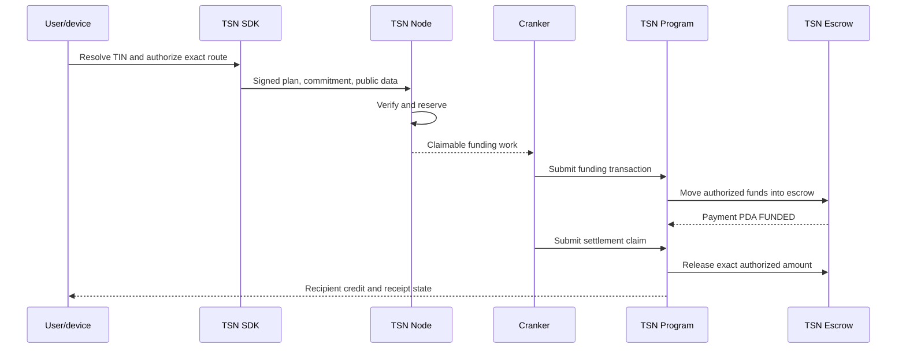

# TSN protocol architecture

## 1. TSN as infrastructure

The Transfer Settlement Network is identity-aware payment coordination and
settlement infrastructure built on Solana. TSN spans user devices, the TSN
SDK, the TSN Node, Crankers, Solana programs, program-controlled accounts,
receipts, and status services.

TSN is not a blockchain, validator set, or replacement for Solana. Solana
provides accounts, public keys, transactions, programs, token accounts,
clusters, consensus, and finality. TSN adds TIN identity, recipient discovery,
protected ZK-PRU routes, payment intents, scoped authorization, node
coordination, Cranker execution, TSN Escrow, settlement state, and receipts.

## 2. Solana foundation

- **Wallet:** a user-controlled signing authority.
- **Wallet address:** a public key that identifies an account or authority.
- **Token account:** an account holding one SPL token for an owner or delegate.
- **Program:** executable on-chain Solana logic.
- **PDA:** a deterministic program-controlled address without a private key.
- **Validator:** a Solana participant that processes, votes on, and confirms
  transactions.
- **Cluster:** a separate Solana environment, such as localnet, Devnet, or
  mainnet-beta.

TSN Nodes are not validators. Crankers are not validators. TSN's work queue is
an application-level coordination layer and is not Solana's validator
transaction-processing pipeline. Cluster identity is part of authorized plan
data so a plan for one environment cannot be replayed on another.

## 3. Identity and authority

A TIN is a user-facing TSN payment identity; it is not a wallet, token account,
private key, or replacement for every on-chain address. The main wallet or
implemented root signer owns the identity and retains recovery and revocation
authority. See [Identity and TIN](./identity-and-tin.md).

The authority boundary is:

1. The root wallet authorizes the operation and, where required, the device.
2. The authorized device decrypts the encrypted ZK-PRU envelope locally.
3. The SDK derives only the selected child authority and signs its scoped
   authorization.
4. The TSN execution PDA is the restricted program delegate.
5. The Cranker uses only its own operator/fee-payer authority.

The node and Cranker never receive plaintext seeds or user child private keys.

## 4. Conceptual layers

The project uses layers to describe responsibility, not additional blockchains:

- **Layer 1 — User authorization:** wallet approval, route commitment, local
  ZK-PRU child signatures, and the exact amount/source/recipient/fee/change,
  nonce, expiry, cluster, and program constraints.
- **Layer 2 — Network execution:** node verification and reservation, work
  coordination, Cranker submission, and TSN Program enforcement. This layer
  cannot alter a signed route or derive user keys.

Encrypted ZK-PRU derivation material is device-held secret material, not a
server-issued Layer 2 spending permit. “Memlayer Wallet” is not a distinct
implemented runtime component in the current repository and is therefore not
used as a canonical architecture term.

## 5. ZK-PRU inside TSN

ZK-PRU is an internal protected receiving and spending subsystem, not a
separate blockchain or production registry. TIN identifies the route; ZK-PRU
provides device-authorized source and receiving state; the SDK plans; the node
verifies; the Cranker submits; and the TSN Program enforces.

ZK-PRU can reduce direct wallet linkage and unnecessary reuse of one receiving
account. It does not automatically hide every SPL amount, token-account
movement, timing signal, public exit, or Solana transaction.

## 6. Runtime responsibilities

| Component | Responsibility |
| --- | --- |
| TrustLink Pay | Collects user input, displays routes, requests signatures, and shows status. |
| TSN SDK | Resolves routes, selects inputs, calculates fees/tranches/change, builds commitments, decrypts locally, and signs locally. |
| TSN Node | Verifies signed plans, reserves state, prevents replay, exposes claimable work, and tracks status. |
| Cranker | Claims verified work, pays fees, submits exact authorized transactions, retries safely, and reports signatures. |
| TSN Program | Verifies signatures, commitments, state, delegates, replay, and performs token movement. |
| TSN Escrow | Holds funded assets until a valid settlement or recovery transition. |
| Solana validators | Execute and confirm submitted Solana transactions. |

## 7. Two-stage transaction

The frontend request is authorization and coordination input, not itself the
final settlement. The four routes are documented in
[TSN Transaction Explorer](./tsn-transaction-explorer.md).

## 8. Security boundary

Plaintext master/derivation material and child private keys remain on the
authorized device. The frontend and node receive public plan data and
signatures. The Cranker receives verified work, not secrets. The TSN Program
enforces the signed constraints. Solana validators process the resulting
public transaction according to Solana runtime rules.

TCAP is a separate experimental asset/ownership direction and is not the live
settlement actor described here.
