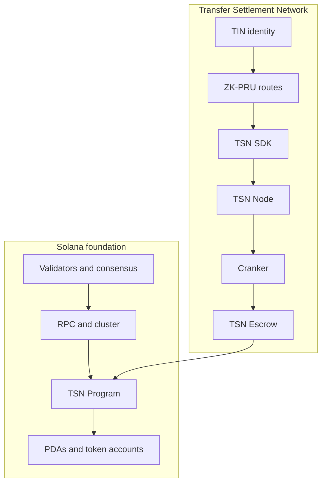
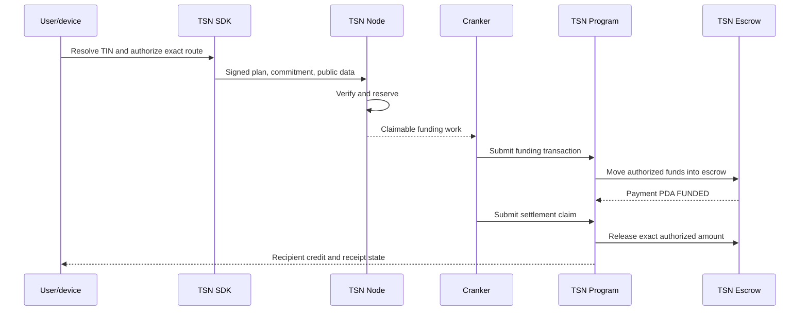
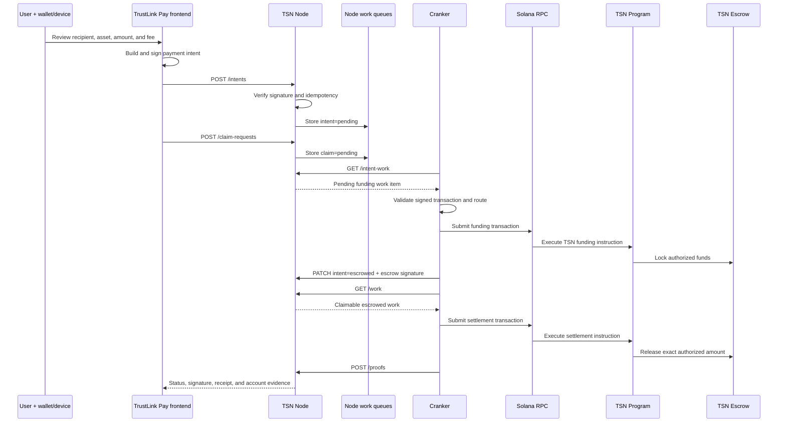

# TSN protocol architecture

## 1. TSN as infrastructure

The Transfer Settlement Network is identity-aware payment coordination and
settlement infrastructure built on Solana. TSN spans user devices, the TSN
SDK, the TSN Node, Crankers, Solana programs, program-controlled accounts,
receipts, and status services.

TSN is not a blockchain, validator set, or replacement for Solana. Solana
provides accounts, public keys, transactions, programs, token accounts,
clusters, consensus, and finality. TSN adds TIN identity, recipient discovery,
protected ZK-PRU routes, payment intents, scoped authorization, node
coordination, Cranker execution, TSN Escrow, settlement state, and receipts.



## 2. Solana foundation

- **Wallet:** a user-controlled signing authority.
- **Wallet address:** a public key that identifies an account or authority.
- **Token account:** an account holding one SPL token for an owner or delegate.
- **Program:** executable on-chain Solana logic.
- **PDA:** a deterministic program-controlled address without a private key.
- **Validator:** a Solana participant that processes, votes on, and confirms
  transactions.
- **Cluster:** a separate Solana environment, such as localnet, Devnet, or
  mainnet-beta.

TSN Nodes are not validators. Crankers are not validators. TSN's work queue is
an application-level coordination layer and is not Solana's validator
transaction-processing pipeline. Cluster identity is part of authorized plan
data so a plan for one environment cannot be replayed on another.

## 3. Identity and authority

A TIN is a user-facing TSN payment identity; it is not a wallet, token account,
private key, or replacement for every on-chain address. The main wallet or
implemented root signer owns the identity and retains recovery and revocation
authority. See [Identity and TIN](./identity-and-tin.md).

The authority boundary is:

1. The root wallet authorizes the operation and, where required, the device.
2. The authorized device decrypts the encrypted ZK-PRU envelope locally.
3. The SDK derives only the selected child authority and signs its scoped
   authorization.
4. The TSN execution PDA is the restricted program delegate.
5. The Cranker uses only its own operator/fee-payer authority.

The node and Cranker never receive plaintext seeds or user child private keys.

## 4. Conceptual layers

The project uses layers to describe responsibility, not additional blockchains:

- **Layer 1 — User authorization:** wallet approval, route commitment, local
  ZK-PRU child signatures, and the exact amount/source/recipient/fee/change,
  nonce, expiry, cluster, and program constraints.
- **Layer 2 — Network execution:** node verification and reservation, work
  coordination, Cranker submission, and TSN Program enforcement. This layer
  cannot alter a signed route or derive user keys.

Encrypted ZK-PRU derivation material is device-held secret material, not a
server-issued Layer 2 spending permit. “Memlayer Wallet” is not a distinct
implemented runtime component in the current repository and is therefore not
used as a canonical architecture term.

## 5. ZK-PRU inside TSN

ZK-PRU is an internal protected receiving and spending subsystem, not a
separate blockchain or production registry. TIN identifies the route; ZK-PRU
provides device-authorized source and receiving state; the SDK plans; the node
verifies; the Cranker submits; and the TSN Program enforces.

ZK-PRU can reduce direct wallet linkage and unnecessary reuse of one receiving
account. It does not automatically hide every SPL amount, token-account
movement, timing signal, public exit, or Solana transaction.

## 6. Runtime responsibilities

| Component | Responsibility |
| --- | --- |
| TrustLink Pay | Collects user input, displays routes, requests signatures, and shows status. |
| TSN SDK | Resolves routes, selects inputs, calculates fees/tranches/change, builds commitments, decrypts locally, and signs locally. |
| TSN Node | Verifies signed plans, reserves state, prevents replay, exposes claimable work, and tracks status. |
| Cranker | Claims verified work, pays fees, submits exact authorized transactions, retries safely, and reports signatures. |
| TSN Program | Verifies signatures, commitments, state, delegates, replay, and performs token movement. |
| TSN Escrow | Holds funded assets until a valid settlement or recovery transition. |
| Solana validators | Execute and confirm submitted Solana transactions. |

## 7. Two-stage transaction



The frontend request is authorization and coordination input, not itself the
final settlement. The four routes are documented in
[TSN Transaction Explorer](./tsn-transaction-explorer.md).

## 8. How an intent becomes a Solana transaction

This is the concrete runtime path implemented by the current repository. The
application-facing intent and the on-chain transactions are separate records.

### Step 1 — The user authorizes an intent

TrustLink Pay collects the recipient TIN or destination wallet, token, amount,
source, and fee details. The SDK builds the signed public authorization and
the sender wallet/device signs it. The frontend helper
`enqueueTsnPaymentFromFrontend` submits the signed payload to the configured
TSN Node endpoint:

```text
POST /intents
```

The request contains the payment ID, sender authorization message/signature,
recipient route data, token and amount, and the sender-signed settlement
transaction when the selected funding path requires one. It must not contain
plaintext user seed material or child private keys.

### Step 2 — The TSN Node verifies and queues it

The Node's `post_intent` handler:

1. checks idempotency by `paymentId`;
2. verifies the sender authorization message and signature;
3. normalizes the signed fields;
4. creates the intent record with status `pending`;
5. stores it in the configured mempool store under the intents collection;
6. returns a public intent/status record.

The current HTTP API exposes the stored records through:

```text
GET /intents
PATCH /intents/{intent_id}/status
```

The application backend may also mirror the intent in its payment database for
user history. That database record is not the authority for token movement;
the signed intent, Node state, Solana transaction, and program state are the
evidence chain.

### Step 3 — A claim request enters the second queue

After an intent exists, the application or SDK posts a claim request:

```text
POST /claim-requests
```

The Node checks that the intent exists and is eligible, makes the operation
idempotent, assigns a claim ID, and stores the claim with status `pending` in a
separate claims collection. The claim does not execute a transaction. It is a
request for a Cranker to process the settlement after funding is available.

The claim can be inspected with:

```text
GET /claim-requests
PATCH /claim-requests/{claim_id}/status
```

### Step 4 — The Cranker polls for funding work

Every Cranker runs its operator key, fee-payer configuration, Solana RPC
connection, and TSN Node client. Its loop polls:

```text
GET /intent-work?limit=...
```

`/intent-work` returns only intents whose status is `pending`. The Cranker
does not receive a random transaction. It receives a deterministic work item
containing the intent and the sender-authorized transaction/public execution
data.

Before submission, the Cranker checks the sender signature, sender/fee-payer
relationship, token mint, amount, recipient route, commitment, expiry, nonce,
settlement mode, and transaction instruction layout. Invalid work is canceled
and never submitted.

### Step 5 — The Cranker submits the funding transaction

For the current sponsored path, the Cranker submits the sender-signed
settlement transaction to Solana using its own fee-payer/operator authority.
The Cranker does not change the sender's instructions. On success it records:

```text
PATCH /intents/{intent_id}/status
status = escrowed
escrowTxSig = <confirmed or submitted signature>
assignedCrankerPubkey = <operator public key>
```

The TSN Program validates the instruction and the TSN Escrow account receives
the funded amount. The Payment PDA/intent state is now eligible for claim
settlement. If the blockhash expires or validation fails, the intent is marked
expired/canceled and a fresh authorization is required.

### Step 6 — The Cranker polls for claimable settlement work

The Cranker then polls:

```text
GET /work?limit=...
```

The Node joins pending claims to their intents and returns a work item only
when the intent is in an escrow-ready state (`escrowed`, `onchain`, or
`claimed`). This is where the Cranker picks up the settlement request. A
pending claim whose funding transaction has not succeeded is not returned as
executable work.

### Step 7 — The Cranker leases and executes the claim

The Cranker evaluates claim economics and acquires the claim's processing lease
through the claim lease endpoint. It then submits the settlement instructions
to the TSN Program through Solana RPC. The program verifies the commitment,
amount, mint, destination, nonce/replay state, escrow state, and fee rules
before releasing the authorized amount from TSN Escrow.

The current repository still contains a legacy private-payout permit/decryption
branch in this executor. That branch is an implementation migration boundary,
not the intended security model: it must be removed before production so the
Cranker receives only public authorized work and never decrypts user route
material.

### Step 8 — Proof, status, and user history

After a successful settlement transaction, the Cranker posts a proof:

```text
POST /proofs
```

The Node stores the proof, advances the intent to `executed`, and creates any
required recovery work. The application and frontend read the intent, claim,
proof, and payment status records to render:

```text
pending → escrowed → processing → executed
                     ↘ failed/canceled/reverted
```

The final source of truth for actual funds is the confirmed Solana signature
and fetched account state. Node status alone is not proof that tokens moved.

### End-to-end runtime sequence



## 9. Security boundary

Plaintext master/derivation material and child private keys remain on the
authorized device. The frontend and node receive public plan data and
signatures. The Cranker receives verified work, not secrets. The TSN Program
enforces the signed constraints. Solana validators process the resulting
public transaction according to Solana runtime rules.

TCAP is a separate experimental asset/ownership direction and is not the live
settlement actor described here.
