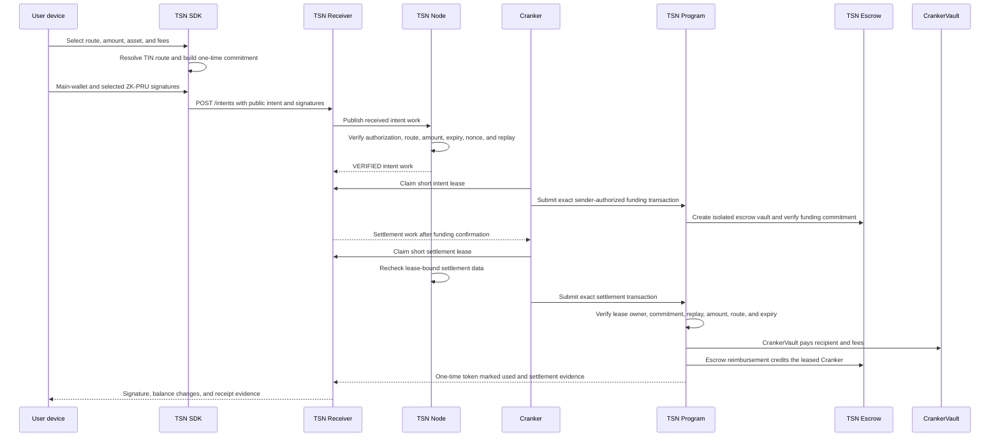

# TSN protocol architecture

TrustLink Labs' Transfer Settlement Network (TSN) is a Solana-based payment
coordination and settlement network. TrustLink Pay is the application layer.
TIN provides payment identity, ZK-PRU provides protected receiving and source
authorization, the Receiver stores durable work, the TSN Node verifies work,
and Crankers execute leased settlement work.

## Solana foundation

- **Wallet:** a user-controlled signing authority.
- **Token account:** an account holding one SPL token for an owner or delegate.
- **Program:** executable Solana logic that validates accounts and instructions.
- **PDA:** a deterministic program-controlled address without a private key.
- **Validator:** a Solana participant that processes and confirms transactions.
- **Cluster:** a separate Solana environment such as localnet, Devnet, or
  mainnet-beta.

TSN Nodes and Crankers are application services, not Solana validators. TSN's
Receiver is an application work queue, not Solana's validator transaction
pipeline. Cluster identity is part of the authorized data so a plan for one
environment cannot be replayed on another.

## Identity and authority

A TIN is a TSN payment identity. It is not a wallet, token account, or private
key. The main wallet owns the identity and retains authorization and recovery
authority.

The authority boundary is:

1. the main wallet authorizes the operation;
2. the authorized device decrypts the encrypted ZK-PRU material locally;
3. the SDK derives only selected child authorities and signs the scoped source
   authorization;
4. the TSN Program enforces the signed constraints and lease;
5. the Cranker uses only its own operator and fee-payer authority.

The Receiver, Node, and Cranker never receive plaintext seeds or user child
private keys.

## ZK-PRU inside TSN

ZK-PRU is TSN's protected receiving and spending technology. The TIN identifies
the payment route, the authorized device derives selected source authorities,
the SDK plans and signs, the Node verifies, and the Cranker submits the exact
leased work. ZK-PRU improves protected identity and route separation; it does
not claim that every public Solana amount, timing signal, or exit is hidden.

## Components

| Component | Responsibility |
| --- | --- |
| TrustLink Pay | Authenticates the user, collects route choices, requests signatures, and displays evidence. |
| TSN SDK | Resolves routes, selects inputs, calculates fees/change, builds commitments, and signs locally. |
| TSN Receiver | Stores intents, claims, leases, work, proofs, and status in the durable service. |
| TSN Node | Verifies signed work, route commitments, replay state, lease state, and eligibility. |
| Cranker | Pays Solana fees, claims short leases, pays recipients from its CrankerVault, and reports signatures. |
| TSN Program | Enforces commitment, lease, replay, amount, route, and token-account rules on Solana. |
| TSN Escrow | Isolated program-controlled reimbursement source for the Cranker that completes settlement. |
| CrankerVault | Protocol-controlled liquidity vault used for the recipient payout and protocol fees. |
| Solana validators | Execute and confirm the submitted transactions. |

No backend, Receiver, Node, or Cranker receives a user's plaintext master seed,
ZK-PRU child private key, or serialized user signer.

## End-to-end settlement



## Stage 1: intent and isolated funding

The authorized device and SDK create the intent, route commitment, source
authorization, fee limits, expiry, and replay nonce. The frontend submits the
public payload to the Receiver. The Node verifies it before publishing work.

A Cranker leases the verified intent and submits the exact sender-authorized
funding transaction. The TSN Program creates the isolated payment vault and
holds the authorized amount. The vault is not the recipient payout account; it
is the reimbursement source for the Cranker that completes settlement.

The funding transaction does not authorize the Cranker to change the route,
amount, recipient, fees, or commitment.

## Stage 2: lease, payout, and reimbursement

After funding confirmation, settlement work becomes available. A Cranker claims
a short lease and receives a one-time settlement token/commitment binding. The
TSN Node rechecks the work, and the TSN Program enforces the same binding on
chain.

The payout is made from the leased Cranker's CrankerVault. The recipient route,
mint, amount, fee split, lease owner, expiry, and replay state are verified.
Only after the payout succeeds does the isolated escrow reimburse that same
Cranker. An expired lease can be recovered or reassigned; an expired or replayed
commitment cannot settle.

## Commitment-based separation

The intent, the Cranker payout, and the escrow reimbursement are separate
records. The commitment proves that the leased Cranker executed the exact
authorized settlement without requiring a public direct sender-to-recipient
transfer edge. Public Solana facts remain visible, including program accounts
and token-account addresses, but the tested flow does not publish the sender's
private ZK-PRU material or a direct settlement link between the two identities.

This is commitment-based verification, not a claim that every Solana fact is
hidden or that the system provides formal transaction unlinkability proofs.

## Four settlement routes

1. Native TIN-to-TIN: protected source route to a protected recipient route.
2. Wallet-to-TIN: public wallet funding to a protected TIN route.
3. TIN-to-wallet: protected source route to a public wallet destination.
4. Wallet-to-wallet: public compatibility settlement.

All four routes use the same Receiver, Node, lease, CrankerVault payout, and
escrow-reimbursement lifecycle.

## TIN and ZK-PRU boundary

TIN stores public identity and route commitments plus encrypted route material.
The authorized device decrypts the master seed locally, derives selected
ZK-PRU authorities, and signs the exact scoped source authorization. The Node
may resolve the public receiving route, but it cannot derive or sign with user
private keys. The Cranker receives only verified public work and signatures.

## Runtime APIs

The main work surfaces are:

```text
POST /intents
GET  /intent-work
POST /claim-requests
GET  /work
POST /proofs
```

Receiver status is coordination evidence. Confirmed Solana signatures and
account balances are the final proof that token movement occurred.

## Failure and recovery

- invalid intent: reject before funding;
- funding failure or expired blockhash: keep settlement non-executable;
- active lease: reject a competing Cranker;
- expired lease: requeue or recover according to policy;
- replayed commitment or settlement token: reject on chain;
- failed payout: do not release reimbursement as successful settlement.

Recurring payments remain disabled. TCAP remains a separate experimental
confidential-asset direction and is not the current settlement actor.
