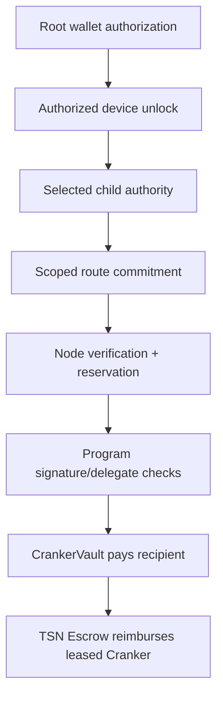

# Security model

## Authority table

| Component | Can see | Can sign | Can move funds | Must never receive |
| --- | --- | --- | --- | --- |
| Authorized device | User-unlocked local plaintext and selected private state | Scoped child authorizations | Only through signed program instructions | Nothing beyond its local session |
| Frontend | Public plan, wallet state, and user-approved display data | Requests wallet signatures | No direct authority | Plaintext seed or child private keys in persistent state |
| TSN SDK | Local inputs and public route data | Root and scoped signatures on the device | No direct program authority | Server-provided private permits |
| Application backend/TIN service | Authenticated profile, public metadata, ciphertext | No user-PRU signing authority | No user funds | Plaintext seeds and child keys |
| TSN Node | Signed public plans, commitments, reservations | No user signing authority | No direct token authority | Seeds, private keys, route-rewriting authority |
| Cranker | Verified work and public transaction data | Own operator/fee payer only | Submits; cannot authorize user sources | User private keys and escrow keys |
| TSN Program | Public instruction data and account state | PDA signing through program rules | Exact validated token movement | Off-chain secrets |
| TSN Escrow | Isolated reimbursement assets and state | Program-controlled | Credits only after a verifier-approved reimbursement transition | Serialized escrow signer keys |
| CrankerVault | Cranker liquidity used for recipient payout | Program-controlled | Pays only the exact leased settlement route | User keys or unrestricted payout authority |
| Solana validator | Public transaction and account data | Validator protocol messages | Executes submitted instructions | TSN user secrets |

## Authorization boundary

Plaintext derivation material and child private keys remain on the authorized
device. The root wallet signs the complete operation. A child authority signs
only its selected source action. The node and Cranker receive public keys and
signatures, never the signing material.

## Program protections

The TSN Program must enforce:

- exact canonical message and route commitment;
- correct Ed25519 instruction and signer;
- source account, mint, token program, and restricted execution PDA;
- delegated allowance and allowance decrement;
- nonce and replay registry;
- source state version and concurrency reservation;
- fee cap, cluster, program ID, and expiry;
- Payment PDA and escrow state transitions;
- refund/recovery rules for recoverable failures.

Tampering with amount, source, recipient, change, fee, nonce, state version,
delegate, signature offsets, or instruction ordering must fail closed.

## Device trust and revocation

Device authorization is a capability, not ownership transfer. The root wallet
can revoke a device; a revoked device must not retrieve or decrypt new
envelopes. Local unlock credentials must not be sent to the node, backend,
Cranker, analytics, or receipts.

## Privacy limits

ZK-PRU provides protected identity and routing. It does not automatically hide
all public SPL amounts, token-account movements, timing, public exits, or
graph-analysis signals. Commitments provide hiding and binding for committed
fields, but a commitment alone is not a formal zero-knowledge proof.

## Compromise scenarios

- A compromised frontend must not gain device secrets; wallet/device approval
  and signature review remain required.
- A compromised node can refuse or delay work but must not alter a verified
  plan without invalidating its commitment.
- A compromised Cranker can censor or fail to submit; it cannot sign as a user
  or change authorized batches.
- A compromised device can spend only within the capabilities it can locally
  unlock and sign; root revocation and state replay checks limit reuse.
- A malicious validator cannot bypass TSN Program constraints without a valid
  Solana consensus/runtime path.

Known limitations must be verified against the deployed program, tests, and
current operational evidence before being described as guarantees.
