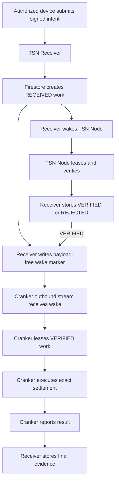

# TSN Service Coordination and Resource Discipline

We treat network requests, database reads, CPU time, and hosted
runtime minutes as scarce resources. Services communicate only when there is
work to do, while Firestore remains the durable source of truth.

## Storage and authority

Firestore stores durable work, leases, idempotency, replay state, verification
evidence, and settlement results. Realtime Database is a wake channel only. A
wake marker contains no payment payload, route, amount, recipient, signature,
or private value. It contains only a nonce, work kind, and timestamp.



The wake is only a hint. The Node or Cranker must authenticate and re-read or
lease authoritative work from the Receiver before acting.

## Idle behavior

### Receiver

The Receiver has no background polling loop. It accepts a request, commits
durable state, sends wake hints, and returns.

### TSN Node

The Node waits on its authenticated Receiver wake event. It drains eligible
work after a wake and sleeps when the queue is empty. It does not poll the
Receiver or Firebase while idle.

### Cranker

With the wake channel enabled, a Cranker keeps one outbound authenticated
Realtime Database stream open. It calls the lease endpoint only after a wake.

If the stream is unavailable, it uses a bounded safety fallback:

```text
2s → 4s → 8s → 16s → 30s
```

With wake mode enabled, the fallback check is limited by
`TSN_CRANKER_WAKE_FALLBACK_POLL_MS` (default five minutes). This recovers lost
wakes without continuous high-frequency reads.

## Event sequence

1. Receiver writes the signed work record in a Firestore transaction.
2. Receiver sends a payload-free wake to the Node.
3. Receiver writes `tsn/crankerWake` in Realtime Database.
4. Node leases and verifies the work.
5. Receiver stores `VERIFIED` or `REJECTED` in Firestore.
6. On `VERIFIED`, Receiver writes a second wake marker. The first wake can
   arrive before verification completes.
7. Cranker receives the marker and calls `/api/cranker/work`.
8. Receiver leases only verified work and returns the Node-approved execution
   view.
9. Cranker submits the exact authorized transaction and reports its result.

## Authentication boundaries

| Connection                           | Authentication                    | Allowed data                |
| ------------------------------------ | --------------------------------- | --------------------------- |
| Receiver → Node wake                 | `TSN_RECEIVER_NODE_API_KEY`       | reason only                 |
| Cranker → wake-token endpoint        | `TSN_RECEIVER_CRANKER_API_KEY`    | Cranker public ID           |
| Cranker → Realtime Database          | Firebase ID token, `role=cranker` | wake marker only            |
| Cranker → lease/transition endpoints | `TSN_RECEIVER_CRANKER_API_KEY`    | lease and public evidence   |
| Node → Receiver work endpoints       | `TSN_RECEIVER_NODE_API_KEY`       | verification state/evidence |

No wake path carries a master seed, child private key, serialized key,
settlement secret, or private permit.

## Resource budget

| State             | Firestore                | Realtime Database                    | Worker activity               |
| ----------------- | ------------------------ | ------------------------------------ | ----------------------------- |
| Idle              | no work reads            | one quiet stream per enabled Cranker | Node sleeps; Cranker waits    |
| New submission    | one idempotent write     | one marker write                     | Node wake; Cranker wake event |
| Node verification | lease and transition     | one marker if verified               | Node verification             |
| Settlement        | lease/result transitions | no marker required                   | one execution attempt         |
| Lost wake         | durable state unchanged  | reconnect with backoff               | bounded fallback lease check  |

## Configuration

Receiver:

```text
FIREBASE_PROJECT_ID=tsn-epoch-record
FIREBASE_CLIENT_EMAIL=...
FIREBASE_PRIVATE_KEY=...
FIREBASE_DATABASE_URL=...
FIREBASE_WEB_API_KEY=...
TSN_RECEIVER_NODE_API_KEY=...
TSN_RECEIVER_CRANKER_API_KEY=...
TSN_NODE_URL=...
```

Cranker:

```text
TSN_RECEIVER_URL=https://tsn-receiver-kappa.vercel.app
TSN_RECEIVER_CRANKER_API_KEY=...
TSN_CRANKER_WAKE_ENABLED=true
FIREBASE_DATABASE_URL=...
TSN_CRANKER_WAKE_FALLBACK_POLL_MS=300000
```

Deploy the Realtime Database rules after creating the database:

```bash
firebase deploy --only database --project tsn-epoch-record
```

Rules must allow reads only for Firebase tokens whose custom claim is
`role == 'cranker'`; writes are server-only.

## Operational signals

```text
[tsn-cranker] wake=outbound-realtime-database
[tsn-cranker] receiver.wake-received
```

Without wake configuration, an idle Cranker should show increasing intervals,
not a rapid loop:

```text
[tsn-cranker] receiver.poll no-eligible-work; sleepMs=4000
[tsn-cranker] receiver.poll no-eligible-work; sleepMs=8000
```

Wake failure never deletes work. Stale leases are requeued by the Receiver;
Firestore remains authoritative if Realtime Database is unavailable.
