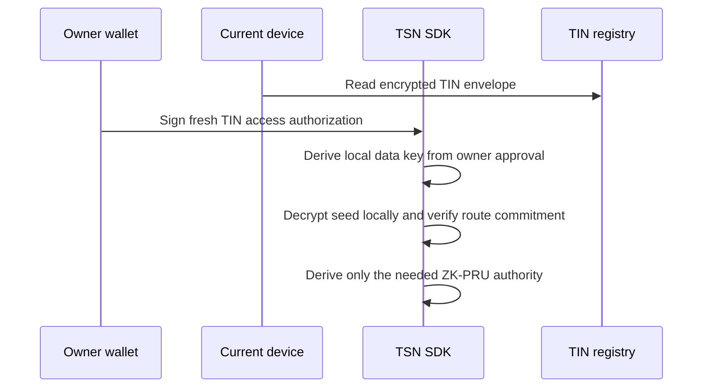

# TIN master-seed architecture (historical ZK-PRU note)

The live architecture no longer derives or publishes funded PRU receiving
units. Use the GPRU authorization scope and owner-encrypted TCAP snapshot path
described in [CURRENT-ARCHITECTURE.md](./CURRENT-ARCHITECTURE.md).

## Purpose

A TIN is a payment identity owned by a normal Solana wallet. Its encrypted
master seed is random local root material used to derive scoped ZK-PRU child
authorities. It is not a replacement wallet and it never turns the Receiver,
Node, or Cranker into a custodian.

## Wallet-owned access, not device-owned access

New and upgraded TINs use the `wallet-owner-signature-v1` envelope. The wallet
signs a fresh, canonical TIN-access authorization containing the TIN, owner
wallet, route version, commitment, and the fixed any-device access binding.
The SDK derives the local data key from that owner approval and decrypts the
seed locally on the device currently in use.

This means the same wallet can access its TIN on another phone or computer. A
device is where local decryption happens; it is not the permanent authority
over the TIN. The plaintext seed and derived private keys never leave the
device and are never sent to the Receiver, Node, Cranker, or application
backend.

## What is stored

The TIN stores the owner-wallet binding, encrypted master-seed envelope,
ZK-PRU configuration commitment, public-route envelope for Node route
resolution, and route version/nonce. It does not store the plaintext seed,
child private keys, or a universal copy of a wallet signing key.

## Legacy migration

Older `tsn-device-envelope-v1` records were device-bound. They remain usable
only from a device that can already unlock them, until the owner performs the
one-time upgrade. That compatibility path is limited to old data; it is not the
access model for a new or upgraded TIN.

## Spending and receiving

For spending, the main wallet and the selected locally derived PRU authority
sign the same scoped plan. The Node verifies the public plan and route binding;
the Cranker submits it without user keys. For receiving, the Node can use only a
separate public-route envelope and never the master seed.
