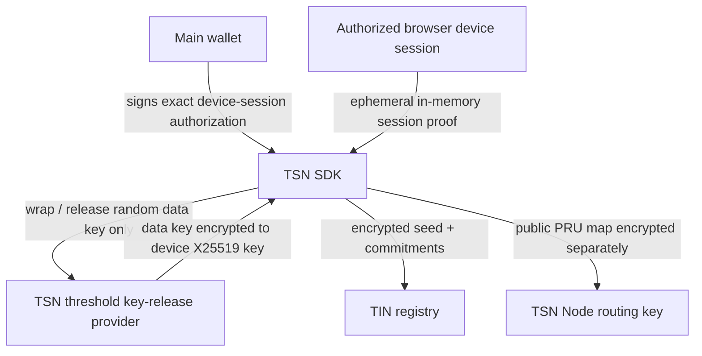
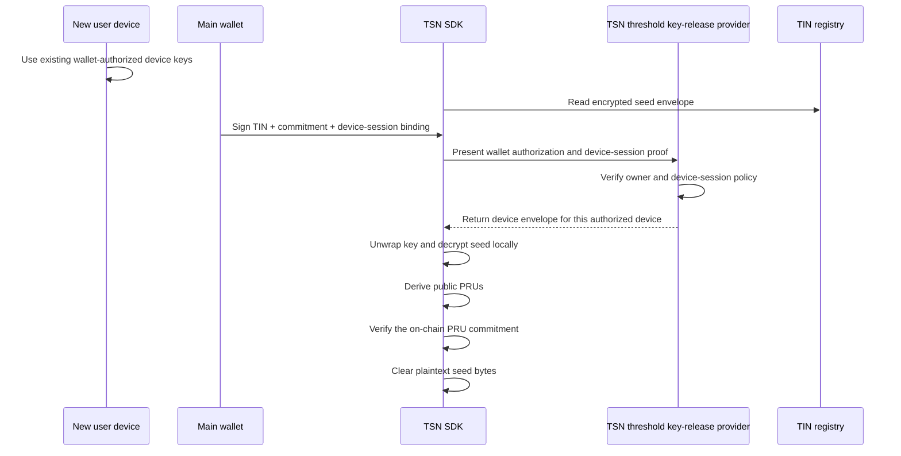

# TIN Master-Seed Architecture

## Purpose

A TIN is the payment identity used inside TSN. Its encrypted master seed is
random root material from which the authorized user device derives ZK-PRU
child authorities. The seed is not a wallet replacement and never signs a
transaction directly.

## Stored TIN data

The TIN stores:

- the main-wallet authority binding;
- a locally encrypted master-seed envelope whose independent data key is
  released by a multi-device TSN threshold key-release provider and wrapped
  to the requesting authorized device's non-exportable X25519 key;
- the ZK-PRU configuration commitment;
- a separately encrypted public-route envelope for the TSN Node;
- route version and nonce.

The TIN does not store device identifiers, device public keys, device
fingerprints, an authorized-device list, or a per-device access key.
Authorizing a new device therefore requires no TIN transaction.

## Package boundary

The TSN SDK owns:

- random master-seed generation;
- ZK-PRU child derivation;
- PRU configuration commitments;
- threshold-encryption policy and envelope validation;
- device-session-bound wallet authorization;
- public-route construction and encryption;
- scoped PRU signing.

The frontend supplies only wallet and browser-device adapters and renders safe
results. The TrustLink application backend is not a participant. The TSN Node
may decrypt only the public-route envelope. The Cranker receives only public
plans and signatures.

## Creation

The SDK generates a random 32-byte seed. It derives the public ZK-PRU set and
computes its configuration commitment. The main wallet then signs a canonical
authorization bound to:

- access domain;
- TIN;
- main-wallet public key;
- route version;
- PRU configuration commitment;
- the current device-session public binding.

The SDK requests a fresh random 32-byte data key from the configured TSN
threshold key-release provider. The provider retains only an opaque,
threshold-protected handle and returns the data key encrypted to the current
authorized device. The device unwraps it locally, and the SDK encrypts the seed
with AES-256-GCM. Neither the master seed nor plaintext data-key bytes are sent
to the backend, Node, Cranker, or Receiver.

## Authorized-device decryption

The wallet signature is authorization, not an encryption key. The device
provider also requires proof of the current device session. A copied wallet
signature cannot decrypt the envelope because the key is wrapped to the
authorized device's non-exportable X25519 key.

The authorized device separately signs the same threshold-access request with
its non-exportable Ed25519 device key. The main-wallet authorization also
binds the device's existing non-exportable X25519 encryption public key. The
proof is bound to the exact operation and protected-resource commitment, so
authorization for one ciphertext cannot unlock another. It has a five-minute
maximum lifetime and a one-time nonce.

The provider must check both signatures, every identity and resource field,
the device fingerprint, expiry, and a one-time nonce before releasing a device
envelope. A wallet-only bypass is not accepted. The repository's old
`tsn-device-envelope-v1` provider is migration/test compatibility only and is
disabled by default in production; it cannot unlock a TIN created on another
device.

A device must first be authorized through the existing TSN Private View device
authorization flow. The main wallet then signs the exact short-lived
master-seed access request for that device. The device provider releases the
data key only as an envelope encrypted to that device's non-exportable X25519
key. The TIN stores no device registry. A new device requires an explicit
migration/re-wrap from an already authorized device (or a separately
implemented owner recovery flow); it never receives a copied private key.

The threshold provider never receives the master seed or its ciphertext. It
can release only the independent data key as an envelope encrypted to the
authorized device. Capturing the wallet authorization, request, or response
does not give another device usable key material. A live multi-device provider
must be deployed before existing device-bound envelopes can be migrated
safely; the SDK fails closed until then.

## Loading the TIN balance

After local unlock, the SDK derives the public PRU addresses and verifies they
match the TIN commitment. The frontend may then query those public token
accounts and aggregate their balances. The private link between the TIN and
the PRUs is never sent to the application backend.

## Receiving

The recipient need not be online. The TSN Node decrypts a separate envelope
containing only the public PRU route map. It verifies the route commitment and
selects a receiving PRU using the SDK allocation policy.

The Node cannot decrypt the master seed, derive private keys, or sign as a PRU.

## Spending

Movement from a ZK-PRU requires two Ed25519 authorizations over the same plan
commitment:

1. the main wallet authorizes the complete spend;
2. the selected locally derived PRU child authority signs the same operation.

The Node verifies and reserves the immutable public plan. The Cranker pays the
network fee and submits it without user keys. The TSN Program rejects a
missing signature, mismatched commitment, stale nonce, expired plan, or replay.

## Security limits

- A compromised device can observe plaintext while the owner legitimately
  unlocks it.
- Closed Shadow DOM and canvas rendering reduce exposure but are not
  cryptographic authorization.
- Public token accounts remain public once their addresses are known.
- ZK-PRU commitments provide binding and consistency; they are not by
  themselves a general-purpose zero-knowledge proof system.
