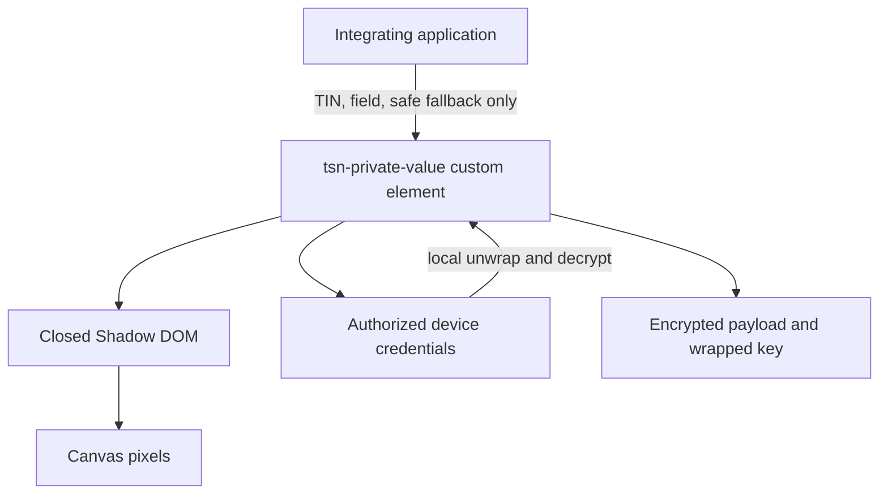
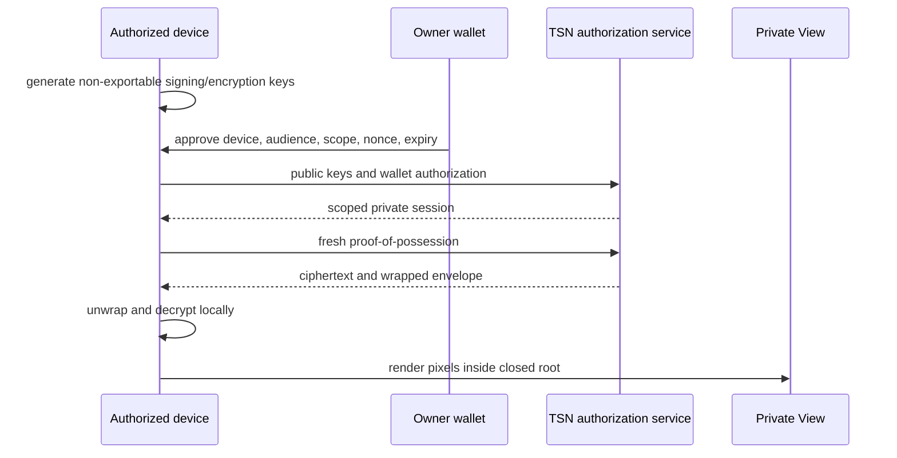

# TSN Private View: Lit Web-Component Architecture

**Status:** Active SDK architecture; authorization-service extraction remains
in progress  
**SDK element:** `<tsn-private-value>`  
**Owner:** Transfer Settlement Network SDK

> This document describes the Lit web-component library used for private
> rendering. It is not the Lit Protocol threshold network. Lit Protocol's
> separate master-seed access duty is documented in
> [Lit Protocol in TSN](./lit-protocol-in-tsn.md).

## Purpose

TSN Private View is the owner-device display boundary for values that an
integrating application must not receive as ordinary application data. This
includes private receipts, recovery references, privacy-receiving-root metadata,
encrypted TCAP snapshot references, and
other fields classified as private by the identity or settlement protocol.

TrustLink Pay mounts the component; it does not own the renderer, plaintext
DOM, decryption lifecycle, or cleanup behavior. This makes the boundary
portable to other wallets and payment applications.

## Why Lit and closed Shadow DOM

Lit provides standards-based custom elements, scoped styles, lifecycle hooks,
and Shadow DOM rendering. TSN requests a closed root:

```ts
static shadowRootOptions: ShadowRootInit = { mode: "closed" };
```

The host element therefore exposes `shadowRoot === null`, and ordinary
document traversal cannot inspect the internal tree. This is encapsulation and
exposure reduction—not encryption and not a complete security boundary.



## Security composition

No single mechanism provides the guarantee. The protection is compositional:

| Layer | Protection |
| --- | --- |
| Wallet ownership proof | Establishes control of the TIN owner authority |
| Device signing key | Proves possession for private sessions and requests |
| Device encryption key | Restricts envelope decryption to the authorized device |
| Authenticated encryption | Protects confidentiality and integrity before rendering |
| SDK-owned Lit element | Keeps plaintext out of application properties and state |
| Canvas rendering | Keeps the value out of DOM text nodes and attributes |
| Closed Shadow DOM | Hides the internal tree from ordinary selectors |
| Lifecycle cleanup | Clears state when disconnected, expired, revoked, or replaced |

## Rendering contract

```html
<tsn-private-value
  tin="1000000008"
  field="settlementWallet"
  fallback="Privately verified"
></tsn-private-value>
```

The application supplies only a field identifier, TIN identifier, and safe
fallback. It must never supply decrypted text as an attribute, child node,
React property, serialized payload, or application-store value.

The SDK performs this sequence:

1. detect the authorized device credential;
2. create or confirm a device-signed private session;
3. obtain ciphertext and the envelope addressed to that device;
4. decrypt locally using the non-exportable device credential;
5. draw the value as pixels on a canvas inside the closed root;
6. clear the value when authorization expires or the element disconnects.

An unauthorized device receives only the fallback. An authorized device can
render automatically after its active session is established.

## Canvas and copy behavior

The value is never inserted into a text node, attribute, ARIA label, slot,
hidden input, or framework state. Canvas is not encryption: authorized or
compromised code may still inspect pixels, instrument drawing or clipboard
APIs, or capture the screen. CSP, XSS prevention, dependency integrity, device
authorization, and authenticated encryption remain mandatory.

Because canvas text is not selectable DOM text, the SDK provides a Copy action.
Copy performs a fresh authorized resolution and writes directly to the system
clipboard. It does not create a temporary plaintext input or dispatch a
plaintext-bearing application event.

Accessibility labels describe the control but never contain the private value.
An accessible plaintext-reveal mode requires a separate threat model and is
disabled by default.

## Platform boundary

The frontend may mount and style the host element using documented theme
tokens. It must not own private-session state, decrypted values, device private
keys, or the internal renderer.

The backend and TSN authorization service may process challenges, commitments,
public device keys, signed proofs, ciphertext, envelopes, revocation state,
and replay nonces. They must not receive:

- decrypted private fields;
- device private keys;
- unwrapped data-encryption keys;
- plaintext copied from the component;
- private values in analytics, logs, screenshots, or error reports.

## Device authorization relationship



For payment authorization, the TSN SDK asks the device-envelope provider to
unlock encrypted privacy-receiving-root and snapshot metadata on the user
device, then signs scoped GPRU operations. Master-seed
decryption requires both a verified main-wallet authorization and proof of the
current non-exportable device session. A captured wallet signature cannot
decrypt an envelope addressed to another device. The raw master seed never
signs and never leaves the user device.

The application backend does not issue a private-data capability and does not
participate in root or snapshot decryption. Authorizing a new device creates a new
device session, obtains a fresh wallet authorization, and satisfies the same
threshold access policy without changing the TIN. See
[TIN Master-Seed Architecture](./tin-master-seed-architecture.md).

## What closed Shadow DOM does not prove

Closed Shadow DOM does not prevent screenshots, browser extensions with
privileged access, OS compromise, code that intercepts `attachShadow` before
construction, canvas pixel inspection, or clipboard interception. It does not
replace encryption, device authorization, CSP, or dependency review.

## Serialization policy

Private View roots must not use `serializable: true`. The component must not
participate in server-side rendering, static HTML export, session replay,
analytics DOM capture, or error-reporting DOM snapshots. Light-DOM snapshots
may contain the host element and safe attributes, never the revealed value.

## Verification checklist

- `customElements.get("tsn-private-value")` resolves to the SDK class;
- the class is exported from `tsn-protocol/tsn-sdk`, not the application;
- `element.shadowRoot === null` after mounting;
- the host has no plaintext child or private-value attribute;
- the value is drawn only as canvas pixels and cleared on disconnect;
- Copy performs a fresh authorization and creates no plaintext DOM node;
- unauthorized devices render only the fallback;
- logout, revocation, and session expiry return the component to locked state;
- no API response, React state, log, analytics event, or cache contains the value.

## Source locations

| Source | Responsibility |
| --- | --- |
| `tsn-protocol/tsn-sdk/src/private-view/private-value-element.ts` | Lit element and lifecycle |
| `tsn-protocol/tsn-sdk/src/private-view/public.ts` | Public SDK export |
| `tsn-protocol/tsn-sdk/src/device/` | Device credentials and fingerprints |
| `tsn-protocol/tsn-sdk/src/authorization/` | Owner-device authorization |
| `tsn-protocol/tsn-sdk/src/sessions/` | Proof-of-possession sessions |
| `tsn-protocol/tsn-sdk/src/receipts/` | Encryption and key envelopes |

## Current extraction limitation

Some challenge, device-registry, and private-session transport adapters are
still physically hosted in the TrustLink backend process. They must move to a
TSN-owned authorization service for the final deployment boundary. This
document does not treat the current hosting location as proof that the
application backend is allowed to see plaintext.

## References

- [Lit Shadow DOM](https://lit.dev/docs/components/shadow-dom/)
- [Lit lifecycle](https://lit.dev/docs/components/lifecycle/)
- [MDN `attachShadow`](https://developer.mozilla.org/en-US/docs/Web/API/Element/attachShadow)
- [MDN canvas accessibility](https://developer.mozilla.org/en-US/docs/Learn_web_development/Extensions/Client-side_APIs/Drawing_graphics#accessibility_concerns)
- [MDN Clipboard security](https://developer.mozilla.org/en-US/docs/Web/API/Clipboard_API#security_considerations)
