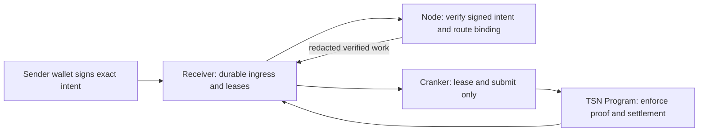

# TSN Receiver, Node, and Cranker architecture

This is the short technical architecture. For the layperson-oriented explanation
and exact retention boundary, see [Receiver verification and Cranker
settlement](./tsn-receiver-verification-settlement.md).

## Responsibility boundary

- The **Receiver** uses Firestore for accepted work, state transitions,
  idempotency, short leases, and compact confirmation receipts. It never
  verifies a plan, chooses a recipient, or signs a Solana transaction.
- The **Node** verifies canonical signatures, expiry, nonce/replay rules,
  amounts, commitments, and the recipient route commitment/version. It redacts
  recipient identity from the durable verified payment record. A separate,
  expiring Node-only route reference is used only to create payout
  authorization after funding confirmation.
- The **Cranker** can lease only verified work. It submits the exact
  sender-authorized funding transaction or the exact Node-authorized,
  lease-bound claim transaction and returns chain confirmation evidence.
- The **TSN Program** is the final on-chain enforcement point for the lease,
  commitment, amount, mint, expiry, and one-time/replay state.

## Work lifecycle

`RECEIVED -> NODE_VERIFYING -> VERIFIED -> CRANKER_LEASED -> SUBMITTED -> CONFIRMED`

`REJECTED` is terminal for invalid work. A lease expiration may return eligible
work to the queue; it does not grant a Cranker authority to alter the plan.

## Recipient privacy boundary

The initial signed request includes a recipient TIN only long enough for the
Node to verify its binding to the sender-signed route commitment. The durable
verified payment record excludes the recipient TIN, recipient wallet, complete
route map, raw sender authorization, and serialized transaction. The Cranker
learns a payout destination only inside the short-lived claim authorization it
needs to submit that specific payout.

## Wallet-owned TIN access

TIN private access belongs to the owner wallet, not a single browser or device.
New and upgraded wallet-owned envelopes unlock locally after fresh owner-wallet
approval on the current device. Receiver, Node, and Cranker never receive a
plaintext TIN master seed or private child key. Older device-bound envelopes
need a one-time upgrade from a device that can already unlock them.
