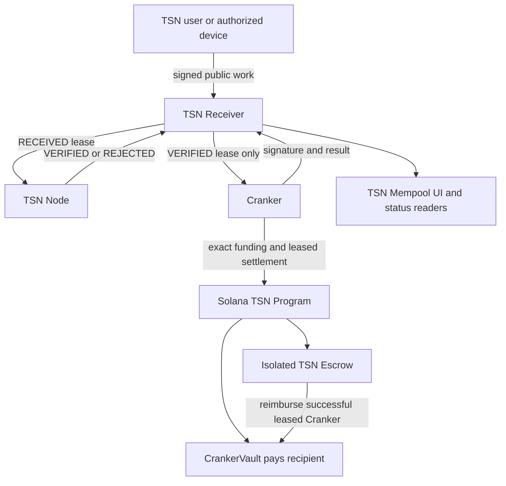
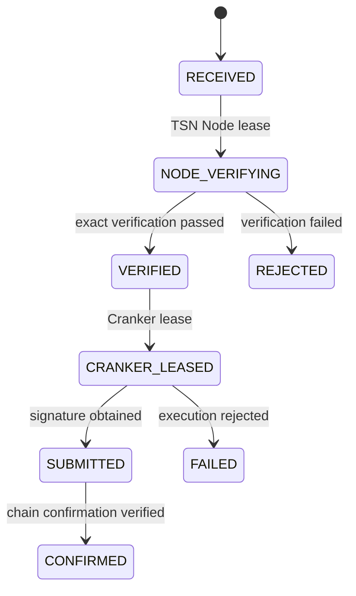
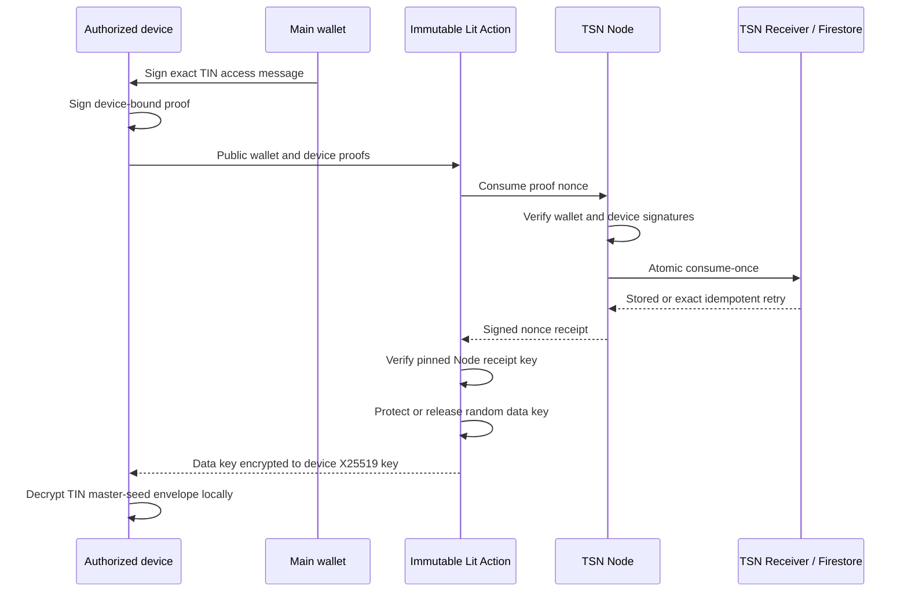
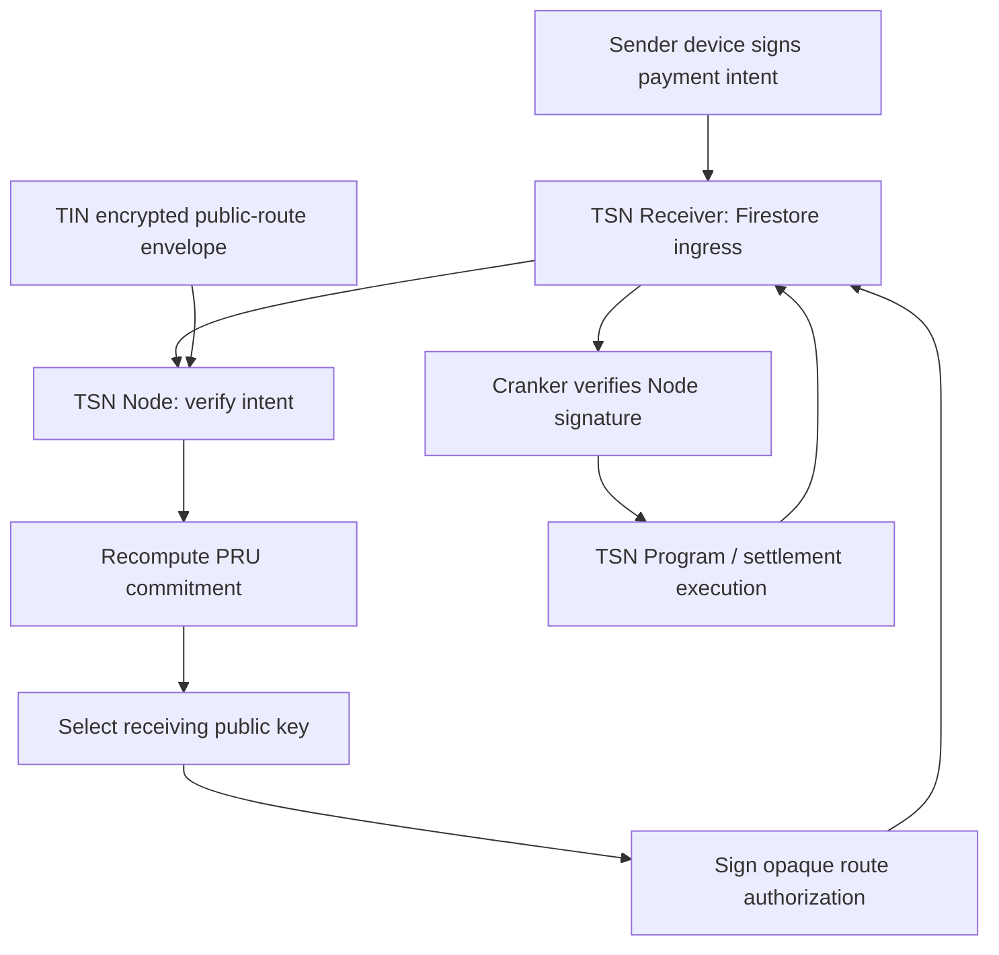

# TSN Receiver, Node, and Cranker Architecture

## Responsibility boundary

The TSN Receiver, TSN Node, and Cranker are separate runtime roles.



## TSN Receiver

The Receiver is the durable ingress and work-publication service. Its production store is Firebase Firestore. It accepts public signed work, assigns immutable payload commitments, maintains monotonic state versions, and performs atomic Node and Cranker leases.

The Receiver cannot decrypt a TIN master seed, derive or sign as a ZK-PRU, decide whether a cryptographic plan is valid, modify an execution plan, or sign a Solana transaction.



Firestore transactions enforce leases, idempotency, and state-version changes. Local JSON is not a production storage option.

## TSN Node

The Node is a stateless protocol processor. It leases `RECEIVED` work from the Receiver, verifies canonical messages, signatures, commitments, expiry, routing relationships, and protocol state, and returns `VERIFIED` or `REJECTED` evidence. Durable reads and writes use the Receiver API; the Node does not own a queue database.

The Node may decrypt only the encrypted public routing envelope needed to select a receiving ZK-PRU public key. It never receives or decrypts the TIN master seed and cannot sign as a user ZK-PRU.

## Cranker

The Cranker reads only `VERIFIED` work from the Receiver. It validates that the
received plan still matches its commitment, claims a short lease, submits the
exact funding and settlement transactions, pays the network fee, and returns
confirmed signatures and results. The recipient payout comes from the CrankerVault;
the isolated escrow reimburses only the Cranker whose lease completed the payout.
It does not select ZK-PRUs, decrypt user secrets, or reconstruct user signing
authority.

## Authorized-device threshold access



The Lit Action never receives the master seed. It handles only the random 32-byte data-encryption key. Identical Lit-node retries return the same signed nonce receipt; an altered replay is rejected.
# TSN Receiver, Node, and Cranker privacy boundary

The TSN Receiver is durable ingress and status storage. It stores accepted work
in Firestore, assigns monotonic state versions, and leases work. It does not
decrypt TIN private data, select receiving units, sign routes, or submit Solana
transactions.

The TSN Node is a stateless verifier. For a TIN recipient it reads the encrypted
public-route envelope through Receiver-backed state, decrypts that envelope with
the Node routing key, reconstructs the PRU configuration commitment, and selects
an eligible receiving public key. This envelope contains public routing keys
only. It never contains the master seed or PRU private keys.

A commitment is not an address catalogue. Its digest cannot be reversed to find
PRU public keys. The encrypted route envelope supplies the candidate public map;
recomputing the on-chain commitment proves that the map has not been replaced.

Before releasing work, the Node removes the recipient TIN and complete PRU map.
It signs an opaque route authorization binding the work ID, selected destination,
route commitment, mint, amount, expiry, and TSN program ID.

The Cranker receives only the minimized verified payload. It verifies the Node
signature and exact field bindings, submits the already-authorized transaction,
and reports the signature to the Receiver. It cannot decrypt routes, infer the
recipient TIN from Receiver work, select another receiving unit, or sign for a
user PRU.



Cranker-visible route data:

- selected destination public key;
- PRU configuration commitment;
- payment mint and amount;
- authorization expiry;
- Node signature and public verification key;
- TSN program ID and Receiver work ID.

Cranker-hidden route data:

- recipient TIN;
- complete PRU public-key map;
- PRU indexes and allocation history;
- TIN master seed and every derived private key;
- authorized-device private material.

## Claim and recovery settlement work

Claim and recovery are Receiver work kinds. Settlement work is eligible only
after the funding transaction has confirmed. The Receiver leases the work to
one Cranker and the Node rechecks the immutable, lease-bound authorization:

```mermaid
sequenceDiagram
    participant R as Receiver
    participant N as TSN Node
    participant C as Cranker
    participant P as TSN Program
    C->>R: lease CLAIM or RECOVERY
    R->>N: work id + Cranker public key
    N->>R: signed immutable settlement authorization
    R-->>C: public work + authorization only
    C->>P: exact authorized payout or recovery transaction
    P->>P: verify lease, commitment, replay, amount, route, and expiry
    P->>P: CrankerVault pays recipient; escrow reimburses leased Cranker
    P-->>C: signature and confirmation
    C->>R: CONFIRMED result and evidence
```

The Node signs the authorization from Receiver-held immutable fields and the
current replay sequence. It does not issue a permit, reconstruct a user key,
decrypt a master seed, or select a new route. The Cranker cannot change the
amount, destination, mint, escrow account, nullifier, sequence, or expiry. If
the Node is unavailable, the lease expires and the Receiver requeues the work;
no settlement transaction is attempted.
