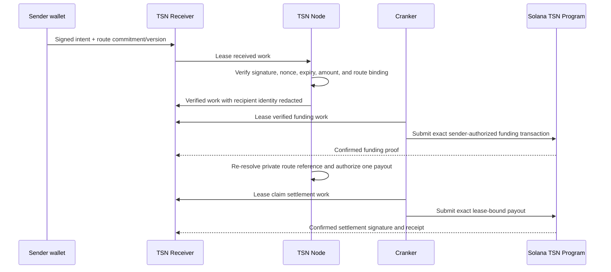

# TSN Receiver, verification, and Cranker settlement

This guide explains a TSN payment without assuming you know blockchains.
The important idea is simple: **the Receiver is a temporary work desk, not a
wallet or bank.** It holds just enough signed work for the TSN Node to verify a
payment and for a Cranker to submit an already-authorized transaction.

## The people and services involved

| Name | Plain-English job | Cannot do |
| --- | --- | --- |
| Sender wallet | Approves the payment with its own key | Give the Receiver, Node, or Cranker the wallet key |
| Recipient TIN | A payment identity that points to the recipient's current receiving route | Act as a bank account or private key |
| TSN Receiver | Durable inbox, status board, and short work lease service | Decide a payment is valid, choose a recipient, or sign a transaction |
| TSN Node | Checks that the signed plan is real, current, and not replayed | Spend user funds or learn a TIN master seed |
| Cranker | Pays network fees and submits the exact approved transaction | Change recipient, amount, asset, commitment, or expiry |
| TSN Program | Solana rules that enforce the proof, lease, and one-time use | Hold a user's wallet key |

## What reaches the TSN Receiver

The sender signs a canonical payment message locally. It binds the payment to:

- the amount, token mint, fee limits, expiry, and one-time nonce;
- the sender authorization and transaction/commitment evidence;
- the **recipient route commitment** and **route version**.

The commitment is a tamper-evident fingerprint of the recipient's active route.
It lets the Node prove that the sender approved *this route version* without
placing the recipient's full route map in ordinary payment work.

At initial receipt, the Receiver must retain the submitted evidence briefly so
the Node can verify the exact sender signature. The Receiver marks this work
`RECEIVED`; it does not decide that the payment is valid.

## What the Node verifies

The Node takes a short lease, then checks all of the following before it
returns `VERIFIED`:

1. The canonical message and signatures are valid.
2. The request exactly matches the signed message.
3. The nonce has not been used and the authorization has not expired.
4. The recipient TIN's current route has the same signed commitment and route
   version.
5. The amount, mint, sources, transaction commitment, and program constraints
   match the authorized plan.

If any check fails, the Receiver records `REJECTED`. A Cranker can never lease
rejected or merely received work.

## What is kept, and what is removed

After a successful payment verification, the durable Receiver payment record is
reduced to the information needed to coordinate settlement: payment/work IDs,
the sender-approved amount and mint, the route commitment and version, bounded
expiry/replay evidence, state, and later transaction receipts.

It does **not** keep the recipient TIN, the full recipient route, a recipient
wallet address, the raw sender authorization message/signature, the original
serialized transaction, or encrypted settlement tokens as part of the verified
payment record. Once the Cranker has confirmed payment work, the Receiver also
keeps a compact receipt context instead of the original authorization data.

The Node keeps a separate, short-lived recipient-route reference keyed by the
work ID. It contains only the recipient TIN, signed route commitment, route
version, and expiry. It is not mixed into the sender's payment work. It expires
and is deleted when no longer valid.

## How the recipient is protected but still paid

The recipient is not chosen from an unsigned request at payout time. The Node
uses its temporary route reference only after funding has been confirmed. It
re-resolves the recipient TIN, checks the same commitment and route version
again, and selects an eligible receiving account using the verified route.

Only after the Cranker confirms sender-authorized epoch funding does the Node create a short-lived DNA settlement authorization.
That authorization gives the leased Cranker the destination needed to submit
that one payout. It does not reveal the recipient TIN or the complete route
map in the original payment work.

If the route changed, expired, or no longer matches the sender-signed
commitment, the payout authorization is refused. The system never silently
switches the sender to a new recipient route.

## What the Cranker proves

The Cranker is an executor, not a decision-maker. It must first obtain a short
Receiver lease. For payment funding it submits the exact sender-authorized
transaction. For a claim payout it submits the exact Node-authorized settlement
transaction.

The proof it sends back is the Solana transaction signature and confirmation
result. The TSN Program verifies the binding rules on chain, including the
lease holder, route commitment, mint, amount, expiry, and one-time/replay
state. A valid signature alone is not enough if any of those rules do not
match.

The Receiver records the confirmed signature and compact receipt information.
Wallets and users should treat the confirmed Solana transaction and account
state as the final evidence that tokens moved.

## TIN access on any device

A TIN belongs to its owner wallet, not to one device. New and upgraded TINs
use a wallet-owned encrypted envelope: the owner gives a fresh wallet approval
on whichever device they are using, and that device decrypts the TIN material
locally. No Receiver, Node, or Cranker receives the plaintext seed or private
child keys.

Older device-bound envelopes remain readable only by a previously authorized
device until they are upgraded. This is a migration limit of old data, not a
rule for new TSN TIN access.
