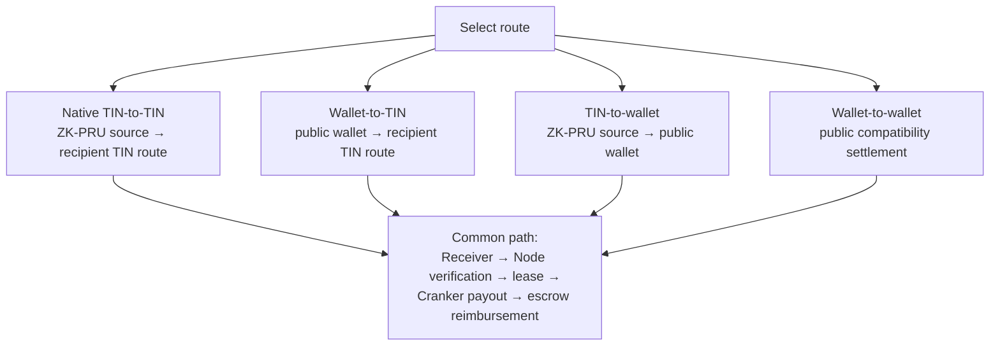

# TSN transaction explorer

This page documents the tested TSN settlement path. It has two coordinated
stages: intent verification and escrow funding, followed by a leased Cranker
settlement and reimbursement. The Receiver is the durable ingress and work
surface. The TSN Node verifies and publishes work. The Cranker pays Solana
fees, pays the recipient from its CrankerVault, and receives reimbursement only
after the leased settlement succeeds.

## Complete transaction flow

```mermaid
flowchart TD
    START["1. Sender chooses route, token, amount, and fees"]
    START --> DEVICE["2. Authorized device + TSN SDK resolve the route<br/>select sources, calculate fees/change,<br/>and create the signed intent commitment"]
    DEVICE --> SIGN["3. Main wallet and selected ZK-PRU authorities sign<br/>the exact authorization on the device"]
    SIGN --> INTENT["4. Frontend submits POST /intents"]

    subgraph RECEIVER1["STAGE 1 — Receiver ingress and verification"]
        INTENT --> RECEIVED["Receiver stores intent = RECEIVED"]
        RECEIVED --> NODE["TSN Node verifies sender authorization,<br/>route commitment, mint, amount, expiry,<br/>nonce, replay state, and source rules"]
        NODE --> RESULT{"Intent accepted?"}
        RESULT -->|No| REJECT["Receiver records rejection<br/>No funding transaction is submitted"]
        RESULT -->|Yes| VERIFIED["Receiver publishes VERIFIED intent work"]
    end

    subgraph FUNDING["STAGE 1 — Sender funding and isolated escrow"]
        VERIFIED --> LEASE1["Cranker leases the verified intent work"]
        LEASE1 --> FUND["Cranker submits the exact sender-authorized funding transaction"]
        FUND --> PROGRAM1["TSN Program creates the isolated payment vault,<br/>checks the commitment, and verifies the funding transfer"]
        PROGRAM1 --> ESCROW["Authorized funds are held in the isolated escrow vault"]
        ESCROW --> CLAIMWORK["Receiver exposes settlement work after funding confirmation"]
    end

    subgraph SETTLEMENT["STAGE 2 — Lease, payout, and reimbursement"]
        CLAIMWORK --> LEASE2["Cranker obtains a short settlement lease<br/>and a one-time settlement token"]
        LEASE2 --> NODE2["TSN Node rechecks the settlement data<br/>and publishes only the leased work"]
        NODE2 --> SETTLE["Cranker submits the exact settlement transaction"]
        SETTLE --> PROGRAM2["TSN Program verifies lease owner,<br/>one-time commitment, amount, route,<br/>expiry, and replay protection"]
        PROGRAM2 --> PAY["CrankerVault pays the recipient route<br/>and protocol fees"]
        PAY --> REIMBURSE["Escrow reimbursement credits only<br/>the Cranker that held the active lease"]
        REIMBURSE --> CONSUME["One-time settlement token is marked used;<br/>commitment, signatures, balances, and receipts are recorded"]
    end

    CONSUME --> DONE["Sender and recipient read final evidence"]
    ESCROW --> EXPIRE{"Lease expires before payout?"}
    EXPIRE -->|Yes| RECOVER["Recovery or reassignment follows policy;<br/>the original lease cannot settle"]
    RECOVER --> CLAIMWORK

    classDef user fill:#fbf6e9,stroke:#8b7131,color:#30240d;
    classDef receiver fill:#f6f0df,stroke:#8b7131,color:#30240d;
    classDef node fill:#e9efed,stroke:#4e6e60,color:#14241c;
    classDef cranker fill:#f2eee6,stroke:#6b6254,color:#211f1a;
    classDef chain fill:#e7eee9,stroke:#1f5038,color:#10251a;
    classDef result fill:#f4e8e4,stroke:#8e4f45,color:#351915;
    class START,DEVICE,SIGN,INTENT user;
    class RECEIVED,VERIFIED,CLAIMWORK,CONSUME,DONE receiver;
    class NODE,NODE2 result;
    class LEASE1,LEASE2,REIMBURSE,RECOVER cranker;
    class FUND,PROGRAM1,ESCROW,SETTLE,PROGRAM2,PAY chain;
    class RESULT,EXPIRE result;
```

## What each stage means

### Stage 1 — intent, verification, and funding

The frontend submits the signed intent to the Receiver. The TSN Node verifies
the public authorization and route data before the intent becomes Cranker work.
The Cranker cannot change the amount, source, destination, fees, or commitment.

The sender-authorized funding transaction creates an isolated payment vault and
moves the authorized amount into it. This vault is not the recipient payout.
It is the reimbursement source for the Cranker that completes the leased
settlement.

### Stage 2 — settlement lease, payout, and reimbursement

After funding is confirmed, the Receiver publishes settlement work. A Cranker
claims a short lease. The TSN Program binds the settlement to that lease and a
one-time commitment. It rejects a second Cranker, an expired lease, a replayed
token, a changed amount, or a changed destination.

The recipient is paid from the leased Cranker's protocol vault. Only after the
recipient payout succeeds does the isolated escrow reimburse that same
Cranker. This separates the public funding record from the recipient payout
record and is the tested sender-to-recipient link-separation property.

## Four supported routes

TIN-to-TIN is the native protected route. Wallet-to-TIN uses a public funding
wallet but resolves the recipient through the TIN route. TIN-to-wallet exposes
the public destination wallet. Wallet-to-wallet remains a compatibility route.

## Commitment and privacy boundary

The commitment is used to verify that the leased Cranker submitted the exact
authorized settlement. The one-time settlement token is marked used after a
successful payout. The commitment does not itself reveal the sender's
private ZK-PRU material. The Receiver, TSN Node, and Cranker exchange only the
public work and scoped evidence required for execution; user private keys and
decrypted master-seed material stay on the authorized device.

Solana observers can still see normal public transaction facts such as program
accounts and token-account addresses. The tested TSN design avoids publishing a
single direct sender-to-recipient settlement edge by separating intent,
Cranker payout, and escrow reimbursement records.

## Failure and recovery

- Invalid intent: the Receiver rejects it before funding.
- Funding failure or expired blockhash: the intent remains non-executable and
  requires a fresh authorization.
- Active lease: another Cranker cannot settle the same work.
- Expired lease: the work can be reassigned or recovered according to policy.
- Replayed commitment or settlement token: the TSN Program rejects it.
- Failed payout: reimbursement is not released as successful settlement.

The confirmed Solana signatures and account balances are the final evidence;
Receiver status alone is not proof that tokens moved.
