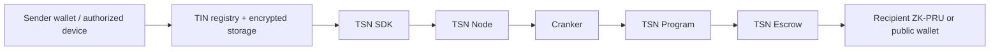
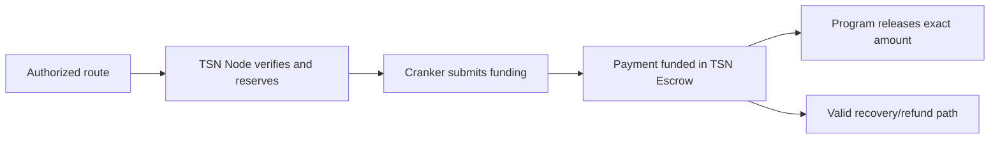
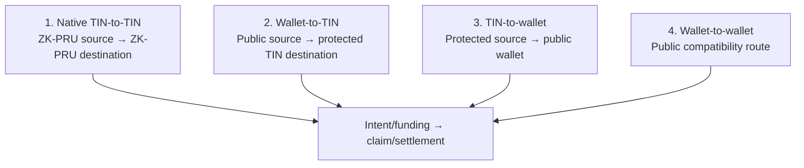
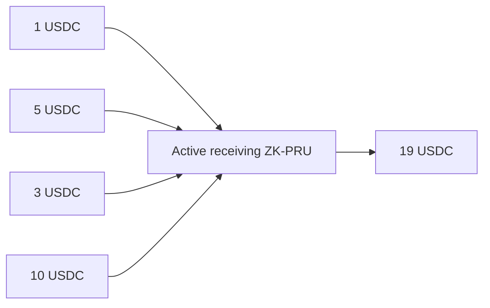

# TSN transaction explorer

TSN coordinates two stages: **intent and funding**, then **claim and
settlement**. TIN discovers the payment identity, ZK-PRU supplies protected
receiving/spending routes, the SDK builds and signs the route, the TSN Node
verifies and reserves it, the Cranker submits it, and the TSN Program enforces
it through TSN Escrow.

The active explorer must not render a ZK-PRU Registry, node signing key,
TCAP reserve, TCAP confidential container, or TCAP ownership ledger as live
settlement actors.

## Two-stage lifecycle

### Intent and funding

The user selects identity, asset, amount, and destination. The SDK resolves
the route, selects sources, calculates fees and change, and creates the
immutable commitment. An authorized device decrypts ZK-PRU material locally
when required; the root wallet and selected child authorities sign. The node
verifies/reserves, the Cranker pays fees and submits, and the TSN execution PDA
moves the authorized tranche into TSN Escrow. The Payment PDA becomes
`FUNDED`.

### Claim and settlement

The node exposes only verified claimable work. The Cranker claims and submits
the exact authorized settlement. The Program verifies commitment, signatures,
source, mint, amount, recipient, nonce, state version, expiry, fee cap, and
replay state. TSN Escrow releases the exact amount, authorized change follows
the plan, and the Payment PDA becomes `SETTLED`.

## Four routes

1. **Native TIN-to-TIN:** protected identity and routing. Incoming value is
   paid to the recipient's active ZK-PRU route; public SPL movements may still
   be observable.
2. **Wallet-to-TIN:** public wallet funds the route and the recipient's
   protected ZK-PRU receives the payment. No sender seed decryption is needed.
3. **TIN-to-wallet:** a device-authorized ZK-PRU source exits to a public
   wallet. The destination and amount are public output.
4. **Wallet-to-wallet:** both source and destination are public compatibility
   endpoints; no ZK-PRU seed is needed.

## Receiving and spending

Small receipts accumulate in one active receiving route:

Receiving rotation is policy-driven, not fixed at 1,000 USDC. Spending
prefers one sufficient source, uses adaptive tranches, minimizes inputs, and
sends authorized change to a fresh route. These are protected identity and
routing properties, not a claim of complete confidentiality.

## Authority boundary

The main wallet is the root authority. Encrypted ZK-PRU derivation material is
decrypted only on an authorized device. The SDK derives selected child
authorities and emits public data plus signatures. The node and Cranker never
receive user private keys. The Cranker is a fee payer and submitter, not a
delegate or route planner.
