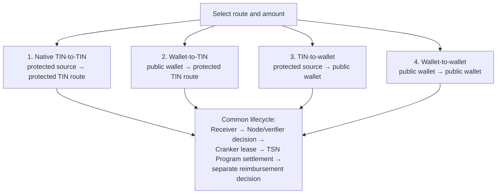

# TSN transaction explorer

This page describes the tested TSN payment lifecycle. The Receiver stores work,
the TSN Node and verifier services decide whether work is valid, the Cranker
submits only leased work, and the TSN Program performs the on-chain checks and
token movement.

## Complete transaction flow

```mermaid
flowchart TD
    START["1. Sender opens TrustLink Pay"]
    START --> INPUT["2. Select recipient, asset, amount, source, and fees"]
    INPUT --> ROUTE{"Destination route"}
    ROUTE --> T2T["Native TIN-to-TIN<br/>ZK-PRU source → protected TIN route"]
    ROUTE --> W2T["Wallet-to-TIN<br/>public wallet → protected TIN route"]
    ROUTE --> T2W["TIN-to-wallet<br/>protected source → public wallet"]
    ROUTE --> W2W["Wallet-to-wallet<br/>public compatibility settlement"]

    T2T --> DEVICE
    W2T --> DEVICE
    T2W --> DEVICE
    W2W --> DEVICE

    DEVICE["3. Authorized device + TSN SDK<br/>Resolve route, select inputs,<br/>calculate fees/change, build commitment"]
    DEVICE --> SIGN["4. Main wallet and selected ZK-PRU authorities<br/>sign the exact authorization locally"]
    SIGN --> INTENT["5. Frontend submits signed intent<br/>POST /intents → TSN Receiver"]

    subgraph STAGE1["STAGE 1 — PAYMENT INTENT, VERIFICATION, AND FUNDING"]
        INTENT --> RECEIVED["Receiver: intent = RECEIVED<br/>Store immutable public work and state version"]
        RECEIVED --> NODE_INTENT["TSN Node leases and verifies intent<br/>signature, route, amount, mint, expiry,<br/>nonce, commitment, and replay state"]
        NODE_INTENT --> INTENT_RESULT{"Intent verification"}
        INTENT_RESULT -->|Rejected| REJECT["Receiver records rejection<br/>No funding transaction is submitted"]
        INTENT_RESULT -->|Verified| SETTLEMENT_INTENT["TSN Node decrypts the recipient route<br/>and creates the settlement intent<br/>(inactive until submission is verified)"]
        SETTLEMENT_INTENT --> VERIFY_SUBMISSION["TSN Node confirms the payment intent<br/>was submitted and asks the TSN Program<br/>to validate required on-chain state"]
        VERIFY_SUBMISSION --> VERIFIED_INTENT["Receiver: intent = VERIFIED<br/>Publish funding work"]
        VERIFIED_INTENT --> FUNDCRANK["Cranker leases verified intent work<br/>and pays the Solana fee"]
        FUNDCRANK --> FUNDTX["Cranker submits the exact<br/>sender-authorized funding transaction"]
        FUNDTX --> PROGRAM1["TSN Program verifies funding and creates<br/>the payment-intent vault"]
        PROGRAM1 --> ESCROW["Isolated vault exists for a later<br/>TSN/verifier reimbursement decision"]
    end

    subgraph STAGE2["STAGE 2 — SETTLEMENT PROOF, LEASE, AND PAYOUT"]
        ESCROW --> SETTLEMENT_WORK["Receiver publishes settlement work<br/>after funding evidence is confirmed"]
        SETTLEMENT_WORK --> NODE_SETTLE["TSN Node activates the prepared settlement intent<br/>after verifying settlement proof, route, amount,<br/>commitment, expiry, and replay"]
        NODE_SETTLE --> LEASE_RESULT{"Settlement accepted?"}
        LEASE_RESULT -->|Rejected or expired| REJECT_SETTLE["Reject, requeue, or recover<br/>according to TSN policy"]
        LEASE_RESULT -->|Accepted| LEASE["Short settlement lease granted<br/>to one Cranker"]
        LEASE --> SETTLECRANK["Cranker submits the exact leased<br/>settlement transaction"]
        SETTLECRANK --> PROGRAM2["TSN Program verifies lease owner,<br/>one-time commitment, route, amount,<br/>expiry, and replay protection"]
        PROGRAM2 --> DEST["CrankerVault pays the recipient route<br/>and protocol fees"]
        DEST --> PROOF["Node/verifier confirms the transaction proof"]
        PROOF --> DECISION{"Reimbursement authorized?"}
        DECISION -->|No| EVIDENCE["Receiver stores rejection or recovery evidence"]
        DECISION -->|Yes| REIMBURSE["Separate TSN Program reimbursement transition<br/>credits the authorized Cranker"]
        REIMBURSE --> EVIDENCE["Receiver stores signatures, balances, and receipts"]
    end

    PROGRAM2 -. "Does not write the original vault as Paid or recoverable" .-> ESCROW

    classDef device fill:#edf3ec,stroke:#284c36,color:#17251b;
    classDef receiver fill:#f6f0df,stroke:#8b7131,color:#30240d;
    classDef verifier fill:#e9efed,stroke:#4e6e60,color:#14241c;
    classDef cranker fill:#f2eee6,stroke:#6b6254,color:#211f1a;
    classDef chain fill:#e7eee9,stroke:#1f5038,color:#10251a;
    classDef result fill:#f4e8e4,stroke:#8e4f45,color:#351915;
    class START,INPUT,DEVICE,SIGN,INTENT user;
    class RECEIVED,VERIFIED_INTENT,ESCROW,SETTLEMENT_WORK,EVIDENCE receiver;
    class NODE_INTENT,NODE_SETTLE,PROOF,DECISION verifier;
    class FUNDCRANK,SETTLECRANK,LEASE,REIMBURSE cranker;
    class FUNDTX,PROGRAM1,PROGRAM2,DEST chain;
    class ROUTE,INTENT_RESULT,LEASE_RESULT,REJECT,REJECT_SETTLE result;
```

## Authority and state boundary

The Receiver and Node provide coordination and verification evidence. The
Cranker submits transactions but cannot decide that a payment is valid, paid,
recoverable, or reimbursable. Those decisions belong to the TSN verifier rules
and the TSN Program's on-chain account constraints.

The payment-intent vault is created during the funding stage. The settlement
transaction does not write that vault as `Paid` or `recoverable`. A valid proof
may create separate reimbursement work; only a later TSN Program transition can
move reimbursement funds.

## Commitment and privacy boundary

The commitment binds the authorized settlement fields and prevents replay or
replacement of the leased work. It is not a public sender-to-recipient edge.
Solana observers can still see public program accounts, token accounts, amounts,
and timing signals, but the tested route keeps the intent record, recipient
route, settlement proof, and reimbursement decision as separate records.

## Four routes

## Failure and recovery

- Invalid intent: reject before funding.
- Invalid settlement proof: no settlement lease is granted.
- Expired lease: requeue or recover according to TSN policy.
- Replayed commitment: reject on chain.
- Failed payout: no reimbursement is authorized.
- Receiver status alone is not proof; confirmed Solana signatures and account
  balances are the final evidence.
