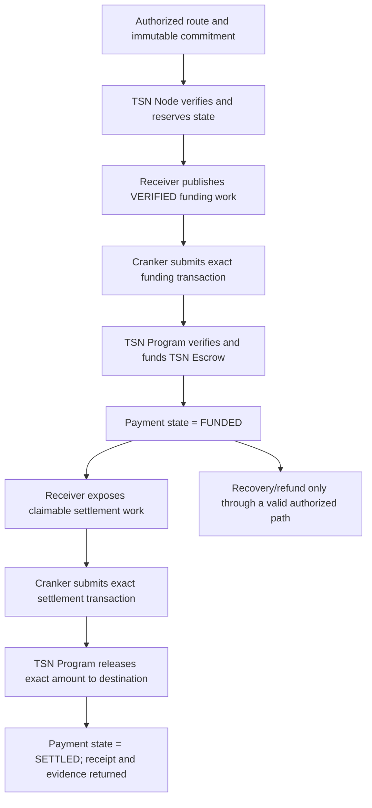
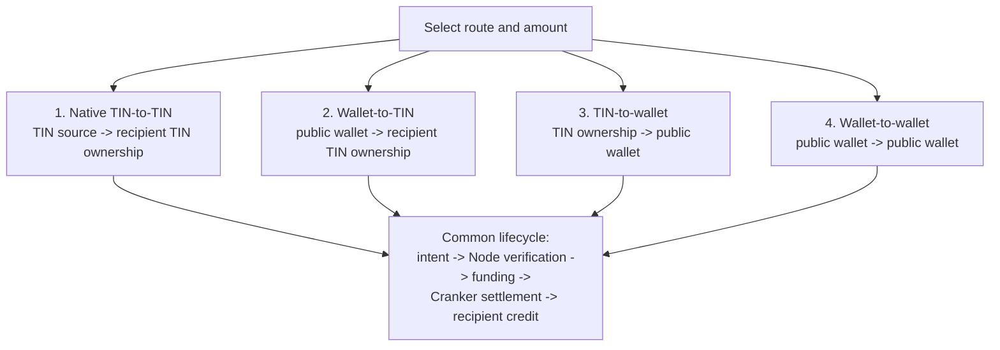
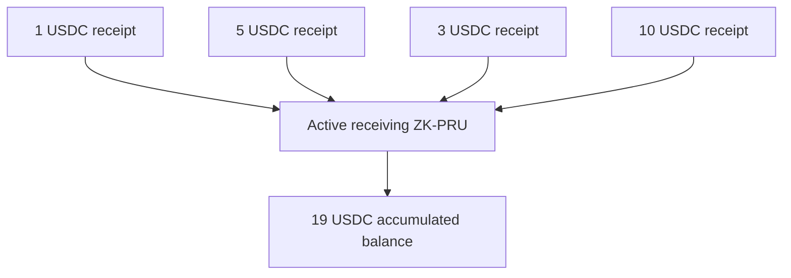

# TSN transaction explorer

TSN coordinates two explicit stages: **intent and funding**, then **claim and
settlement**. The frontend and TSN SDK create the immutable authorization. The
TSN Receiver stores and publishes work, the TSN Node verifies it, the Cranker
submits the exact authorized transactions, and the TSN Program enforces the
movement through TSN Escrow.

## Complete two-stage transaction flow

```mermaid
flowchart TD
    START["1. Sender opens TrustLink Pay"]
    START --> INPUT["2. Select recipient, asset, amount, and source"]
    INPUT --> ROUTE{"Destination route"}

    ROUTE --> T2T["Native TIN-to-TIN<br/>TIN source -> confidential TIN ownership"]
    ROUTE --> W2T["Wallet-to-TIN<br/>public wallet -> confidential TIN ownership"]
    ROUTE --> T2W["TIN-to-wallet<br/>confidential TIN ownership -> public wallet"]
    ROUTE --> W2W["Wallet-to-wallet<br/>public compatibility settlement"]

    T2T --> DEVICE
    W2T --> DEVICE
    T2W --> DEVICE
    W2W --> DEVICE

    DEVICE["3. Authorized device + TSN SDK<br/>Resolve route, select inputs,<br/>calculate fees/change, build commitment"]
    DEVICE --> SIGN["4. User authorization<br/>Main-wallet signature + selected ZK-PRU signatures<br/>Only public plan data and signatures leave device"]
    SIGN --> INTENT["5. Frontend submits payment intent<br/>POST /intents -> TSN Receiver"]

    subgraph STAGE1["STAGE 1 - PAYMENT INTENT, VERIFICATION, AND FUNDING"]
        INTENT --> RECEIVED["Receiver: intent = RECEIVED<br/>Store immutable payload, idempotency key,<br/>commitment, and state version"]
        RECEIVED --> CLAIM_POST["Frontend or SDK posts claim request<br/>linked to the payment intent"]
        CLAIM_POST --> CLAIM_PENDING["Receiver: claim = PENDING<br/>Claim cannot execute before funding"]
        RECEIVED --> NODE_INTENT["TSN Node leases payment intent<br/>Verifies sender signature, route, amount,<br/>mint, expiry, nonce, replay, and plan commitment"]
        NODE_INTENT --> INTENT_RESULT{"Payment intent verification"}
        INTENT_RESULT -->|Rejected| REJECT["Receiver: intent = REJECTED<br/>No funding transaction submitted"]
        INTENT_RESULT -->|Verified| VERIFIED_INTENT["Receiver: intent = VERIFIED<br/>Publish immutable funding work"]
        VERIFIED_INTENT --> FUNDCRANK["Cranker polls Receiver<br/>Leases VERIFIED payment-intent work<br/>Pays Solana fee; does not replan"]
        FUNDCRANK --> FUNDTX["Cranker submits exact sender-authorized<br/>funding transaction to Solana"]
        FUNDTX --> PROGRAM1["TSN Program verifies funding<br/>Ed25519 signatures, execution-PDA delegate,<br/>mint, amount, nonce, commitment, replay"]
        PROGRAM1 --> FUND_RESULT{"Funding confirmation"}
        FUND_RESULT -->|Failed| FUND_FAIL["Receiver: funding failed or expired<br/>No claim becomes executable"]
        FUND_RESULT -->|Confirmed| ESCROW["TSN Escrow receives authorized funds<br/>Receiver: intent = FUNDED"]
    end

    ESCROW --> NODE_CLAIM
    CLAIM_PENDING --> NODE_CLAIM

    subgraph STAGE2["STAGE 2 - CLAIM VERIFICATION, SETTLEMENT, AND RECEIPT"]
        NODE_CLAIM["TSN Node leases claim + linked intent<br/>Verifies funded state, claim commitment,<br/>destination, amount, nonce, expiry, and replay"]
        NODE_CLAIM --> CLAIM_RESULT{"Settlement-claim verification"}
        CLAIM_RESULT -->|Rejected| CLAIM_REJECT["Receiver: claim = REJECTED<br/>Escrow remains protected"]
        CLAIM_RESULT -->|Verified| CLAIM_WORK["Receiver: claim = VERIFIED<br/>Publish claimable settlement work"]
        CLAIM_WORK --> SETTLECRANK["Cranker polls Receiver<br/>Leases VERIFIED claim work"]
        SETTLECRANK --> SETTLE["Cranker submits exact settlement transaction<br/>No source, amount, route, or fee changes"]
        SETTLE --> PROGRAM2["TSN Program verifies settlement<br/>commitment, signatures, escrow state,<br/>destination, nonce/nullifier, expiry, replay"]
        PROGRAM2 --> RELEASE["TSN Escrow releases the exact authorized amount"]
        RELEASE --> DEST["Recipient receives:<br/>confidential TIN ownership or public wallet tokens"]
        DEST --> PROOF["Cranker posts confirmed signature and result<br/>to the Receiver"]
        PROOF --> RECEIPT["Receiver: claim = SETTLED<br/>Payment state, private receipt, and evidence published"]
    end
```

The Cranker does not create or submit the original payment intent. The
frontend submits the intent to the Receiver, and the frontend or SDK may post
the linked claim request. The claim remains `PENDING` while the Node verifies
the payment intent and while funding is pending. After funding confirms, the
Node verifies the claim and its linked intent again before the Receiver
publishes settlement work. The Cranker then submits two on-chain transactions:
the authorized funding transaction and, after funding is confirmed, the exact
settlement transaction.

## Two-stage lifecycle

### Stage 1 - intent and funding

The user selects identity, asset, amount, source, and destination. The SDK
resolves the route, selects sources, calculates fees and change, and creates
the immutable commitment. An authorized device decrypts ZK-PRU material
locally when required; the root wallet and selected child authorities sign.
The frontend submits the public payment intent to the Receiver. The Node
leases and verifies the intent, then the Receiver publishes `VERIFIED` funding
work. A Cranker leases that work, pays the network fee, and submits the exact
funding transaction. The TSN execution PDA moves the authorized tranche into
TSN Escrow, and the Receiver records the Payment state as `FUNDED`.

### Stage 2 - claim and settlement

The frontend or SDK creates a claim request linked to the intent; the Receiver
holds it as `PENDING` until funding is confirmed. The Node then verifies the
claim and linked payment data again; only then does the Receiver expose
claimable settlement work. A Cranker leases that work and submits the exact
settlement transaction. The Program verifies the
commitment, signatures, source, mint, amount, recipient, nonce, state version,
expiry, fee cap, escrow state, and replay state. TSN Escrow releases the exact
amount, authorized change follows the plan, and the Receiver records the
Payment state as `SETTLED` with the confirmed signature and receipt evidence.

## Four routes

1. **Native TIN-to-TIN:** protected identity and routing. The recipient's
   active ZK-PRU route receives confidential ownership and a private receipt.
2. **Wallet-to-TIN:** public wallet funds the route and the recipient's
   protected TIN ownership receives the payment.
3. **TIN-to-wallet:** a device-authorized TIN source exits to a public wallet;
   the destination and amount are public output.
4. **Wallet-to-wallet:** both source and destination are public compatibility
   endpoints.

## Receiving and spending

Small receipts accumulate in one active receiving route:

Receiving rotation is policy-driven, not fixed at 1,000 USDC. Spending
prefers one sufficient source, uses adaptive tranches, minimizes inputs, and
sends authorized change to a fresh route. These are protected identity and
routing properties, not a claim of complete confidentiality.

## Authority boundary

The main wallet is the root authority. Encrypted ZK-PRU derivation material is
decrypted only on an authorized device. The SDK derives selected child
authorities and emits public data plus signatures. The Node and Cranker never
receive user private keys. The Cranker is a fee payer and submitter, not a
delegate or route planner.
