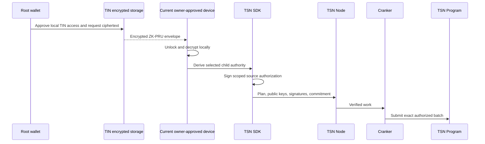
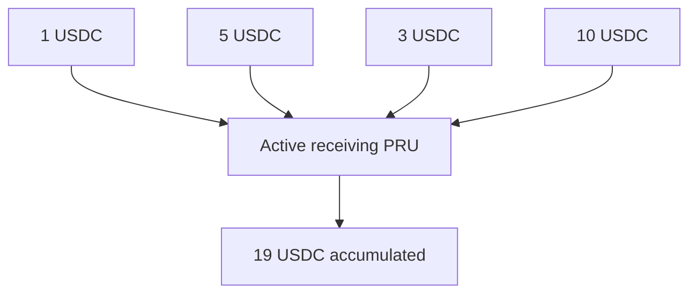

# ZK-PRU inside TSN

ZK-PRU is TSN's protected receiving and spending subsystem. It is not a
separate blockchain, independent settlement network, or server-owned registry.
It connects a TIN payment identity to wallet-authorized receiving routes and
scoped source spending.

## What “ZK” means here

The current implementation uses encrypted local derivation material that the
owner wallet can unlock on any device, plus
commitments, scoped signatures, and protected routing. A commitment can hide
and bind data, but it is not by itself a formal zero-knowledge proof. Do not
claim active SNARK/STARK or complete transaction unlinkability unless a proof
system and verification path are present and tested.

## Authority boundary



- The main wallet is the root authority.
- The encrypted master/derivation material is recovery material, not a
  standalone authorization.
- The current owner-approved device derives only the selected child authority.
- The child signature is scoped to source, amount, route commitment, nonce,
  state version, expiry, cluster, and program.
- The TSN execution PDA is the restricted token delegate.
- The node and Cranker never receive plaintext seed material or child private
  keys.

## Receiving

ZK-PRU receiving is designed to accumulate small receipts instead of creating
one newly funded route for every payment:



The policy may manage active-receiving, funded, empty-rotation,
sealed/spend-only, reserved, spent, and retired states where those states are
implemented. Receiving targets and rotation are adaptive; exactly 1,000 USDC
is not a protocol rule. State versions and reservations prevent concurrent
receipts from overwriting one another.

## Spending

The planner prefers one sufficient source, minimizes inputs and transactions,
uses base-unit bigint accounting, calculates dynamic fees, chooses an
adaptive tranche, and routes authorized change to a fresh empty route.

Illustrative example, not a fixed policy:

```text
Source PRU:       10,000 USDC
Payment:              50 USDC
Adaptive tranche:    837.42 USDC
Payment funding:      50 USDC
Fresh change route:   787.42 USDC
```

Wallet top-up and fragmented-source planning are supported only when the
resulting plan and signatures bind every selected input, amount, destination,
fee, and change route.

## Token-account and execution model

ZK-PRU source accounts use public token-account addresses with authority and
delegate state enforced by the TSN Program. The user authorizes a restricted
TSN execution PDA delegate and the program performs the token CPI with
`invoke_signed`. The Cranker is never the user-token delegate and cannot choose
or rewrite sources.

## Privacy properties and limits

ZK-PRU can reduce direct exposure of the main wallet, avoid reusing one
receiving account, and keep signing authority on the user's device. It does
not automatically hide public SPL token movements, amounts, timing, public
exits, or all graph-analysis signals. The correct description is **protected
identity and routing**, not “fully confidential.”

## Failure, recovery, and status

Invalid signatures, stale state versions, replayed nonces, expired plans,
incorrect delegates, insufficient allowance, and mismatched commitments must
fail closed. Device revocation prevents new local decryption or child signing;
root-wallet recovery remains the authority for replacing a device. Exact
recovery and lifecycle support must follow the deployed program, tests, and
current operational evidence.
