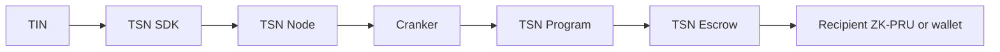

# Transfer Settlement Network

This folder contains the TSN SDK, TSN Node services, RPC gateway, Cranker
operator, and Solana program workspace.

TSN is the payment infrastructure behind TrustLink Pay. It coordinates TIN
identity, protected ZK-PRU routes, signed payment plans, off-chain verification
and reservation, Cranker submission, TSN Program enforcement, TSN Escrow, and
receipts on Solana.

## Boundaries

- The SDK plans, commits, and authorizes locally.
- The TSN Node verifies, reserves, queues, and tracks public work. The source
  directory `tsn-mempool-backend` retains a legacy name; the architecture term
  is TSN Node.
- The Cranker pays Solana fees and submits exact authorized transactions. It
  does not select sources, replan, decrypt envelopes, or sign for users.
- The TSN Program enforces signatures, commitments, replay, state, delegates,
  and escrow transitions.
- Solana validators provide execution, ordering, consensus, and finality. They
  are not TSN Nodes or Crankers.

## Start here

The canonical documentation is in the repository root:

- [`../docs/protocol-architecture.md`](../docs/protocol-architecture.md)
- [`../docs/identity-and-tin.md`](../docs/identity-and-tin.md)
- [`../docs/zk-pru.md`](../docs/zk-pru.md)
- [`../docs/execution-plan-v2.md`](../docs/execution-plan-v2.md)
- [`../docs/network-and-runtime.md`](../docs/network-and-runtime.md)
- [`../docs/security-model.md`](../docs/security-model.md)
- [`../docs/operations-and-testing.md`](../docs/operations-and-testing.md)

TCAP remains a separate experimental confidential-asset direction. It is not
the active TSN settlement actor described by this workspace.
