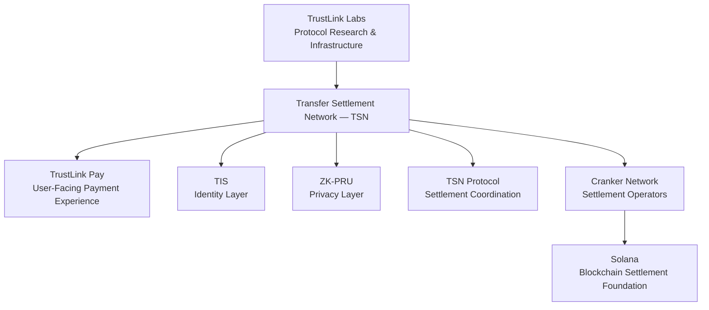
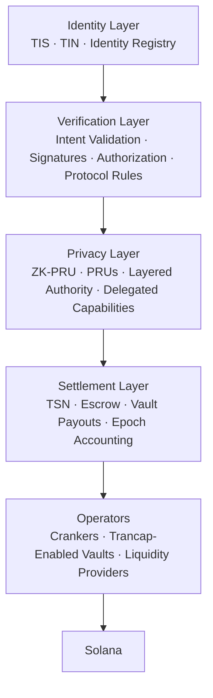
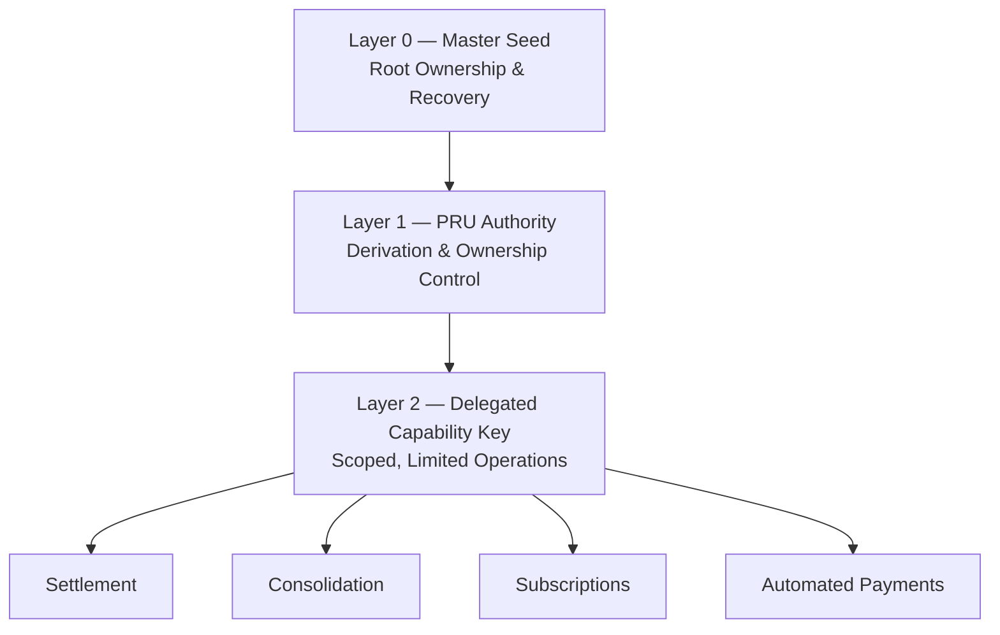
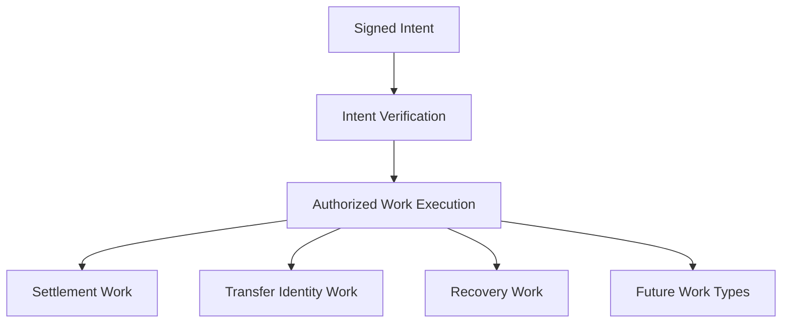
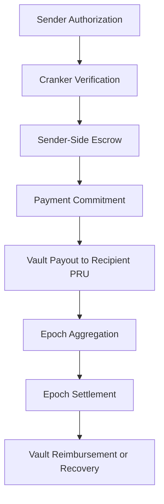
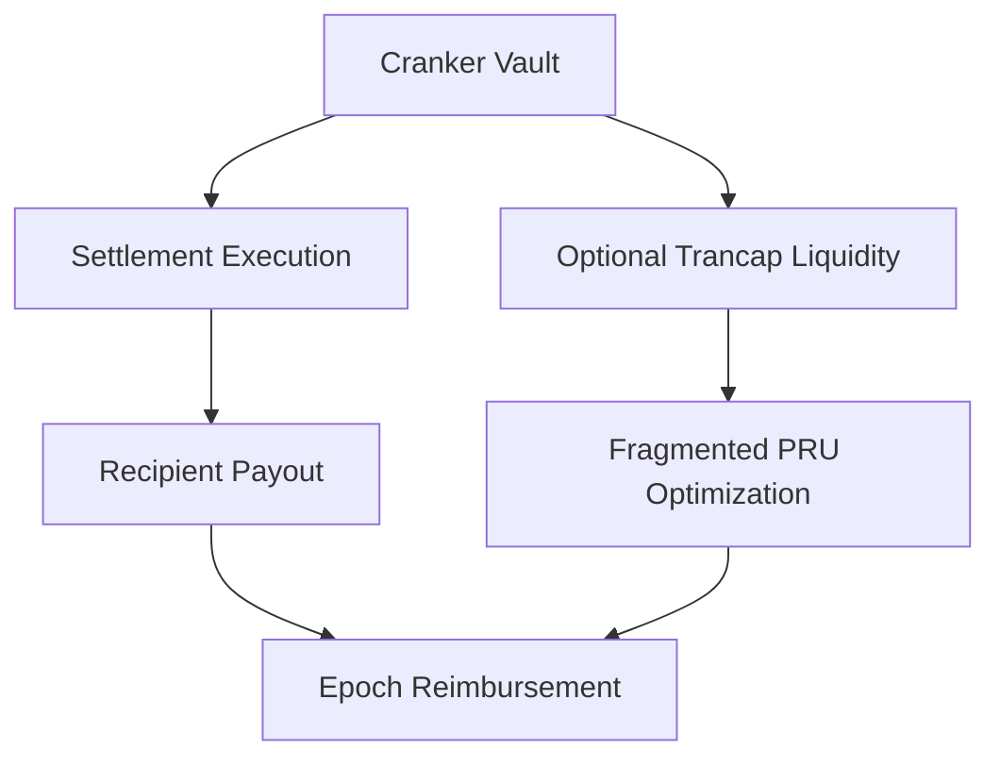
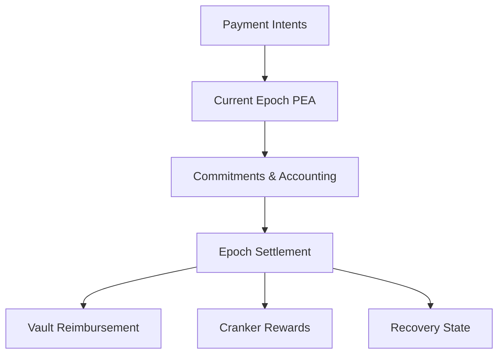
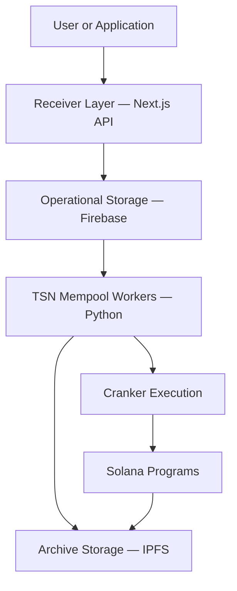

# Transfer Settlement Network (TSN)

**Identity-first, privacy-aware stablecoin settlement infrastructure on Solana.**

TSN is the settlement protocol developed by **TrustLink Labs** for coordinating payment intents, sender-side escrow, recipient payouts, Cranker execution, vault liquidity, commitments, and epoch accounting.

TSN is designed for everyday stablecoin payments—not only institutional or cross-border settlement. It enables applications such as **TrustLink Pay** to provide human-readable payment identity, private receiving infrastructure, programmable payments, and decentralized settlement execution.

> TSN does not make Solana private. It makes the normal payment graph less direct by separating identity, authorization, receiving infrastructure, and settlement execution.

---

## Architecture at a Glance



### Core systems

| System           | Responsibility                                                                  |
| ---------------- | ------------------------------------------------------------------------------- |
| **TIS**          | Human-readable identity abstraction through Transfer Identity Numbers and Names |
| **ZK-PRU**       | Private, deterministic receiving infrastructure and layered authorization       |
| **TSN Protocol** | Intent coordination, escrow, payouts, commitments, fees, and epoch accounting   |
| **Crankers**     | Independent operators that verify and execute authorized TSN work               |
| **Solana**       | Finality, transparent verification, immutable state, and on-chain programs      |

---

## Four-Layer TrustLink Architecture



The Verification Layer is a top-level control function, while Crankers and liquidity providers operate inside the Settlement Layer.

---

## Transfer Identity System (TIS)

The **Transfer Identity System** is the identity foundation of the TrustLink ecosystem and provides the identity layer used by TSN-powered payments.

Traditional blockchain payments require users to share wallet addresses. Wallet addresses are effective ownership identifiers, but they are poor payment identities because they are difficult to use, expose public transaction relationships, and create risks such as address poisoning.

TIS introduces payment identities that applications and users can understand without treating wallet addresses as public usernames.

### Transfer Identity Number (TIN)

A **Transfer Identity Number** is a unique 10-digit payment identity for users and businesses.

```text
Sender
  ↓
Recipient TIN or Transfer Identity Name
  ↓
Signed Payment Intent
  ↓
TSN Verification and Settlement
  ↓
Recipient PRU Route
```

A TIN does not own funds by itself. Ownership remains secured through cryptographic wallet authorization and the ZK-PRU authority model.

### Identity privacy principle

> People should be discoverable by the identities they choose to share, not by the identities others search for.

TIS separates discoverable identity from settlement infrastructure. It does not need to expose a readable public map between a user's identity, wallet, PRUs, and financial activity.

---

## Privacy Receiving Units (PRUs)

**Privacy Receiving Units** are private, deterministic receiving containers used by TSN for identity-first, privacy-aware settlement.

Each Transfer Identity can generate multiple PRUs through the ZK-PRU architecture. A PRU is:

- User-owned
- Token-agnostic
- Deterministically derivable
- Capable of holding supported stable assets
- Separated from the user's public payment identity
- Governed through scoped authorization rather than protocol custody

A PRU is not restricted to one token. The same PRU can hold multiple stable assets accepted by the network.

### PRU lifecycle

| State                     | Meaning                                                                           |
| ------------------------- | --------------------------------------------------------------------------------- |
| **ACTIVE**                | Ready to receive supported stable assets and participate in authorized operations |
| **LOCKED**                | Funds are reserved for a pending operation and cannot be double-spent             |
| **CONSOLIDATION_PENDING** | Fragmented balances are waiting for optimized reconciliation                      |
| **SETTLED**               | The operation has completed and accounting is finalized                           |
| **ARCHIVED**              | The PRU is no longer active but remains part of historical accounting             |

ZK-PRU repository: [Trustlink-Labs/ZK-PRU](https://github.com/Trustlink-Labs/ZK-PRU)

---

## ZK-PRU Layered Authority



Layer 2 is not an unrestricted settlement key. It must be constrained by operation, Stable Unit currency, amount per epoch, merchant or service, frequency, expiry, nonce, and destination restrictions.

---

## Stable Units and Stable Unit Power

TSN is a stablecoin payment network. Volatile assets are outside the TSN settlement domain.

The protocol represents payment value using **Stable Units**, classified by the fiat currency the stable asset represents.

Examples:

- **Stable Unit USD**
- **Stable Unit NGN**
- **Stable Unit INR**
- **Stable Unit AED**

**Stable Unit Power** represents the estimated real payment value contributed by a stable asset relative to its intended fiat unit.

```text
Token Amount × Stable Unit Power = Normalized Payment Value
```

Stable Unit Power supports accurate settlement, TIN balance valuation, vault-liquidity accounting, peg-risk controls, and fiat-style payment displays.

---

## Intent-Driven Work Model

Every TSN operation begins as a signed intent.



---

## TSN Settlement Flow



A lightweight on-chain Payment Commitment records the minimum public information needed to prove authorized settlement work without exposing plaintext private routes or unnecessary identity data.

---

## Crankers: Settlement Operators

Crankers are independent TSN operators that validate signed intents, reject invalid or expired work, claim eligible settlement work, execute payouts through approved vaults, process TIN operations, and participate in epoch settlement and recovery.

Crankers execute protocol work but do not own users' identities, master seeds, PRU keys, or funds.

---

## Work Types

### Settlement Work

Settlement Work executes a verified payment intent. A Cranker must possess a valid **claim credit** before performing the corresponding settlement work. Intent verification itself does not earn the settlement fee; successful execution unlocks the reward.

### Transfer Identity Work

Transfer Identity Work handles TIN creation, updates, commitment changes, and registry mutations. It does not require settlement claim credit and follows its own fee path.

### Recovery Work

Recovery Work handles epoch recovery, vault reconciliation, unresolved settlement states, and reimbursement recovery. It does not require claim credit; eligible Crankers compete through protocol-defined challenges.

---

## Claim Credits

- **Intent verification** identifies and validates work
- **Claim credit** grants settlement execution eligibility
- **Completed settlement work** earns the fee

---

## Cranker Vaults and Trancap

A Cranker vault provides recipient-payout liquidity. It may also enable **Trancap**, an optional liquidity-optimization capability.



Trancap is used when the sender already has sufficient authorized value but direct PRU composition would create excessive account, signature, compute, or transaction-size overhead.

---

## Treasury and Vault Liquidity

### Protocol Treasury

Supports sender-side liquidity balancing, fragmented-value completion, protocol accounting, and recovery mechanisms. It is not the default recipient-payout source.

### Cranker Vault Liquidity

Recipient payouts are funded from Cranker vault liquidity supplied by operators and liquidity providers. Vaults are reimbursed through epoch settlement or smart epoch recovery.

---

## Pooled Epoch Accounting (PEA)



PEA isolates each settlement window so reimbursements, rewards, reconciliation, and recovery can be reasoned about independently.

---

## Fee Distribution

### Normal payment fees

| Recipient         | Share |
| ----------------- | ----: |
| LP vault rewards  |   85% |
| Cranker operator  |    8% |
| Protocol Treasury |    5% |
| Reserve pool      |    2% |

### TIN-operation fees

| Recipient                                      | Share |
| ---------------------------------------------- | ----: |
| Cranker A — first verification/fee transaction |   30% |
| Cranker B — registry mutation                  |   40% |
| Protocol Treasury                              |   10% |
| Reserve pool                                   |   20% |

---

## Programmable Payments and Subscriptions

ZK-PRU delegated capabilities allow users to authorize bounded recurring payments by Stable Unit amount, currency, merchant, frequency, expiry, and maximum amount per epoch—without exposing root authority or transferring unrestricted control.

---

## Privacy Model

TSN separates identity, receiving infrastructure, authorization, and settlement execution.

Public-chain analysis may still infer relationships from timing, amounts, external information, or repeated usage. TSN therefore makes payment graphs less direct; it does not claim impossible anonymity.

---

## Data and Infrastructure Flow



The receiver stores requests immediately, Firebase maintains current operational work, Python workers process intents deterministically, IPFS stores finalized records, and Solana provides settlement finality.

---

## Security Considerations

The architecture must enforce domain-separated signatures, replay protection, expiry and epoch binding, stable-asset allowlists, capability limits, deterministic commitments, PRU double-spend prevention, vault-solvency checks, idempotent execution, and data minimization.

---

## Repository Status

TSN is under active architecture and protocol development. The implementation is being developed in phases and should not yet be treated as fully production-ready or audited.

---

## Related Projects

- [ZK-PRU](https://github.com/Trustlink-Labs/ZK-PRU)
- [TrustLink Pay](https://github.com/bigdreamsweb3/trustlink-pay)
- [Veil Privacy Protocol](https://github.com/bigdreamsweb3/veil-privacy-protocol-vpp)

---

## Protocol Positioning

TSN is not a wallet, exchange, bridge, or speculative trading protocol. It is an intent-driven stablecoin settlement network for consumer payments, merchant payments, subscriptions, automated services, business settlement, and stable-value commerce.

Built by **TrustLink Labs**.
