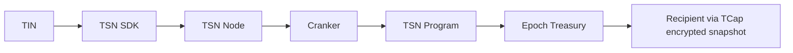

# Transfer Settlement Network

This folder contains the TSN SDK, Mother Node services, RPC gateway, Cranker Node
operator, and Solana program workspace.

TSN is TrustLink Labs' Transfer Settlement Network implementation of the
Decentralized Settlement Protocol (DESP). It is the payment infrastructure
behind TrustLink Pay and coordinates TIN
identity, GPRU authorization/routing, signed payment plans, off-chain verification,
and TCap encrypted private balance snapshots
and reservation, Mother DNA authorization, Cranker submission, TSN Program enforcement, epoch treasury reimbursement, and
receipts on Solana.

<!--  -->

## Boundaries

- The SDK plans, commits, and authorizes locally.
- The Mother Node verifies, reserves, queues, and tracks public work. The
  source directory `tsn-node` is the runtime implementation; the public
  architecture role is Mother Node.
- A Cranker Node pays Solana fees and submits exact authorized transactions. It
  does not select sources, replan, decrypt envelopes, or sign for users.
- The TSN Program enforces signatures, Mother DNA commitments, replay, state,
  delegates, opaque slot transitions, and exact vault reimbursement.
- Solana validators provide execution, ordering, consensus, and finality. They
  are not Mother Nodes or Cranker Nodes.

DeFi decentralizes financial services; DESP decentralizes settlement
infrastructure.

## Start here

The canonical documentation is in the repository root:

- [`../docs/protocol-architecture.md`](../docs/protocol-architecture.md)
- [`../docs/identity-and-tin.md`](../docs/identity-and-tin.md)
- [`../docs/CURRENT-ARCHITECTURE.md`](../docs/CURRENT-ARCHITECTURE.md)
- [`../docs/execution-plan.md`](../docs/execution-plan.md)
- [`../docs/network-and-runtime.md`](../docs/network-and-runtime.md)
- [`../docs/security-model.md`](../docs/security-model.md)
- [`../docs/operations-and-testing.md`](../docs/operations-and-testing.md)

TCap is the live private balance path for credit-only tip transitions and
owner-encrypted snapshots. Confidential debits/exits are not implemented.
